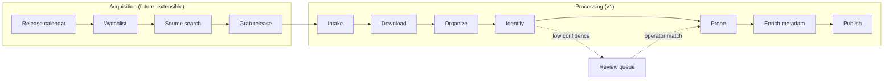

# Automation Pipeline

## Description

The automation pipeline is the center of Media Server. Its purpose is **maximum
automation**: after the single manual step of adding a torrent and choosing a
catalog, the system carries the content all the way to "available for playback"
on its own. Manual intervention is an exception (a review queue), not a step in
the normal flow. This is the key difference from earlier, manual-step systems.

The pipeline is an **ordered, extensible set of stages** operating on an ingest
item. It is split into two phases:

- **Acquisition (`ACQ`)** — decides *what* to download. Optional and added over
  time (watchlist, release calendar, content sources). It ends by handing a
  magnet/`.torrent` plus a target catalog to Intake.
- **Processing (`PROC`)** — turns an acquired download into a published library
  item. This is the v1 core.



## Stages (PROC, v1)

| Stage | Input | Output / effect |
| --- | --- | --- |
| `Intake` | torrent + chosen catalog | creates an ingest item; resolves catalog paths, naming, seeding policy |
| `Download` | torrent | file(s) in `<catalog.root>/files/`; progress events |
| `Organize` | completed files | hardlinks main media into `<catalog.root>/library/` clean names; applies seeding policy |
| `Identify` | parsed name | matches against a metadata provider; high confidence auto-matches, low confidence → review queue |
| `Probe` | library file | `ffprobe` → media sources and streams |
| `Enrich` | matched id | fetches and caches metadata in all supported languages |
| `Publish` | enriched item | item becomes browsable and playable; emits availability event |

## Design Principles

- **Event-driven.** Completing a stage publishes an event that triggers the next.
  Stages are loosely coupled so new ones can be inserted, especially at the front.
- **Extensible contract.** Stages implement a common `IPipelineStage` with a stage
  key and a shared `IngestContext`. The acquisition phase is built from the same
  contract; new `ACQ` stages prepend without touching `PROC`.
- **Idempotent.** Every stage can be safely re-run. Re-processing never creates
  duplicate items; it reconciles against the stable public ID and the catalog
  layout.
- **Resilient.** A reconciler periodically re-drives items stuck in a
  non-terminal state (after a crash, restart, or transient provider error), with
  bounded retries and backoff.
- **Non-blocking.** A single item entering the review queue (ambiguous match)
  does not block other items in the pipeline.
- **Observable.** Each stage emits background job events (see
  [Background tasks](background-tasks.md)) consumed by the UI activity view.

## Ingest Item State

```text
INTAKE → DOWNLOADING → DOWNLOADED → ORGANIZING → IDENTIFYING
       → PROBING → ENRICHING → PUBLISHED → AVAILABLE
                              ↘ NEEDS_REVIEW        ↘ FAILED
```

Each item stores: id, catalog id, source torrent reference, current stage,
status, attempt count, last error, and timestamps. The set of stages it has
passed is recorded so re-entry resumes at the correct point.

## Manual Override

- `NEEDS_REVIEW` items appear in the UI with parsed guesses and provider
  candidates. The operator confirms a match (manual match override), which
  resumes the pipeline.
- The operator can re-run identify/enrich/probe for any item.

## Extension Points (future)

- `ACQ` stages: release calendar polling, watchlist matching, content-source
  search, and release grabbing (see [Watchlist and discovery](watchlist-and-discovery.md)).
- MCP tools: pipeline operations (`add_torrent`, `rescan`, `download_status`,
  `search_content`) are shaped as discrete commands so an AI agent can drive them
  through MCP.

## Testing Expectations

Backend tests should use xUnit and Imposter. Required coverage:

- Stage transitions and the full happy-path sequence.
- Idempotency: re-running a stage produces no duplicates.
- Reconciler re-drives stuck items with bounded retries/backoff.
- Low-confidence identify routes to review without blocking other items.
- Manual match override resumes the pipeline at the correct stage.
- Event emission for each stage.
