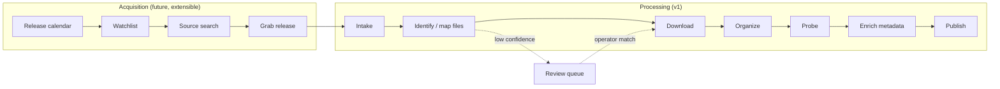

# Automation Pipeline

Status: Implemented
Created: 2026-06-15
Updated: 2026-06-21

## Description

The automation pipeline is the center of Media Server. Its purpose is **maximum
automation**: after the manual step of adding a torrent and choosing a catalog,
the system parses the torrent name/file list, suggests metadata matches, and then
carries the content all the way to "available for playback" on its own. Manual
intervention is an exception (a review queue), not a step in the normal flow.
This is the key difference from earlier, manual-step systems.

The pipeline is an **ordered, extensible set of stages** operating on an ingest
item. It is split into two phases:

- **Acquisition (`ACQ`)** — decides *what* to download. Optional and added over
  time (watchlist, release calendar, content sources). It ends by handing a
  magnet/`.torrent` plus a target catalog to Intake.
- **Processing (`PROC`)** — turns an acquired download into a published library
  item. This is the v1 core.



## Stages (PROC, v1)

| Stage | Input | Output / effect |
| --- | --- | --- |
| `Intake` | torrent + chosen catalog | creates an ingest item; resolves catalog paths, naming, seeding policy; reads torrent metadata/file list where available |
| `Identify` | torrent name/file list + catalog type | suggests or confirms provider identities; maps playable source files to movies or episodes |
| `Download` | torrent | file(s) in `<catalog.root>/.incoming/<downloadId>/`; progress events; on completion the download→identify hand-off drops the `Download` row (files kept) |
| `Organize` | confirmed files | **moves** the main media into the canonical layout at the catalog root (rename, no hardlink) and clears the `.incoming/` staging folder |
| `Probe` | library file | `ffprobe` → media sources and streams |
| `Enrich` | matched id | fetches and caches metadata in all supported languages |
| `Publish` | enriched item | item becomes browsable and playable; emits availability event |

Identify is **two-phase** so magnet links are never blocked on metadata:

- **`.torrent` files** expose the file list immediately, so name- and file-level
  matching can run at intake.
- **Magnet links** have no file list until torrent metadata is fetched. Phase 1
  matches on the torrent name and **Download starts immediately**; Phase 2 maps
  the playable files once the engine has the file list (during or after download).

If confidence is high, matching is automatic; if candidates are ambiguous, the
item enters `NeedsReview`. Download can continue while metadata is unresolved, but
organize/publish waits for each playable file to be assigned to a movie or
episode.

**Two entry points.** The full pipeline starts at `Intake` for a torrent. A
**catalog scan** is a second entry point: it creates an ingest **at `Identify`**
for each media file already present in the catalog root with no published source,
then runs the same identify → organize → probe → enrich → publish tail — for
onboarding a hand-copied collection (see [Catalogs](catalogs.md)).

**Seeding** lives only on the `Download` stage and is mutually exclusive with
being in the library: with `keepSeeding` the ingest parks at `Download` (the file
stays seedable in `.incoming/`) until the operator stops seeding, which then runs
the hand-off and the rest of the pipeline.

## Design Principles

- **Event-driven.** Completing a stage publishes an event that triggers the next.
  Stages are loosely coupled so new ones can be inserted, especially at the front.
- **Extensible contract.** Stages implement a common `IPipelineStage` with a stage
  key and a shared `IngestContext`. The acquisition phase is built from the same
  contract; new `ACQ` stages prepend without touching `PROC`.
- **Idempotent.** Every stage can be safely re-run. Re-processing never creates
  duplicate items; it reconciles against source-file assignments, the stable
  public ID, and the catalog layout.
- **Resilient.** A reconciler periodically re-drives items stuck in a
  non-terminal state (after a crash, restart, or transient provider error), with
  bounded retries and backoff.
- **Non-blocking.** A single item entering the review queue (ambiguous match)
  does not block other items in the pipeline.
- **Observable.** Each stage emits background job events (see
  [Background tasks](background-tasks.md)) consumed by the UI activity view.
- **Database is source of truth.** Publish writes items to the database; the
  reconcile scan only checks the catalog root against it, while the import scan
  ingests orphan files through the pipeline (see [Catalogs](catalogs.md)).

## Ingest Item State

```text
INTAKE → IDENTIFYING → DOWNLOADING → DOWNLOADED → ORGANIZING
       → PROBING → ENRICHING → PUBLISHED → AVAILABLE
              ↘ NEEDS_REVIEW                    ↘ FAILED
```

For magnet sources, `DOWNLOADING` may begin before `IDENTIFYING` completes (the
file-level mapping resumes once the file list is known), so the orchestrator
tracks progress through `StagesCompleted` rather than assuming a strict linear
order.

Each item stores: id, catalog id, source torrent reference, current stage,
status, attempt count, last error, and timestamps. The set of stages it has
passed is recorded so re-entry resumes at the correct point.

## Manual Override

- `NEEDS_REVIEW` items appear in the UI with parsed guesses, provider candidates,
  and the relevant playable source files. The operator confirms the movie or the
  series/season/episode mapping, which resumes the pipeline.
- The operator can remap an already published source file to another movie or
  episode. Remap **moves/renames** the canonical file and re-runs probe/enrich/
  publish where needed.
- The operator can re-run identify/enrich/probe for any item.

## Extension Points (future)

- `ACQ` stages: release calendar polling, watchlist matching, content-source
  search, and release grabbing (see [Watchlist and discovery](watchlist-and-discovery.md)).
- MCP tools: pipeline operations (`add_torrent`, `rescan`, `download_status`,
  `search_content`) are shaped as discrete commands so an AI agent can drive them
  through MCP.

## Testing Expectations

Backend tests should use xUnit and Imposter. Required coverage:

- Stage transitions and the full happy-path sequence.
- Intake-time match suggestions for movies, single episodes, and season packs.
- Idempotency: re-running a stage produces no duplicates.
- Reconciler re-drives stuck items with bounded retries/backoff.
- Low-confidence identify routes to review without blocking other items.
- Manual match override and post-publish remap resume the pipeline at the correct
  stage.
- Event emission for each stage.
