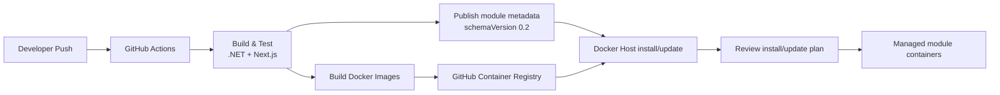

# Build, Packaging, and Deployment

## Description

Media Server uses the Docker Host Dev Model for local running, container images
for runtime artifacts, GitHub Actions for CI/CD, and Docker Host module metadata
as the primary self-hosted install contract.

## Docker Host Dev Model

Local development should run through the Docker Host Dev Model (`docker-host dev`) so the
application is validated against the same Host shell, gateway, storage, settings,
and identity assumptions used by production installs.

The local dev model must define:

- ASP.NET Core Minimal API backend.
- Next.js web frontend.
- Supporting infrastructure services, such as database, cache, reverse proxy, or
  observability components when added.
- Network routing between frontend, backend API, and SignalR hub.
- Environment variables and settings required for local development.
- Storage mounts for database files, metadata cache, torrent state, transcode
  temp files, media libraries, downloads, and import folders.

Local commands and manifests should be kept close to Docker Host module metadata
so development, validation, and production packaging exercise the same service
shape. Production containers should run the actual application services.

## Containerization and Module Strategy

The backend and frontend should be packaged as separate Docker images:

- Backend image: ASP.NET Core application exposing Minimal API endpoints.
- Frontend image: Next.js application running with the production Next.js server
  unless the frontend is later converted to a fully static export.

Docker Host module metadata is the primary self-hosted install contract. The
metadata must use `schemaVersion: "0.2"` and declare the containers, runtime
ports, endpoint hints, settings, storage mappings, and Host shell UI entrypoint
needed for Docker Host to install and run Media Server.

Docker Compose remains useful for image builds, service wiring checks, and
non-Host self-hosting. Generated or maintained Compose files must make service
dependencies explicit and configure backend/frontend networking so that the
frontend can reach the backend API and SignalR hub.

The Docker Host module should preserve stable contract keys across releases:

- Module id, recommended as a reverse-DNS id such as `com.haas.media-server`.
- Container keys, such as `web` and `api`.
- Endpoint keys.
- Setting keys.
- Storage keys and mount collection keys.

Changing these keys can affect updates, persisted state, gateway exposures, and
administrator configuration.

Detailed Docker Host module requirements are maintained in
[Docker Host module](docker-host-module.md).

## GitHub Actions CI/CD

A GitHub Actions workflow must build and publish container artifacts.

The workflow must:

- Run on pushes to the main branch and on pull requests where validation is required.
- Restore and build the .NET solution.
- Install frontend dependencies and build the Next.js application.
- Run backend unit tests with xUnit.
- Build Docker images for the backend and frontend.
- Publish Docker images to GitHub Container Registry.
- Tag images with at least the Git commit SHA and optionally `latest` for the main branch.
- Use `GITHUB_TOKEN` with `packages: write` permissions for GHCR publishing.

Example target image names:

- `ghcr.io/<owner>/<repository>/media-server-api:<sha>`
- `ghcr.io/<owner>/<repository>/media-server-web:<sha>`

## Docker Host Deployment Flow

Docker Host installs or updates Media Server from the published module metadata
URL. The Host validates the metadata, resolves dependencies if any are declared,
prepares module-owned storage, asks the administrator for required settings and
external media mounts, pulls the GHCR images, and runs the managed containers.

Secrets and environment-specific values must be collected through Docker Host
settings or provided through host-level secret management, not baked into
images.

## Module Requirements Summary

Module metadata requirements:

- Use `schemaVersion: "0.2"`.
- Publish metadata at a direct absolute `http` or `https` URL.
- Do not use unsupported extension fields.
- Declare web and API containers with explicit HTTP runtime ports.
- Use endpoint public flags only as gateway capability hints.
- Add `ui` metadata so Media Server appears in the authenticated Docker Host Apps shell.
- Declare settings for TMDb, streaming, Jellyfin compatibility, torrent limits,
  and other runtime configuration.
- Declare module-owned storage for database, metadata cache, torrent state, and
  transcode temp files.
- Use administrator-selected external mount collections for media libraries,
  downloads, and import folders.

Authorization boundaries:

- Docker Host controls Host login, Host roles, module assignment, shell access,
  and gateway exposure policy.
- Media Server controls its own library permissions, playback state, torrent
  permissions, and administrative features.
- If Media Server consumes Docker Host identity, it must validate the signed
  `X-Docker-Host-Identity` token against Host JWKS, require issuer
  `docker-host`, require the Media Server module id as audience, and reject
  expired tokens.
- Media Server must not trust Host cookies, forwarded headers,
  trusted-proxy assertions, or client-supplied `X-Docker-Host-*` headers as
  identity.

## Testing Expectations

Backend tests should use xUnit and Imposter.

Required validation:

- Restore and build the .NET solution.
- Install frontend dependencies and build the Next.js application.
- Run backend unit tests.
- Build backend and frontend Docker images.
- Run the application locally through the Docker Host Dev Model.
- Validate Docker Host metadata with schema `0.2` rules.
- Install release metadata through Docker Host for production-like lifecycle,
  storage, and container networking checks.
