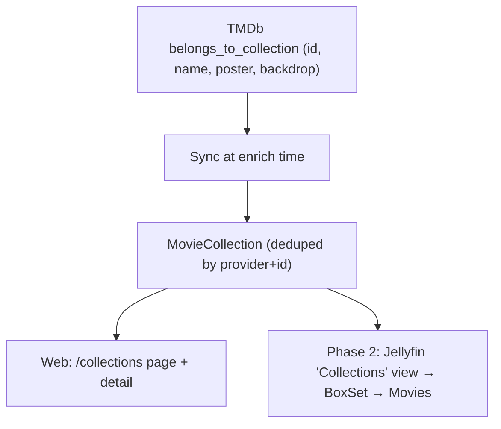

# Collections (Movie Franchises)

Status: Phase 1 (web) implemented; Phase 2 (Infuse) planned
Created: 2026-06-24
Updated: 2026-06-24

> Phased scope. **Phase 1 (implemented)** adds a web "Collections" page that
> groups owned movies by their TMDb franchise. **Phase 2 (planned)** exposes those
> collections to Infuse as a separate Jellyfin catalog (`BoxSet`s) — this extends a
> documented Jellyfin non-goal (see [jellyfin-compatibility.md](jellyfin-compatibility.md))
> and is deliberately deferred behind Phase 1.

## Description

A *collection* is a movie franchise as defined by TMDb's
`belongs_to_collection` — e.g. "The Lord of the Rings Collection", "James Bond
Collection". The feature groups the movies the operator **actually owns** into
their franchise so they can be browsed as a unit, both in the web UI and (later)
in native clients.

Collections are **movie-only**: TMDb has no `belongs_to_collection` equivalent
for TV, so series/anime catalogs are unaffected.



The Infuse hierarchy Phase 2 targets (a movie appears both under its movie
catalog **and** under its collection, exactly as Jellyfin does it):

```text
Collections (CollectionFolder, CollectionType=boxsets)
└── The Lord of the Rings Collection (BoxSet)
    ├── The Fellowship of the Ring (Movie)
    ├── The Two Towers (Movie)
    └── The Return of the King (Movie)
Movies (CollectionFolder, CollectionType=movies)   ← the films are still here too
TV (CollectionFolder, CollectionType=tvshows)
```

## Data Model

`belongs_to_collection` already lands in `MetadataRecord.Raw` on every movie
detail fetch (it is a top-level field on TMDb `/movie/{id}`, not gated behind
`append_to_response`), carrying `id`, `name`, `poster_path`, `backdrop_path`.
Today `LibraryReadService.ParseCollectionName` reads only the **name** from
`Raw` and surfaces it on the movie detail (`LibraryDetailDto.CollectionName`).
There is no grouping, and the collection **id** is not extracted.

### Decision (taken): a thin `MovieCollection` entity

Phase 1 adds a normalized entity, **not** a per-field column on the metadata record:

```text
MovieCollection
  Id            Guid
  Provider      string   // "tmdb"
  ProviderId    string   // TMDb collection id
  Name          string
  PosterPath    string?  // raw provider path
  PosterUrl     string?  // ready-to-render
  BackdropUrl   string?
  UpdatedAt     DateTimeOffset
  (unique index on (Provider, ProviderId))

MediaItem
  + CollectionId  Guid?   // FK → MovieCollection; null for non-movies / no franchise
  (index on CollectionId)
```

**Why an entity rather than a bare column.** This mirrors the `Person` /
`MediaItemPerson` pattern introduced in
[PR #31](https://github.com/alex-de-haas/media-server/pull/31): a provider-
identified object, deduped by `(Provider, ProviderId)`, synced from the cached
payload at enrich time. A collection's name/poster belong to the *collection*,
not to any one member movie, so storing them once is more normalized than
re-deriving them from whichever member's `Raw` happens to be read. Listing and
counting then become a clean indexed `JOIN`/`GROUP BY` with no JSON scanning,
and a later overview / curated order / "missing movies" extension only adds
columns to the same table.

This is consistent with the architecture, **not** an exception to it: the
"derive from `Raw` at display time" rule in [metadata.md](metadata.md) governs
*single-item display attributes* (overview, tagline, studios, keywords, trailer).
*Cross-item structure* — a person appearing in many items, a franchise grouping
many movies — cannot be expressed that way (each `Raw` is independent), so it is
persisted. `OfficialRating` was the first promotion (a queryable scalar),
`Person` the second (cross-item identity), `MovieCollection` is the third
(cross-item grouping). Cardinality differs from `Person`: a movie belongs to at
most one collection (one-to-many), so no join table is needed — a single FK
suffices.

### Alternative: bare promoted column (lighter)

Promote only `CollectionTmdbId (int?)` (+ optionally `CollectionName`) onto
`MediaItem`, exactly like `OfficialRating`, and re-derive the collection's
name/poster from a member movie's `Raw` when rendering the list. No new table.
Cheaper to land, but the collection name/poster live redundantly in every
member's `Raw`, the list endpoint parses JSON per collection, and a future
collection-level overview/artwork has nowhere natural to live. It was the
considered-and-rejected lighter alternative: kept here as the fallback if the
entity ever proves heavier than its worth.

## Metadata Sync

Follow `PersonSyncService`: a `CollectionSyncService` (or a fold into the
existing person sync call site in `EnrichService`) that, for `MediaKind.Movie`
only, parses `belongs_to_collection` from the primary-language `Raw`, upserts the
`MovieCollection` by `(Provider, ProviderId)`, and sets/clears
`MediaItem.CollectionId`. Idempotent and convergent — a re-fetch that drops the
collection clears the FK, exactly like person credits converge. Poster/backdrop
URLs are built with the existing `ImageUrl(path)` helper
(`TmdbImageBase + path`).

A one-shot backfill (mirroring `PersonBackfillService`) populates existing items
without forcing a full re-enrich.

## Read / API Surface

New routes under the existing `/api/library` group
([`LibraryEndpoints.MapLibraryEndpoints`](../../src/api/MediaServer.Api/Library/LibraryEndpoints.cs)):

- `GET /api/library/collections` → `CollectionSummaryDto[]`
  (`tmdbId/id`, `name`, `posterUrl`, `itemCount`). Only collections with
  **≥ 2 owned movies** are returned (single-owned-movie franchises are noise).
- `GET /api/library/collections/{id}` → `CollectionDetailDto`
  (`name`, `overview?`, `posterUrl`, `backdropUrl?`, `items: LibraryItem[]`),
  members ordered by release date.

Grouping spans catalogs (one global collections list), independent of which
movie catalog a film lives in.

## Frontend

Mirrors the existing movies surface:

- **Tab** in `PRIMARY_TABS`
  ([`app-shell.tsx`](../../src/web/src/components/app-shell.tsx)), e.g. a
  `Layers` icon.
- **Client/types** `listCollections()` / `getCollectionDetail(id)` in
  [`media-server.ts`](../../src/web/src/lib/media-server.ts).
- **Pages** `collections/page.tsx` (grid of collection cards reusing
  `PosterCard`, subtitle = "N movies") and `collections/[id]/page.tsx` (header +
  member grid). Extend `detailHref` for a `Collection` kind → `/collections/{id}`.

A collection card's poster comes from the collection's own `poster_path`, with a
fallback to the first member movie's poster.

## Jellyfin / Infuse Surface (Phase 2)

Deferred behind Phase 1; extends the documented Jellyfin non-goal.

- Add a synthetic top-level view in
  [`JellyfinLibraryService.GetViewsAsync`](../../src/api/MediaServer.Api/Jellyfin/JellyfinLibraryService.cs):
  a `CollectionFolder` with `CollectionType = "boxsets"`, shown alongside the
  catalog views.
- New `BoxSet` shape in `JellyfinItemMapper` and stable ids via
  `JellyfinIds.Collection(...)` plus an id for the collections view itself.
- Parent resolution: `ParentId` = collections view → all `BoxSet`s;
  `ParentId` = a `BoxSet` → the owned movies with that `CollectionId`. The
  recursive top-level branch already returns only `Movie/Series/Episode`, so
  `BoxSet`s are naturally excluded from flat recursive scans — the new view needs
  its own handling.
- BoxSet artwork: v1 uses the collection's poster/backdrop (served through the
  existing image proxy), falling back to a member movie's poster. Image binaries
  are currently cached per `MediaItem`; collection artwork is a small addition.

## Open Decisions

- **Entity vs bare column** (see Data Model). Decided: thin entity.
- **Minimum size to surface a collection.** Default ≥ 2 owned movies.
- **Missing movies.** Phase 1 shows owned movies only. Showing the full franchise
  (greyed-out unowned entries) needs a `/collection/{id}` TMDb fetch and extra
  `MovieCollection` fields/rows — out of scope unless requested.
- **Phase 2 timing.** The Infuse catalog is a separate effort gated on Phase 1.

## Non-Goals

- TV/anime "collections" (no TMDb equivalent).
- Operator-curated / manual collections (TMDb-driven only for now).
- Collection-level watched roll-up beyond what per-movie `UserData` already gives.

## Testing Expectations

- `LibraryReadServiceTests` already has a `belongs_to_collection` fixture; extend
  it to cover collection-id extraction, grouping, the ≥ 2 threshold, and the
  detail projection.
- `CollectionSyncService` tests mirroring `PersonSyncServiceTests`: upsert by
  `(Provider, ProviderId)`, FK set/clear convergence on re-fetch, movie-only.
