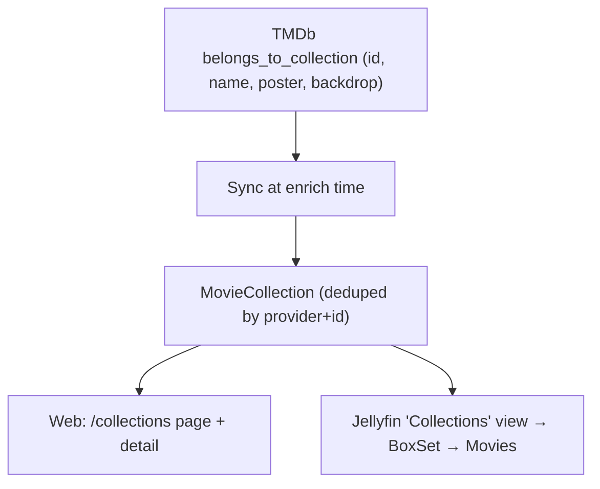

# Collections (Movie Franchises)

Created: 2026-06-24
Updated: 2026-08-15

Movies the operator owns are grouped into the franchise they belong to, and the
grouping is browsable on both surfaces: a Collections page in the web UI, and a
Jellyfin `boxsets` library in Infuse.

## Description

A *collection* is a movie franchise as defined by TMDb's
`belongs_to_collection` — e.g. "The Lord of the Rings Collection", "James Bond
Collection". Only the movies the operator **actually owns** are grouped, and only
franchises with at least `CollectionMetadata.MinOwnedMovies` (2) owned movies are
surfaced; a single-owned-movie "franchise" is noise on either surface.

Collections are **movie-only**: TMDb has no `belongs_to_collection` equivalent
for TV, so series/anime catalogs are unaffected.



The Infuse hierarchy (a movie appears both under its movie catalog **and** under
its collection, exactly as Jellyfin does it):

```text
Collections (CollectionFolder, CollectionType=boxsets)
└── The Lord of the Rings Collection (BoxSet)
    ├── The Fellowship of the Ring (Movie)
    ├── The Two Towers (Movie)
    └── The Return of the King (Movie)
Movies (CollectionFolder, CollectionType=movies)   ← the films are still here too
TV (CollectionFolder, CollectionType=tvshows)
```

## Data Model

`belongs_to_collection` lands in `MetadataRecord.Raw` on every movie detail fetch
(it is a top-level field on TMDb `/movie/{id}`, not gated behind
`append_to_response`), carrying `id`, `name`, `poster_path`, `backdrop_path`. The
grouping is persisted as a normalized entity rather than a per-field column on
the metadata record:

```text
MovieCollection
  Id            Guid
  Provider      string   // "tmdb"
  ProviderId    string   // TMDb collection id
  Name          string
  PosterPath    string?  // raw provider path
  PosterUrl     string?  // ready-to-render
  BackdropPath  string?
  BackdropUrl   string?
  UpdatedAt     DateTimeOffset
  (unique index on (Provider, ProviderId))

MediaItem
  + CollectionId  Guid?   // FK → MovieCollection; null for non-movies / no franchise
  (index on CollectionId)
```

**Why an entity rather than a bare column.** This mirrors the `Person` /
`MediaItemPerson` pattern: a provider-identified object, deduped by
`(Provider, ProviderId)`, synced from the cached payload at enrich time. A
collection's name/poster belong to the *collection*, not to any one member movie,
so storing them once is more normalized than re-deriving them from whichever
member's `Raw` happens to be read. Listing and counting are then a clean indexed
`JOIN`/`GROUP BY` with no JSON scanning.

This is consistent with the architecture, **not** an exception to it: the
"derive from `Raw` at display time" rule in [metadata](../metadata/feature.md)
governs *single-item display attributes* (overview, tagline, studios, keywords,
trailer). *Cross-item structure* — a person appearing in many items, a franchise
grouping many movies — cannot be expressed that way (each `Raw` is independent),
so it is persisted. `OfficialRating` was the first promotion (a queryable
scalar), `Person` the second (cross-item identity), `MovieCollection` the third
(cross-item grouping). Cardinality differs from `Person`: a movie belongs to at
most one collection (one-to-many), so a single FK suffices — no join table.

The lighter alternative — promoting only `CollectionTmdbId` onto `MediaItem` and
re-deriving name/poster from a member's `Raw` — was considered and rejected: the
collection name and poster would live redundantly in every member's `Raw`, the
list endpoint would parse JSON per collection, and collection-level artwork would
have nowhere natural to live.

## Metadata Sync

`CollectionSyncService` runs for `MediaKind.Movie` at enrich time: it parses
`belongs_to_collection` from the cached payload, upserts the `MovieCollection` by
`(Provider, ProviderId)`, and sets/clears `MediaItem.CollectionId`. It is
idempotent and convergent — a re-fetch that changes the franchise re-points the
link, one that drops it clears the link, and non-movies converge to unlinked.
Poster/backdrop URLs are built with the existing `ImageUrl(path)` helper
(`TmdbImageBase + path`).

`CollectionBackfillService` populates existing items from the `Raw` payloads
already cached, so an installed library does not need a full re-enrich. It looks
only at movies with no link yet.

## Read / API Surface

Under the existing `/api/library` group
([`CollectionEndpoints`](../../../src/api/MediaServer.Api/Collections/CollectionEndpoints.cs)):

- `GET /api/library/collections` → `CollectionSummaryDto[]`
  (`id`, `name`, `posterUrl`, `itemCount`), by name. Only collections with
  **≥ 2 owned movies** are returned.
- `GET /api/library/collections/{id}` → `CollectionDetailDto`
  (`name`, `posterUrl`, `backdropUrl?`, `items: LibraryItem[]`), members ordered
  by release year and then title.

Grouping spans catalogs (one global collections list), independent of which
movie catalog a film lives in.

## Frontend

Mirrors the movies surface: a **tab** in `PRIMARY_TABS`
([`app-shell.tsx`](../../../src/web/src/components/app-shell.tsx)), the
`listCollections()` / `getCollectionDetail(id)` client functions in
[`media-server.ts`](../../../src/web/src/lib/media-server.ts), and the
`collections/page.tsx` (grid of collection cards, subtitle "N movies") and
`collections/[id]/page.tsx` (header + member grid) pages.

A collection card's poster comes from the collection's own `poster_path`, with a
fallback to the earliest member movie's poster.

## Jellyfin / Infuse Surface

Collections are exposed to native clients, extending a documented Jellyfin
non-goal. All collection state on this surface is read-only and derived from the
`MovieCollection` entity; no schema of its own.

- **Collections view.** [`JellyfinLibraryService.GetViewsAsync`](../../../src/api/MediaServer.Api/Jellyfin/JellyfinLibraryService.cs)
  appends a synthetic `CollectionFolder` with `CollectionType = "boxsets"`
  (`JellyfinItemMapper.MapCollectionsView`) alongside the catalog views — but only
  while at least one franchise qualifies, so Infuse never shows an empty library.
- **BoxSets.** `JellyfinItemMapper.MapBoxSet` projects each qualifying
  `MovieCollection` as a `BoxSet` folder; ids are stable via
  `JellyfinIds.Collection(id)` and `JellyfinIds.CollectionsView()`.
- **Eligibility.** [`JellyfinCollectionService`](../../../src/api/MediaServer.Api/Jellyfin/JellyfinCollectionService.cs)
  owns the "≥ `CollectionMetadata.MinOwnedMovies` owned movies" query (shared
  constant with the web surface), member lookup, public-id resolution, the cover
  selection, and the artwork tags.
- **Parent navigation.** `ParentId` = collections view → its `BoxSet`s;
  `ParentId` = a `BoxSet` → that collection's owned movies (which still also live
  under their movie catalog, exactly as Jellyfin models collections). `BoxSet`s
  stay out of flat recursive scans (those return only `Movie/Series/Episode`), and
  `Items/Latest` returns empty for the view/BoxSet rather than leaking the whole
  library.
- **Member order.** A BoxSet's movies come back **chronologically** — by
  `MediaItem.Year`, falling back to the metadata release year the client renders
  as `ProductionYear`, then by localized title; a member with no year at all sorts
  last rather than heading a franchise it cannot be placed in. This is the one
  listing that does not use the shared title ordering, because a franchise is
  watched in release order. The BoxSet also advertises
  `DisplayOrder = "PremiereDate"`, so a client that sorts for itself picks the
  same order.
- **Artwork.** A BoxSet advertises the collection's own TMDb poster/backdrop;
  `JellyfinImageService` fetches and disk-caches it on first request (keyed by a
  stable per-collection tag). The Collections view has no artwork of its own, so
  it borrows a cover franchise's: the eligible collection with the most owned
  movies that has any art (ties broken by id, so the tile is stable), advertised
  as both `Primary` and `Backdrop` and served for either request — its backdrop,
  or its poster when it has no backdrop. A library whose franchises have no
  artwork at all is still listed, just without a tile.

## Non-Goals

- TV/anime "collections" (no TMDb equivalent).
- Operator-curated / manual collections (TMDb-driven only).
- Collection-level watched roll-up beyond what per-movie `UserData` already gives.
- Showing the full franchise with unowned entries greyed out: both surfaces show
  owned movies only. It would need a `/collection/{id}` TMDb fetch and extra
  `MovieCollection` fields/rows.

## Testing Expectations

- `CollectionSyncServiceTests` / `CollectionReadServiceTests` /
  `CollectionMetadataTests` cover parsing, upsert by `(Provider, ProviderId)`, FK
  set/clear convergence, the ≥ 2 threshold, ordering, and the poster fallback.
- `JellyfinCollectionsTests` covers the Jellyfin surface: the boxsets view appears
  only when a franchise qualifies, the view lists eligible BoxSets, a BoxSet maps
  with the right shape/parent/child-count/poster/display order, and browsing one
  returns its member movies in release order (including a member whose year comes
  from metadata, and one with no year at all).
- `JellyfinViewArtworkTests` covers the Collections view's borrowed tile: which
  franchise lends it, the poster fallback, an artless library still being listed,
  and the bytes the image route serves for the view id.
