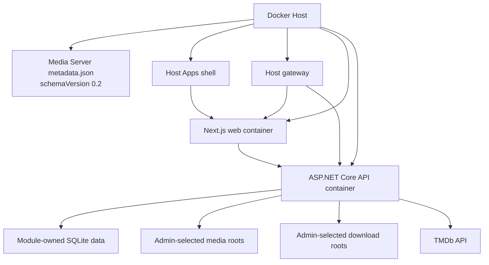

# Docker Host Module

## Description

Media Server is distributed as a Docker Host module. Docker Host installs the
module from a direct JSON metadata URL, validates that metadata, pulls the
declared container images, prepares storage mappings, collects administrator
settings, and exposes the module through the Host shell or gateway.

The module metadata is the deployment contract for Docker Host installs. Docker
images remain the runtime artifacts, but the metadata describes how Docker Host
should run them.

Related documentation:

- [Build, packaging, and deployment](build-packaging-deployment.md)
- [Security and configuration](security-configuration.md)
- [Jellyfin-compatible streaming](jellyfin-compatible-streaming.md)
- [Host shell iframe compatibility](host-shell-iframe.md)

## Module Contract

- Use `schemaVersion: "0.2"` for module metadata.
- Publish a direct `http` or `https` metadata JSON URL with every release.
- Use a stable reverse-DNS module id, such as `com.haas.media-server`.
- Preserve the module id after publication because Docker Host treats one
  installed module instance per id.
- Keep container keys, endpoint keys, setting keys, storage keys, and dependency
  ids stable across updates.
- Do not add unsupported extension fields to schema `0.2` metadata; Docker Host
  rejects unknown fields.
- Treat metadata version updates as contract updates. Docker Host refreshes the
  metadata URL before applying image or runtime changes.

## Runtime Topology

Expected module containers:

- `web`: serves the Next.js application for the Docker Host shell.
- `api`: serves the ASP.NET Core Minimal API, SignalR, background services, and
  Jellyfin-compatible endpoints.

The exact image names and tags are release artifacts published to GitHub
Container Registry. Metadata should reference immutable or release-specific tags
for reproducible installs.

## Metadata Responsibilities

The module metadata should define:

- Containers for the web frontend and backend API.
- Runtime HTTP ports for each container.
- Public endpoint hints only for endpoints that are safe for Docker Host gateway
  routing.
- Connections that inject internal endpoint URLs between containers, such as the
  backend API URL used by the web frontend.
- Settings collected by Docker Host and written to container environment
  variables.
- Module-owned storage directories for internal state.
- Administrator-selected mount collections for external media and download
  directories.
- Optional UI metadata so the application appears in the authenticated Docker
  Host Apps shell.

`endpoints[].public` is only a gateway capability hint. Access policy is chosen
by Docker Host gateway configuration, not by the metadata field.

## Settings

Docker Host should collect operational settings through module metadata and pass
them to containers as environment variables.

Recommended settings include:

- `TMDB_API_KEY` as a required secret setting.
- `JELLYFIN_COMPAT_ENABLED` to enable or disable Jellyfin-compatible endpoints.
- `JELLYFIN_SERVER_NAME` for clients such as Infuse.
- `JELLYFIN_PUBLISHED_SERVER_URL` when the module is exposed through an external
  Host gateway origin.
- `JELLYFIN_DISCOVERY_ENABLED` for optional local network discovery.
- `STREAMING_DIRECT_PLAY_ENABLED`, `STREAMING_HLS_ENABLED`, and
  `STREAMING_TRANSCODING_ENABLED` for playback behavior.
- `STREAMING_TRANSCODE_TEMP_PATH`, `FFMPEG_PATH`, and `FFPROBE_PATH` for
  streaming and probing.
- Torrent speed and ratio limit settings when torrent management is enabled.

Secret settings must not define defaults in metadata.

## Storage

The module should separate module-owned state from administrator-selected media
folders.

Module-owned directories:

- Application database and configuration.
- Metadata cache.
- Torrent engine state.
- Background job state.
- Temporary transcode and HLS session data.

External mount collections:

- Media libraries, such as movie and TV folders.
- Download destinations for torrent content.
- Optional import folders.

External mount collections should use administrator-selected host paths. Docker
Host must not delete external host media data during module removal. The module
must continue to validate all file access against configured storage roots and
library permissions.

## Host Shell And Gateway

The browser UI should be exposed with module `ui` metadata and opened through
the authenticated Docker Host Apps shell. Do not model the primary browser UI as
an anonymous public service endpoint.

The Host shell loads the module UI in a sandboxed iframe. Module browser code
must not depend on Host cookies, Host local storage, Host DOM access, top-level
navigation, or same-origin privileges with the Host shell. Frontend assets,
client-side routes, REST API calls, SignalR, uploads, downloads, and in-shell
media previews must be validated through the Host embed route.

Separate service or API exposure can be configured through Docker Host gateway
policies when needed. This is relevant for Jellyfin-compatible clients, direct
streaming URLs, WebSocket/SignalR access, and external access from clients such
as Infuse.

Gateway exposure policy is Host-owned:

- `public`: no Host login required.
- `loginRequired`: any authenticated Host user can reach the endpoint.
- `assignedUsersOnly`: only assigned Host users can reach the endpoint.

Identity mode is also Host-owned. When enabled, Docker Host sends module
identity in the signed `X-Docker-Host-Identity` header.

## Identity And Authorization

Docker Host and Media Server have separate authorization responsibilities.

- Docker Host decides whether a Host user can reach the module shell or exposed
  gateway endpoint.
- Media Server decides what that user can do inside media libraries, files,
  torrents, playback state, and administrative settings.

If Media Server consumes Host identity, it must validate the
`X-Docker-Host-Identity` JWT before trusting claims:

- Validate the signature against Docker Host JWKS.
- Require issuer `docker-host`.
- Require audience equal to the Media Server module id.
- Reject expired tokens.
- Use `sub` as the stable Host user id for Media Server records.
- Treat `hostRole`, `moduleAccess`, email, and name as signed token claims, not
  as trusted standalone headers.

Media Server must not trust Host cookies, forwarded headers, OIDC provider
headers, trusted-proxy assertions, or client-supplied `X-Docker-Host-*` headers
as module identity.

Jellyfin-compatible access tokens remain Media Server-owned tokens. They should
be scoped, revocable, hashed at rest, and authorized against Media Server
library permissions.

## Development And Validation

Use the Docker Host Dev Model (`docker-host dev`) to validate Host-facing
behavior before building production images.

Recommended local workflow:

- Add a `.docker-host/dev.json` manifest once module metadata and local dev
  commands exist.
- Use `docker-host dev up --manifest .docker-host/dev.json` to seed development
  Host users, link the local module target, and open the Host shell app.
- Use `target.localPort` in the manifest for local frontend or gateway targets.
- Validate shell embedding, redirects, SignalR/WebSocket behavior, assigned-user
  access, and Host-issued identity through Docker Host.
- Do not hand-inject fake `X-Docker-Host-Identity` tokens for integration
  validation.

Validation expectations:

- Run backend unit tests with xUnit.
- Mock backend dependencies with Imposter.
- Build the frontend and backend before publishing images.
- Validate metadata with Docker Host schema `0.2` rules.
- Install the release metadata in Docker Host for production-like lifecycle,
  storage, and container networking checks.

## Update Impact Review

Before publishing a module update, review changes to:

- Container images and tags.
- Metadata version and module id.
- Endpoint keys and port keys.
- Settings and environment targets.
- Storage directories and mount collections.
- Runtime resources.
- Host shell UI metadata and navigation.
- Gateway exposure assumptions.
- Dependencies.
