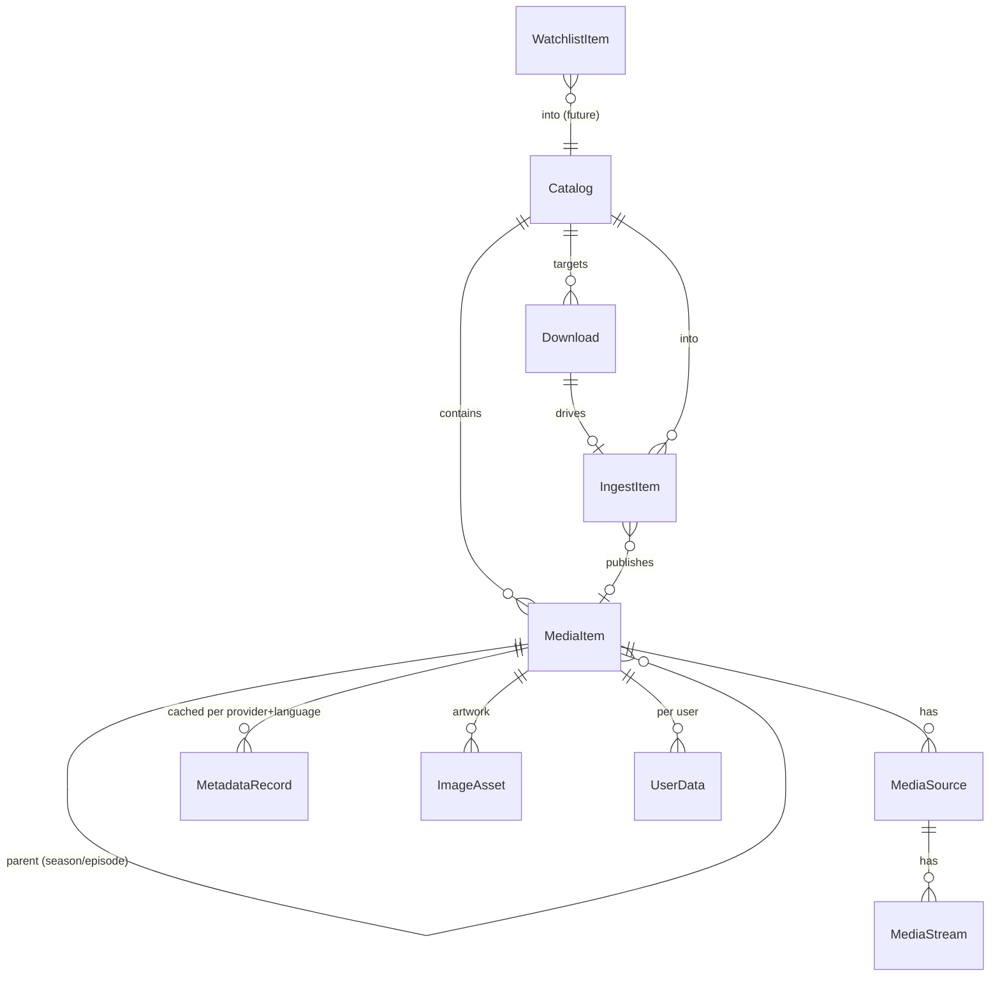

# Domain Model

## Description

This document specifies the persistent entities (EF Core over SQLite) and the
core extension contracts (`IPipelineStage`, `IMetadataProvider`, `IContentSource`)
plus the supporting service interfaces they depend on. It is the design reference
for M0–M1; signatures are illustrative C#, not final code.

Conventions:

- Internal keys are `Guid`. The Jellyfin-facing identifier is a separate stable
  string (`PublicId`) so client IDs survive rescans.
- Flexible/provider-shaped data is stored in **JSON columns** (SQLite JSON1 /
  EF Core JSON mapping), not in a document database (see
  [Storage and data](storage-and-data.md)).
- Catalogs are operator-managed at runtime → a DB table. Secrets and global
  toggles come from Hosty app settings/env, not the DB.

## Entity Overview



## Entities — Catalog & Media

**Catalog**

| Field | Type | Notes |
| --- | --- | --- |
| Id | Guid | PK |
| Name | string | "Movies 4K", "Anime" |
| Type | CatalogType | Movie \| Series |
| Root | string | host path; contains `files/` + `library/` (one filesystem) |
| NamingTemplate | string | e.g. `{Title} ({Year})` |
| DefaultKeepSeeding | bool | default seeding policy |
| MetadataLanguage | string? | optional override of `SUPPORTED_LANGUAGES` |
| CreatedAt / UpdatedAt | DateTime | |

**MediaItem** — unified, hierarchical (matches Jellyfin `BaseItem`)

| Field | Type | Notes |
| --- | --- | --- |
| Id | Guid | PK (internal) |
| PublicId | string | unique, **stable across rescans**, exposed to Jellyfin |
| CatalogId | Guid | FK |
| Kind | MediaKind | Movie \| Series \| Season \| Episode \| Video |
| ParentId | Guid? | self-FK (Season→Series, Episode→Season) |
| SeriesId / SeasonId | Guid? | denormalized for Jellyfin convenience |
| Title / OriginalTitle | string | |
| OriginalLanguage | string? | always stored, language-independent |
| Year | int? | |
| IndexNumber / ParentIndexNumber | int? | episode/season numbering |
| LibraryPath | string? | relative to catalog root; null for Series/Season containers |
| Providers | JSON | `{ "tmdb": "27205" }` provider dictionary |
| AddedAt / UpdatedAt | DateTime | |

`PublicId` is assigned once and re-resolved on rescan by `(CatalogId, relative
library path, Kind)`; the value persists even if the row id changes.

**MediaSource** (per playable item, from probe)

| Field | Type |
| --- | --- |
| Id | Guid (PK) |
| MediaItemId | Guid (FK) |
| Container / Path | string |
| SizeBytes / Bitrate | long / int? |
| DurationTicks | long |
| CreatedAt | DateTime |

**MediaStream** (per source)

| Field | Type | Notes |
| --- | --- | --- |
| Id / MediaSourceId | Guid | PK / FK |
| StreamType | enum | Video \| Audio \| Subtitle |
| Index / Codec / Profile / Language | mixed | |
| Width / Height / FrameRate / BitDepth / HdrFormat | nullable | video |
| Channels / SampleRate | nullable | audio |
| IsDefault / IsForced / IsExternal | bool | |
| ExternalPath | string? | external subtitles |

**MetadataRecord** — unique `(MediaItemId, Provider, Language)`

| Field | Type | Notes |
| --- | --- | --- |
| Id / MediaItemId | Guid | PK / FK |
| Provider / Language | string | e.g. `tmdb` / `ru-RU` |
| Title / Overview / Tagline | string | localized |
| Genres | JSON | |
| OfficialRating / CommunityRating | string? / double? | |
| ReleaseDate / RuntimeTicks | nullable | |
| Cast / Crew | JSON | kept as blob in v1 (normalize later if needed) |
| Raw | JSON | full provider payload |
| FetchedAt | DateTime | |

**ImageAsset**

| Field | Type | Notes |
| --- | --- | --- |
| Id / MediaItemId | Guid | PK / FK |
| ImageType | enum | Primary \| Backdrop \| Logo |
| Language | string? | language-tagged or null (neutral) |
| Provider / RemotePath | string | |
| LocalPath | string? | cached under app data dir |
| Tag | string | hash → Jellyfin `ImageTags` |
| SortOrder | int | |

## Entities — Acquisition & Pipeline

**Download** (torrent)

| Field | Type | Notes |
| --- | --- | --- |
| Id | Guid | PK |
| InfoHash / Name | string | |
| CatalogId | Guid | FK |
| SourceType | enum | Magnet \| File |
| State | DownloadState | see enums |
| Progress / DownloadSpeed / UploadSpeed / Ratio | numeric | |
| EtaSeconds | int? | |
| KeepSeeding | bool | per-torrent override of catalog default |
| SavePath | string | under `<catalog.root>/files/` |
| AddedAt / CompletedAt | DateTime / DateTime? | |

**IngestItem** (pipeline state machine — see [Automation pipeline](automation-pipeline.md))

| Field | Type | Notes |
| --- | --- | --- |
| Id | Guid | PK |
| CatalogId | Guid | FK |
| DownloadId | Guid? | null for future ACQ-originated items |
| MediaItemId | Guid? | set on publish |
| Stage | IngestStage | current stage |
| Status | IngestStatus | Pending \| Running \| NeedsReview \| Failed \| Done |
| AttemptCount | int | for retry/backoff |
| StagesCompleted | JSON | resume point on re-entry |
| ReviewCandidates | JSON? | provider candidates when NeedsReview |
| LastError | string? | |
| CreatedAt / UpdatedAt | DateTime | |

**Job** (observability for background work)

| Field | Type |
| --- | --- |
| Id | Guid (PK) |
| Type | string |
| RelatedType / RelatedId | string? / Guid? |
| Status / Progress / AttemptCount | enum / int / int |
| Error | string? |
| StartedAt / CompletedAt / UpdatedAt | DateTime? |

## Entities — Users & Playback

**MediaAccessCredential** (Infuse login, bound to a Host user)

| Field | Type | Notes |
| --- | --- | --- |
| Id | Guid | PK |
| HostyUserId | string | from scoped directory |
| Username | string | Hosty email |
| PinHash | string | hashed 4–8 digit PIN |
| FailedAttempts | int | lockout counter |
| LockedUntil | DateTime? | temporary lockout (after 10) |
| PermanentlyLocked | bool | after 100; cleared by regenerating |
| Revoked | bool | |
| CreatedAt / LastUsedAt | DateTime / DateTime? | |

**AccessToken** (Jellyfin session token)

| Field | Type |
| --- | --- |
| Id | Guid (PK) |
| TokenHash | string (unique) |
| HostyUserId / Client / Device / DeviceId | string |
| Revoked | bool |
| CreatedAt / LastUsedAt | DateTime / DateTime? |

**UserData** — composite PK `(HostyUserId, MediaItemId)`

| Field | Type |
| --- | --- |
| HostyUserId / MediaItemId | string / Guid (PK) |
| PlaybackPositionTicks | long |
| Played / IsFavorite | bool |
| PlayCount | int |
| PlayedPercentage / Rating | double? |
| LastPlayedDate | DateTime? |

**PlaybackSession**

| Field | Type |
| --- | --- |
| Id / PlaySessionId | Guid / string |
| HostyUserId / DeviceId | string |
| MediaItemId / MediaSourceId | Guid / Guid? |
| PositionTicks | long |
| StartedAt / LastProgressAt | DateTime |

## Entities — Discovery (future, M5)

**WatchlistItem**: Id, Providers (JSON), Type, CatalogId (FK), Monitored,
Quality (JSON preferences), CreatedAt.
**ContentSourceConfig**: Id, Name, Type, Config (JSON incl. secrets), Enabled.

## Enums

```csharp
enum CatalogType { Movie, Series }
enum MediaKind { Movie, Series, Season, Episode, Video }
enum DownloadState { Queued, Downloading, Completed, Seeding, StoppedSeeding, Stopped, Error }
enum IngestStage { Intake, Download, Organize, Identify, Probe, Enrich, Publish }
enum IngestStatus { Pending, Running, NeedsReview, Failed, Done }
enum StreamType { Video, Audio, Subtitle }
enum ImageType { Primary, Backdrop, Logo }
```

## Contract: IPipelineStage

The pipeline is an ordered set of stages over a shared mutable context. New
stages (including acquisition stages) implement the same contract and are inserted
without changing existing ones.

```csharp
public interface IPipelineStage
{
    string Key { get; }            // "download", "organize", "identify", ...
    IngestStage Stage { get; }     // ordered position

    // Idempotency guard: false if already satisfied (skip without side effects).
    bool ShouldRun(IngestContext ctx);

    Task<StageResult> RunAsync(IngestContext ctx, CancellationToken ct);
}

public sealed class IngestContext
{
    public IngestItem Item { get; init; }
    public Catalog Catalog { get; init; }
    public Download? Download { get; init; }
    public CatalogPaths Paths { get; init; }        // resolved files/ and library/
    public IServiceProvider Services { get; init; } // resolve IOrganizer, probe, providers
    public IProgressReporter Progress { get; init; }// emits Job events
}

public abstract record StageResult
{
    public sealed record Completed : StageResult;
    public sealed record NeedsReview(string Reason, IReadOnlyList<MetadataCandidate> Candidates) : StageResult;
    public sealed record Deferred(TimeSpan RetryAfter) : StageResult;   // transient; reconciler retries
    public sealed record Failed(string Error, bool Retryable) : StageResult;
}
```

The orchestrator advances `IngestItem.Stage`/`Status`, records `StagesCompleted`,
applies backoff on `Deferred`/retryable `Failed`, and parks `NeedsReview` items
for manual match override.

## Contract: IMetadataProvider

```csharp
public interface IMetadataProvider
{
    string Key { get; }   // "tmdb"

    Task<IReadOnlyList<MetadataCandidate>> SearchAsync(
        MediaQuery query, CancellationToken ct);

    // Fetch all requested languages in as few calls as possible
    // (e.g. TMDb /translations); returns one record per language.
    Task<IReadOnlyList<ProviderMetadata>> FetchAsync(
        ProviderRef reference, IReadOnlyList<string> languages, CancellationToken ct);

    Task<IReadOnlyList<RemoteImage>> GetImagesAsync(
        ProviderRef reference, IReadOnlyList<string> languages, CancellationToken ct);
}

public record MediaQuery(MediaKind Kind, string Title, int? Year,
                         int? Season = null, int? Episode = null);
public record ProviderRef(string Provider, string Id);
public record MetadataCandidate(ProviderRef Reference, string Title, int? Year, double Score);
public record ProviderMetadata(ProviderRef Reference, string Language, /* fields */ string Raw);
public record RemoteImage(ImageType Type, string? Language, string RemotePath, int SortOrder);
```

Identify uses `SearchAsync` + scoring (auto-match vs review threshold); enrich uses
`FetchAsync`/`GetImagesAsync` to populate `MetadataRecord` and `ImageAsset` keyed
by `provider + language`. See [Metadata](metadata.md).

## Contract: IContentSource (future, M5)

Provider-agnostic (not Torznab-specific); each source is a custom implementation.

```csharp
public interface IContentSource
{
    string Key { get; }
    ContentSourceCapabilities Capabilities { get; }   // movie/series search, paging

    Task<IReadOnlyList<ReleaseCandidate>> SearchAsync(
        ReleaseQuery query, CancellationToken ct);
}

public record ReleaseQuery(MediaKind Kind, string Title, int? Year,
                           int? Season = null, int? Episode = null);

public record ReleaseCandidate(
    string Title, string DownloadUri,        // magnet or .torrent URL
    int? Year, int? Season, int? Episode,
    string? Resolution, string? Quality,
    long? SizeBytes, int? Seeders);
```

A matcher scores candidates against a `WatchlistItem` and quality preferences,
grabs the best (or queues for approval), and hands the result to the pipeline's
`Intake` stage. See [Watchlist and discovery](watchlist-and-discovery.md).

## Supporting Service Interfaces

```csharp
public interface ITorrentEngine          // MonoTorrent wrapper
{
    Task<Download> AddAsync(TorrentSource source, Catalog catalog, bool keepSeeding, CancellationToken ct);
    Task PauseAsync(Guid id, CancellationToken ct);
    Task ResumeAsync(Guid id, CancellationToken ct);
    Task StopSeedingAsync(Guid id, CancellationToken ct);
    Task RemoveAsync(Guid id, bool deleteFiles, CancellationToken ct);
    IObservable<DownloadUpdate> Updates { get; }   // → SignalR
}

public interface IOrganizer
{
    // Hardlink selected media from files/ into library/ (see torrents-and-organizer).
    Task<IReadOnlyList<OrganizedFile>> OrganizeAsync(Download download, Catalog catalog, CancellationToken ct);
    Task UnlinkSeedCopyAsync(Download download, CancellationToken ct);  // stop-seeding cleanup
}

public interface IMediaProbe
{
    Task<ProbeResult> ProbeAsync(string absolutePath, CancellationToken ct); // ffprobe → sources/streams
}

public interface ICatalogPathSandbox     // see file-directory-management / security
{
    bool TryResolve(Catalog catalog, string relativePath, out string absolutePath); // rejects traversal/escape
}
```

## Jellyfin Mapping Notes

- `Catalog` → `CollectionFolder` (`CollectionType` from `Type`).
- `MediaItem.Kind` → `Movie` / `Series` / `Season` / `Episode` / `Video`.
- `MediaItem.PublicId` → Jellyfin `Id`; `ParentId`/`SeriesId`/`SeasonId` map
  directly.
- `MetadataRecord` (selected language) + `ImageAsset.Tag` → `BaseItemDto` fields
  and `ImageTags`.
- `MediaSource`/`MediaStream` → `MediaSources[]`/`MediaStreams[]`.
- `UserData` → `BaseItemDto.UserData`.

## Testing Expectations

Backend tests use xUnit and Imposter. Required coverage:

- EF Core mapping for relational entities, JSON columns, composite keys, and the
  `MediaItem` self-hierarchy.
- `PublicId` stability across simulated rescans.
- `IPipelineStage` orchestration: ordering, `ShouldRun` idempotency, `StageResult`
  handling (Completed/NeedsReview/Deferred/Failed), backoff, and resume from
  `StagesCompleted`.
- `IMetadataProvider` multi-language fetch and candidate scoring (mock provider).
- `ICatalogPathSandbox` containment and traversal/symlink rejection.
- Credential lockout counters and token hashing.
