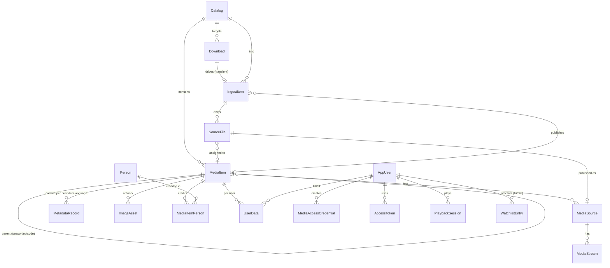

# Domain Model

Status: Implemented
Created: 2026-06-15
Updated: 2026-07-24

## Description

This document specifies the persistent entities (EF Core over SQLite) and the
core extension contracts (`IPipelineStage`, `IMetadataProvider`, `IContentSource`)
plus the supporting service interfaces they depend on. It is the design reference
for M0–M1; signatures are illustrative C#, not final code.

Conventions:

- Internal keys are `Guid`. The Jellyfin-facing identifier is a separate stable
  string (`PublicId`) so client IDs survive rescans.
- Matched media identity is based on a catalog plus a canonical provider
  reference, not on the library path. For movies this is
  `CatalogId + provider movie ref`; for episodes this is
  `CatalogId + provider series ref + season + episode`.
- Hosty users are represented by internal `AppUser` rows. Application data links
  to `AppUser.Id`; Hosty user id and email are external identity attributes that
  can be refreshed or re-linked.
- Flexible/provider-shaped data is stored in **JSON columns** (SQLite JSON1 /
  EF Core JSON mapping), not in a document database (see
  [Storage and data](storage-and-data.md)).
- Catalogs are operator-managed at runtime → a DB table. Secrets and global
  toggles come from Hosty app settings/env, not the DB.

## Entity Overview



## Entities — Catalog & Media

**Catalog**

| Field | Type | Notes |
| --- | --- | --- |
| Id | Guid | PK |
| Name | string | "Movies 4K", "Anime" |
| Type | CatalogType | Movie \| Series \| Anime |
| Root | string | host path; holds `.incoming/` + canonical media (one filesystem) |
| NamingTemplate | string | e.g. `{Title} ({Year})` |
| DefaultKeepSeeding | bool | default seeding policy |
| MetadataLanguage | string? | optional override of `SUPPORTED_LANGUAGES` |
| CreatedAt / UpdatedAt | DateTime | |

**MediaItem** — unified, hierarchical (matches Jellyfin `BaseItem`)

| Field | Type | Notes |
| --- | --- | --- |
| Id | Guid | PK (internal) |
| PublicId | string | unique, **stable across rescans**, exposed to Jellyfin |
| CatalogId | Guid | FK |
| Kind | MediaKind | Movie \| Series \| Season \| Episode \| Video |
| ParentId | Guid? | self-FK (Season→Series, Episode→Season) |
| SeriesId / SeasonId | Guid? | denormalized for Jellyfin convenience |
| Title / OriginalTitle | string | |
| OriginalLanguage | string? | always stored, language-independent |
| Year | int? | |
| IndexNumber / IndexNumberEnd / ParentIndexNumber | int? | episode/season numbering; `IndexNumberEnd` set when one file holds two consecutive episodes |
| LibraryPath | string? | relative to catalog root; null for Series/Season containers |
| IdentityProvider | string? | canonical provider, e.g. `tmdb` |
| IdentityProviderId | string? | movie id or series/show id from the canonical provider |
| IdentitySeasonNumber / IdentityEpisodeNumber | int? | only for episode identity |
| Providers | JSON | `{ "tmdb": "27205" }` provider dictionary |
| AddedAt / UpdatedAt | DateTime | |

`PublicId` is generated from the stable identity key once a media item is matched:

- Movie: `CatalogId + IdentityProvider + IdentityProviderId`.
- Episode: `CatalogId + IdentityProvider + IdentityProviderId + season + episode`.
- Series and season containers derive from the same provider series identity.
- Unmatched videos use a temporary source-file fingerprint/path identity until
  the operator assigns a provider match.

The client-facing Jellyfin `Id` is a 32-character lowercase hex rendering derived
deterministically from the canonical identity key (Jellyfin's `Guid` shape), so
strict clients accept it while it stays stable across rescans.

Additional providers are stored as aliases in `Providers` and do not change the
canonical identity automatically. If a user explicitly remaps a file from one
movie/episode to another, the media source moves to the target item and the
Jellyfin item id changes only when the canonical target identity changes.

Because `PublicId` embeds `CatalogId`, **moving an item to another catalog**
re-mints it (the Jellyfin id changes; clients re-sync). The internal `Id` is
preserved on a re-point, so `UserData` and cached metadata survive the move; a merge
into an existing target item folds the sources in and prunes the source row instead.
See [File and directory management](file-directory-management.md#move-semantics).

Unmatched videos are not exposed to Jellyfin clients — their temporary identity
stays internal to the review queue and admin UI — so a client-visible `PublicId`
is assigned once, at publish, and is stable thereafter. First identification fills
identity on the **same** `MediaItem` row, so the internal `Id` (and the `UserData`
keyed to it) survives the `PublicId` change. The client-visible id therefore
changes only on an operator remap to a *different* canonical title, where the
change is intended; clients re-sync `UserData` from the server on refresh.

**MediaSource** (one per playable file, from probe; an item with alternate versions has several)

| Field | Type |
| --- | --- |
| Id | Guid (PK) |
| MediaItemId | Guid (FK) |
| SourceFileId | Guid? (FK) |
| VersionName | string? (version-picker label, e.g. "Black & White"; null for single-source items; kept in sync with the filename's ` - {edition}` suffix — editing it renames the file) |
| Container / Path | string |
| SizeBytes / Bitrate | long / int? |
| DurationTicks | long |
| CreatedAt | DateTime |

**MediaStream** (per source)

| Field | Type | Notes |
| --- | --- | --- |
| Id / MediaSourceId | Guid | PK / FK |
| StreamType | enum | Video \| Audio \| Subtitle |
| Index / Codec / Profile / Language | mixed | |
| Width / Height / FrameRate / BitDepth / HdrFormat | nullable | video |
| Channels / SampleRate | nullable | audio |
| IsDefault / IsForced / IsExternal | bool | |
| ExternalPath | string? | external subtitles |

**MetadataRecord** — unique `(MediaItemId, Provider, Language)`

| Field | Type | Notes |
| --- | --- | --- |
| Id / MediaItemId | Guid | PK / FK |
| Provider / Language | string | e.g. `tmdb` / `ru-RU` |
| Title / Overview / Tagline | string | localized |
| Genres | JSON | |
| OfficialRating / CommunityRating | string? / double? | |
| ReleaseDate / RuntimeTicks | nullable | |
| Cast / Crew | JSON | retained blob; people are normalized into `Person`/`MediaItemPerson`. Detail **cast** is read from the join (each member carries a stable person id); crew/directors still project from `Raw` |
| Raw | JSON | full provider payload |
| FetchedAt | DateTime | |

**ImageAsset**

| Field | Type | Notes |
| --- | --- | --- |
| Id / MediaItemId | Guid | PK / FK |
| ImageType | enum | Primary \| Backdrop \| Logo |
| Language | string? | language-tagged or null (neutral) |
| Provider / RemotePath | string | |
| LocalPath | string? | cached under app data dir |
| Tag | string | hash → Jellyfin `ImageTags` |
| SortOrder | int | |

**Person** — one cast/crew member, deduped across the whole library by provider identity `(Provider, ProviderId)`

| Field | Type | Notes |
| --- | --- | --- |
| Id | Guid | PK (internal) |
| Provider / ProviderId | string | dedup key, e.g. `tmdb` / TMDb person id as string |
| Name | string | |
| ProfilePath | string? | raw provider profile path; null when no photo |
| ProfileUrl | string? | absolute, ready-to-render image URL derived from `ProfilePath` |
| Biography | string? | from a person-detail fetch; not in media credits |
| KnownForDepartment | string? | provider's "known for", e.g. `Acting` |
| Birthday / Deathday | string? | provider date strings (e.g. `1974-11-11`); from a person-detail fetch |
| PlaceOfBirth | string? | from a person-detail fetch |
| DetailsFetchedAt | DateTimeOffset? | when the person-detail fetch last ran; drives the lazy/staleness refresh, distinct from `UpdatedAt` (which credit syncs also bump) |
| UpdatedAt | DateTimeOffset | |

The credits payload carries only name/profile/known-for; `Biography`,
`Birthday`/`Deathday`, and `PlaceOfBirth` come from a separate person-detail
fetch (`/person/{id}`) done lazily the first time a person page is viewed and
refreshed on a staleness window keyed off `DetailsFetchedAt`.

A `Person` is **shared** across every item it is credited on; per-item credit
details live on the join, not here. Enrich upserts people by `(Provider,
ProviderId)` and never duplicates a person per item. See [Metadata](metadata.md).

**MediaItemPerson** — credit join linking a `Person` to a `MediaItem`

| Field | Type | Notes |
| --- | --- | --- |
| Id | Guid | PK |
| MediaItemId | Guid | FK |
| PersonId | Guid | FK |
| Role | PersonRole | Cast \| Crew |
| Character | string? | portrayed character; set for `Cast` rows |
| Job | string? | crew job, e.g. `Director`; set for `Crew` rows |
| Department | string? | crew department, e.g. `Directing`; set for `Crew` rows |
| Order | int | billing/display order within the item (provider billing order for cast) |

One person can have several rows for the same item (e.g. an actor who also
directed): a `Cast` row carrying the `Character` plus a `Crew` row carrying the
`Job`. Enrich replaces an item's credits wholesale on each refetch, so the set
converges to the latest payload while the shared `Person` rows outlive it.

## Entities — Acquisition & Pipeline

**Download** (torrent)

| Field | Type | Notes |
| --- | --- | --- |
| Id | Guid | PK |
| InfoHash / Name | string | |
| CatalogId | Guid | FK |
| SourceType | enum | Magnet \| File |
| State | DownloadState | persisted; transitions trigger pipeline actions |
| KeepSeeding | bool | per-torrent override of catalog default |
| SavePath | string | transient staging dir, `<catalog.root>/.incoming/<downloadId>/` |
| AddedAt / CompletedAt | DateTime / DateTime? | |

A `Download` is **transient**: it backs a torrent ingest only until the
download→identify hand-off drops it. Live progress, download/upload speed, ratio,
and ETA are **not persisted**. The torrent engine reports them in memory and
broadcasts them over the realtime stream; only state transitions are written to
the database, and a transition (e.g. Completed) is what triggers downstream
pipeline actions. See
[Storage and data](storage-and-data.md) and [Background tasks](background-tasks.md).

**SourceFile** (one playable file flowing through an ingest)

| Field | Type | Notes |
| --- | --- | --- |
| Id | Guid | PK |
| IngestItemId | Guid | FK — durable owner for the file's whole lifetime |
| DownloadId | Guid? | transient torrent; null for scan files and after the hand-off |
| RelativePath | string | catalog-root-relative current path (`.incoming/<id>/…` then canonical) |
| TorrentFileIndex | int? | index in the torrent file list, when available |
| Edition | string? | version label when several files map to one item (e.g. "Black & White"); null otherwise. Set by organize, carried to `MediaSource.VersionName` |
| SizeBytes | long | |
| ContentHash | string? | optional fingerprint for unmatched identity/reconciliation |
| MediaItemId | Guid? | assigned movie or episode |
| AssignmentStatus | enum | Unassigned \| Suggested \| Confirmed \| NeedsReview |
| CreatedAt / UpdatedAt | DateTime | |

Each playable media file eventually maps to exactly one movie or one episode.
Remapping changes the `SourceFile -> MediaItem` assignment and **moves** the
canonical file to the new naming (an atomic rename, no hardlink rebuild).

**IngestItem** (pipeline state machine — see [Automation pipeline](automation-pipeline.md))

| Field | Type | Notes |
| --- | --- | --- |
| Id | Guid | PK |
| CatalogId | Guid | FK |
| DownloadId | Guid? | transient; null for scan-imported items and after the download→identify hand-off |
| MediaItemId | Guid? | set on publish |
| Stage | IngestStage | current stage |
| Status | IngestStatus | Pending \| Running \| NeedsReview \| Failed \| Done |
| AttemptCount | int | for retry/backoff |
| StagesCompleted | JSON | resume point on re-entry |
| LeaseOwner / LeaseUntil | string? / DateTime? | single-flight claim so only one worker drives an item at a time |
| RowVersion | byte[] | optimistic concurrency token |
| ReviewCandidates | JSON? | provider candidates when NeedsReview |
| LastError | string? | |
| CreatedAt / UpdatedAt | DateTime | |

**Job** (observability for background work)

| Field | Type |
| --- | --- |
| Id | Guid (PK) |
| Type | string |
| RelatedType / RelatedId | string? / Guid? |
| Status / Progress / AttemptCount | enum / int / int |
| Error | string? |
| StartedAt / CompletedAt / UpdatedAt | DateTime? |

## Entities — Users & Playback

**AppUser** (internal user linked to Hosty)

| Field | Type | Notes |
| --- | --- | --- |
| Id | Guid | PK; used by Media Server data |
| HostyUserId | string | current Hosty user id from Core |
| Email | string? | normalized email for display and possible re-linking |
| DisplayName | string | |
| Role | UserRole | Admin \| User |
| Enabled | bool | false when Core no longer assigns/allows the user |
| CreatedAt / UpdatedAt / LastSeenAt | DateTime | |

On UI login, Media Server upserts an `AppUser` by `HostyUserId`. If no row is
found and the email uniquely matches an existing row, the app may re-link that
row to the new Hosty id. This mirrors the Host-backed user pattern already used
by other Hosty runtime apps.

**MediaAccessCredential** (Infuse login, bound to an internal app user)

| Field | Type | Notes |
| --- | --- | --- |
| Id | Guid | PK |
| AppUserId | Guid | internal user |
| Username | string | Hosty email |
| PinHash | string | hashed 6–8 digit PIN |
| FailedAttempts | int | lockout counter |
| LockedUntil | DateTime? | temporary lockout (after 10) |
| PermanentlyLocked | bool | after 100; cleared by regenerating |
| Revoked | bool | |
| CreatedAt / LastUsedAt | DateTime / DateTime? | |

**AccessToken** (Jellyfin session token)

| Field | Type |
| --- | --- |
| Id | Guid (PK) |
| TokenHash | string (unique) |
| AppUserId / Client / Device / DeviceId | Guid / string |
| Revoked | bool |
| CreatedAt / LastUsedAt | DateTime / DateTime? |

**UserData** — composite PK `(AppUserId, MediaItemId)`

| Field | Type |
| --- | --- |
| AppUserId / MediaItemId | Guid / Guid (PK) |
| PlaybackPositionTicks | long |
| Played / IsFavorite | bool |
| PlayCount | int |
| PlayedPercentage / Rating | double? |
| LastPlayedDate | DateTime? |

**PlaybackSession**

| Field | Type |
| --- | --- |
| Id / PlaySessionId | Guid / string |
| AppUserId / DeviceId | Guid / string |
| MediaItemId / MediaSourceId | Guid / Guid? |
| PositionTicks | long |
| StartedAt / LastProgressAt | DateTime |

## Entities — Discovery (future, M5)

The near-term **release-tracking** slice splits this reserved `WatchlistItem`
sketch into a global title/schedule part (`TrackedTitle`, `TrackedRelease`) and a
per-user subscription part (`WatchlistEntry`, `ReleaseReminder`,
`ReminderDelivery`); its `CatalogId`
and `Quality` fields move to the deferred acquisition layer. See
[Release tracking](release-tracking.md) for those entities.

**WatchlistItem** *(superseded by the release-tracking split above)*: Id,
Providers (JSON), Type, CatalogId (FK), Monitored, Quality (JSON preferences),
CreatedAt.
**ContentSourceConfig** *(acquisition)*: Id, Name, Type, Config (JSON without raw
secrets), SecretRefs (JSON references to Hosty-managed secrets), Enabled.

## Enums

```csharp
enum CatalogType { Movie, Series, Anime }
enum MediaKind { Movie, Series, Season, Episode, Video }
enum DownloadState { Queued, Downloading, Completed, Seeding, StoppedSeeding, Stopped, Error }
enum IngestStage { Intake, Identify, Download, Organize, Probe, Enrich, Publish }
enum IngestStatus { Pending, Running, NeedsReview, Failed, Done }
enum PipelinePhase { Acquisition, Processing }
enum StreamType { Video, Audio, Subtitle }
enum ImageType { Primary, Backdrop, Logo }
enum PersonRole { Cast, Crew }
enum SourceFileAssignmentStatus { Unassigned, Suggested, Confirmed, NeedsReview }
enum UserRole { Admin, User }
```

## Contract: IPipelineStage

The pipeline is an ordered set of stages over a shared mutable context. New
stages (including acquisition stages) implement the same contract and are inserted
without changing existing ones.

```csharp
public interface IPipelineStage
{
    string Key { get; }            // "intake", "identify", "download", ...
    PipelinePhase Phase { get; }   // Processing (v1) | Acquisition (M5)
    int Order { get; }             // global order; acquisition stages sort before Intake

    // Idempotency guard: false if already satisfied (skip without side effects).
    bool ShouldRun(IngestContext ctx);

    Task<StageResult> RunAsync(IngestContext ctx, CancellationToken ct);
}

public sealed class IngestContext
{
    public IngestItem Item { get; init; }
    public Catalog Catalog { get; init; }
    public Download? Download { get; init; }
    public IReadOnlyList<SourceFile> SourceFiles { get; init; }
    public CatalogPaths Paths { get; init; }        // resolved root + .incoming/ staging
    public IServiceProvider Services { get; init; } // resolve IOrganizer, probe, providers
    public IProgressReporter Progress { get; init; }// emits Job events
}

public abstract record StageResult
{
    public sealed record Completed : StageResult;
    public sealed record NeedsReview(string Reason, IReadOnlyList<MetadataCandidate> Candidates) : StageResult;
    public sealed record Deferred(TimeSpan RetryAfter) : StageResult;   // transient; reconciler retries
    public sealed record Failed(string Error, bool Retryable) : StageResult;
}
```

The orchestrator advances `IngestItem.Stage`/`Status`, records `StagesCompleted`,
applies backoff on `Deferred`/retryable `Failed`, and parks `NeedsReview` items
for manual match override. It claims an item via `LeaseOwner`/`LeaseUntil` and
uses the `RowVersion` token to detect concurrent edits, so the reconciler and
operator actions never double-drive the same item.

`IngestStage` enumerates the v1 **processing** stages and is the persisted
`IngestItem.Stage`. Acquisition stages (M5) implement the same `IPipelineStage`
contract but are ordered before `Intake` via `Order` and operate on
watchlist/release entities — they do not extend `IngestStage`, because an
`IngestItem` only exists once acquisition hands a torrent to `Intake`. Stage
ordering therefore lives on the stage (`Phase` + `Order`), not in the
processing-only `IngestStage` enum.

## Contract: IMetadataProvider

```csharp
public interface IMetadataProvider
{
    string Key { get; }   // "tmdb"

    Task<IReadOnlyList<MetadataCandidate>> SearchAsync(
        MediaQuery query, CancellationToken ct);

    // Fetch all requested languages in as few calls as possible
    // (e.g. TMDb /translations); returns one record per language.
    Task<IReadOnlyList<ProviderMetadata>> FetchAsync(
        ProviderRef reference, IReadOnlyList<string> languages, CancellationToken ct);

    Task<IReadOnlyList<RemoteImage>> GetImagesAsync(
        ProviderRef reference, IReadOnlyList<string> languages, CancellationToken ct);
}

public record MediaQuery(MediaKind Kind, string Title, int? Year,
                         int? Season = null, int? Episode = null);
public record ProviderRef(string Provider, string Id);
public record MetadataCandidate(ProviderRef Reference, string Title, int? Year, double Score);
public record ProviderMetadata(ProviderRef Reference, string Language, /* fields */ string Raw);
public record RemoteImage(ImageType Type, string? Language, string RemotePath, int SortOrder);
```

Identify uses `SearchAsync` + scoring (auto-match vs review threshold); enrich uses
`FetchAsync`/`GetImagesAsync` to populate `MetadataRecord` and `ImageAsset` keyed
by `provider + language`. See [Metadata](metadata.md).

## Contract: IContentSource (future, M5)

Provider-agnostic (not Torznab-specific); each source is a custom implementation.

```csharp
public interface IContentSource
{
    string Key { get; }
    ContentSourceCapabilities Capabilities { get; }   // movie/series search, paging

    Task<IReadOnlyList<ReleaseCandidate>> SearchAsync(
        ReleaseQuery query, CancellationToken ct);
}

public record ReleaseQuery(MediaKind Kind, string Title, int? Year,
                           int? Season = null, int? Episode = null);

public record ReleaseCandidate(
    string Title, string DownloadUri,        // magnet or .torrent URL
    int? Year, int? Season, int? Episode,
    string? Resolution, string? Quality,
    long? SizeBytes, int? Seeders);
```

A matcher scores candidates against a `WatchlistItem` and quality preferences,
grabs the best (or queues for approval), and hands the result to the pipeline's
`Intake` stage. See [Watchlist and discovery](watchlist-and-discovery.md).

## Supporting Service Interfaces

```csharp
public interface ITorrentEngine          // external torrent-engine app client (or disabled stub)
{
    Task<Download> AddAsync(TorrentSource source, Catalog catalog, bool keepSeeding, CancellationToken ct);
    Task PauseAsync(Guid id, CancellationToken ct);
    Task ResumeAsync(Guid id, CancellationToken ct);
    Task StopSeedingAsync(Guid id, CancellationToken ct);
    Task RemoveAsync(Guid id, bool deleteFiles, CancellationToken ct);
    // Removes an in-flight download (before the hand-off): drops the torrent and
    // its .incoming/ staging data. Published items have no download — their
    // removal is a library concern. See torrents-and-organizer Removal Semantics.
    IObservable<DownloadUpdate> Updates { get; }   // → realtime stream
}

public interface IOrganizer
{
    // Move confirmed media from .incoming/ (or wherever a scanned file sits) into
    // the canonical layout at the catalog root — an atomic rename, no hardlinks
    // (see torrents-and-organizer).
    Task<IReadOnlyList<OrganizedFile>> OrganizeAsync(
        IReadOnlyList<SourceFile> sourceFiles,
        Catalog catalog,
        CancellationToken ct);
}

public interface IMediaProbe
{
    Task<ProbeResult> ProbeAsync(string absolutePath, CancellationToken ct); // ffprobe → sources/streams
}

public interface ICatalogPathSandbox     // see file-directory-management / security
{
    bool TryResolve(Catalog catalog, string relativePath, out string absolutePath); // rejects traversal/escape
}
```

## Jellyfin Mapping Notes

- `Catalog` → `CollectionFolder` (`CollectionType` from `Type`).
- `MediaItem.Kind` → `Movie` / `Series` / `Season` / `Episode` / `Video`.
- `MediaItem.PublicId` → Jellyfin `Id`; `ParentId`/`SeriesId`/`SeasonId` map
  directly.
- `MetadataRecord` (selected language) + `ImageAsset.Tag` → `BaseItemDto` fields
  and `ImageTags`.
- `MediaSource`/`MediaStream` → `MediaSources[]`/`MediaStreams[]`.
- `UserData` → `BaseItemDto.UserData`.

## Testing Expectations

Backend tests use xUnit and Imposter. Required coverage:

- EF Core mapping for relational entities, JSON columns, composite keys, and the
  `MediaItem` self-hierarchy.
- `PublicId` stability from canonical provider identity across simulated rescans.
- Internal `AppUser` upsert, Hosty id refresh, unique email re-linking, and role
  mapping from Hosty admin/user status.
- Source-file assignment and remapping for movies, single episodes, and season
  packs.
- `IPipelineStage` orchestration: ordering, `ShouldRun` idempotency, `StageResult`
  handling (Completed/NeedsReview/Deferred/Failed), backoff, and resume from
  `StagesCompleted`.
- `IMetadataProvider` multi-language fetch and candidate scoring (mock provider).
- `ICatalogPathSandbox` containment and traversal/symlink rejection.
- Credential lockout counters and token hashing.

## Links

- [Watch-history calendar idea](../ideas/watch-history-calendar.md)
