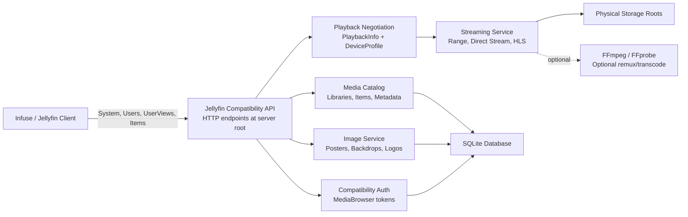
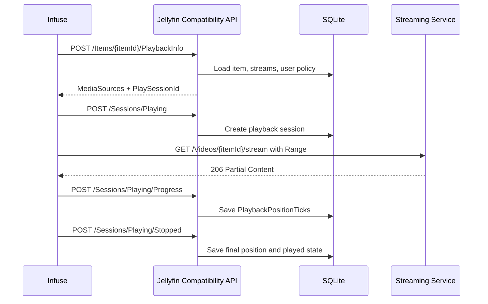

# Jellyfin-Compatible Streaming

## Description

Media Server exposes a Jellyfin-compatible HTTP API subset so clients such as
Infuse can browse libraries, fetch metadata and artwork, direct play media, and
synchronize playback progress.

This is a compatibility layer. Media Server is not intended to become a full
Jellyfin server replacement. The implementation should prioritize the subset
required by Infuse and other Jellyfin clients for movie and TV playback.

Protocol references:

- Jellyfin stable OpenAPI: https://api.jellyfin.org/openapi/
- Jellyfin codec and streaming behavior: https://jellyfin.org/docs/general/clients/codec-support/
- Jellyfin networking and discovery: https://jellyfin.org/docs/general/post-install/networking/
- Infuse media server integration behavior: https://support.firecore.com/hc/en-us/articles/360006462093-Streaming-from-Plex-Emby-and-Jellyfin

## Goals

- Allow Infuse to connect using the Jellyfin integration with a direct server login.
- Expose libraries, movie metadata, series metadata, episode metadata, posters,
  backdrops, and search results using Jellyfin-shaped DTOs.
- Prefer Direct Play and Direct Stream for Apple clients.
- Support HTTP range requests for seeking and high-bitrate playback.
- Synchronize watched state and playback position into the Media Server database.
- Keep all file access constrained to configured media libraries and storage roots.

## Non-Goals for Initial Compatibility

- Full Jellyfin administration API.
- Live TV, DVR, music, photos, books, plugins, collections, playlists, and remote control features.
- DLNA support.
- Full on-the-fly video transcoding in the first milestone.
- Exposing raw filesystem paths to remote clients.

## Compatibility Architecture



The compatibility API should be mounted at the same route shape expected by
Jellyfin clients. These routes intentionally do not use the internal `/api/*`
prefix.

Example routes:

- `/System/Info/Public`
- `/Users/AuthenticateByName`
- `/UserViews`
- `/Items`
- `/Videos/{itemId}/stream`

## Required Endpoints

Server discovery and health:

- `GET /System/Ping`
- `GET /System/Info/Public`
- `GET /System/Info`

Authentication and sessions:

- `POST /Users/AuthenticateByName`
- `GET /Users/Me`
- `POST /Sessions/Logout`
- `POST /Sessions/Capabilities`
- `POST /Sessions/Capabilities/Full`

Libraries and browsing:

- `GET /UserViews`
- `GET /Items`
- `GET /Items/{itemId}`
- `GET /Items/Latest`
- `GET /Items/Counts`
- `GET /Search/Hints`

Artwork:

- `GET /Items/{itemId}/Images/{imageType}`
- `HEAD /Items/{itemId}/Images/{imageType}`
- `GET /Items/{itemId}/Images/{imageType}/{imageIndex}`

Playback negotiation and streaming:

- `GET /Items/{itemId}/PlaybackInfo`
- `POST /Items/{itemId}/PlaybackInfo`
- `GET /Videos/{itemId}/stream`
- `HEAD /Videos/{itemId}/stream`
- `GET /Videos/{itemId}/stream.{container}`
- `HEAD /Videos/{itemId}/stream.{container}`
- `GET /Videos/{itemId}/master.m3u8`
- `GET /Videos/{itemId}/main.m3u8`
- `GET /Videos/{itemId}/hls/{playlistId}/stream.m3u8`
- `GET /Videos/{itemId}/hls/{playlistId}/{segmentId}.{segmentContainer}`
- `GET /Videos/{itemId}/{mediaSourceId}/Subtitles/{index}/Stream.{format}`

Playback state:

- `POST /Sessions/Playing`
- `POST /Sessions/Playing/Progress`
- `POST /Sessions/Playing/Stopped`
- `GET /UserItems/{itemId}/UserData`
- `POST /UserItems/{itemId}/UserData`
- `POST /UserPlayedItems/{itemId}`
- `DELETE /UserPlayedItems/{itemId}`
- `POST /UserFavoriteItems/{itemId}`
- `DELETE /UserFavoriteItems/{itemId}`
- `POST /UserItems/{itemId}/Rating`
- `DELETE /UserItems/{itemId}/Rating`

## Authentication Model

Jellyfin-compatible clients send client and device metadata in a
MediaBrowser-style authorization header.

The server should accept:

- `Authorization: MediaBrowser Client="...", Device="...", DeviceId="...", Version="...", Token="..."`
- `X-Emby-Authorization: MediaBrowser Client="...", Device="...", DeviceId="...", Version="..."`
- `X-Emby-Token: <token>`
- `api_key=<token>` only for Jellyfin-compatible media and image URLs commonly
  opened without custom request headers.

`POST /Users/AuthenticateByName` validates against the Media Server user store
and returns a Jellyfin-shaped `AuthenticationResult`:

```json
{
  "User": {
    "Id": "{userId}",
    "Name": "alex",
    "ServerId": "{serverId}"
  },
  "AccessToken": "{opaque-token}",
  "ServerId": "{serverId}",
  "SessionInfo": {
    "Id": "{sessionId}",
    "UserId": "{userId}",
    "Client": "Infuse",
    "DeviceId": "{deviceId}"
  }
}
```

Tokens must be opaque, hashed at rest, scoped to a user and device, revocable
through `/Sessions/Logout`, and redacted from logs. Query-string token support
should be restricted to compatibility endpoints and must not be accepted by
internal administrative APIs.

## Discovery

Manual server entry must work first through the HTTP endpoints. Local network
auto-discovery can be added as a separate hosted service that listens on
`7359/UDP` and returns the published server name, address, and server ID.

Discovery must be configurable because UDP discovery only works on the local
subnet and requires explicit Docker host and port setup.

## Media Model Mapping

The internal media catalog maps to Jellyfin DTOs with stable IDs:

- Movie library maps to `CollectionFolder` with `CollectionType = "movies"`.
- TV library maps to `CollectionFolder` with `CollectionType = "tvshows"`.
- Movie maps to `Movie`.
- Series maps to `Series`.
- Season maps to `Season`.
- Episode maps to `Episode`.
- Standalone file without metadata maps to `Video`.

IDs exposed to clients must remain stable across rescans. The scanner should
persist a public item ID separately from physical path, TMDb ID, or database row
identity when needed.

`BaseItemDto` responses should include at least:

- `Id`, `Name`, `Type`, and `ServerId`.
- `ParentId`, `SeriesId`, and `SeasonId` where applicable.
- `ProductionYear`, `PremiereDate`, and `RunTimeTicks`.
- `Overview`, `Genres`, `OfficialRating`, and `CommunityRating`.
- `ImageTags`, `BackdropImageTags`, and `PrimaryImageAspectRatio`.
- `UserData` with `PlaybackPositionTicks`, `Played`, `IsFavorite`, and `PlayedPercentage`.
- `MediaSources` for playable items when requested by `fields=MediaSources`.

## Media Probing

The scanner should run FFprobe or an equivalent parser for each playable video
file and persist:

- Container, size, duration, bitrate, video codec, codec profile, width, height,
  frame rate, bit depth, HDR metadata, and pixel format.
- Audio streams with codec, language, channels, bitrate, sample rate, default
  and forced flags.
- Subtitle streams with codec, language, text or picture type, external path,
  default and forced flags.
- Chapters and trickplay metadata when available.

This data is required to build accurate `MediaSourceInfo` and `MediaStream`
objects for Jellyfin clients.

## Playback Negotiation

`GET /Items/{itemId}/PlaybackInfo` and `POST /Items/{itemId}/PlaybackInfo`
return a Jellyfin-shaped `PlaybackInfoResponse` with one or more `MediaSources`
and a `PlaySessionId`.

Initial behavior:

- If the item is a local file and the user is allowed to stream it, return a
  direct stream source.
- Respect `EnableDirectPlay`, `EnableDirectStream`, and `EnableTranscoding`
  request flags.
- Include media stream indexes so clients can select audio and subtitle tracks.
- Do not return raw host filesystem paths.
- Use item IDs, media source IDs, and HTTP playback URLs.
- Return a compatible error code when the item is unavailable, still scanning,
  outside the user's policy, or not playable.

Direct playback should be the default for Infuse. HLS or remux/transcode should
only be selected when the client asks for it, when direct stream is disabled, or
when direct stream is impossible.

## Direct Streaming

The direct streaming endpoint serves the original file with:

- `GET` and `HEAD` support.
- `Range` and `If-Range` request support.
- `206 Partial Content`.
- `Accept-Ranges`, `Content-Range`, `Content-Length`, `ETag`, `Last-Modified`,
  and stable content type headers.
- Cancellation when the client disconnects.
- No buffering of whole files in memory.

Supported direct containers should initially include:

- `.mp4`, `.m4v`, and `.mov`.
- `.mkv`.
- `.webm`.
- `.avi`.
- `.ts` and `.m2ts`.

The endpoint must validate that the requested item resolves to a file inside an
attached storage root and that the authenticated user can access the library.

## HLS, Remuxing, and Transcoding

HLS support should be staged:

1. Direct stream only.
2. Remux-only HLS using FFmpeg stream copy when the codecs are compatible but
   the container is not ideal for the client.
3. Full audio/video transcoding with configurable bitrate, resolution, audio
   channels, subtitle burn-in, and hardware acceleration.

The HLS session model should track:

- User ID.
- Item ID.
- Media source ID.
- Play session ID.
- Requested audio and subtitle stream indexes.
- Output container and segment format.
- FFmpeg process ID.
- Transcode temp path.
- Last access time for cleanup.

Transcoding must have hard limits:

- Maximum parallel transcode sessions.
- Maximum output bitrate.
- Per-user and global session cancellation.
- Temp file cleanup after playback stops or expires.
- Optional hardware acceleration profile.

## Subtitles

The compatibility layer should expose subtitle streams through Jellyfin-shaped
subtitle endpoints.

Initial support:

- External `.srt` and `.vtt` files.
- Text subtitles extracted or converted to WebVTT on demand.
- Subtitle stream metadata in `MediaSources[].MediaStreams`.

Later support:

- ASS/SSA conversion.
- PGS/VobSub extraction where possible.
- Subtitle burn-in only through the transcoding pipeline.

## Playback Progress and User Data

Infuse expects the server to maintain watched history and playback progress.



Rules:

- Store progress per user and item.
- Mark an item played when progress passes a configurable threshold, such as
  90%, or when the client explicitly marks it played.
- Reset progress to zero when the item is marked watched.
- Preserve progress when playback stops before the watched threshold.
- Apply series and season aggregate watched state from episode state.

## Torrent-Aware Streaming

Completed torrent files are streamed exactly like imported files.

Partially downloaded torrent streaming is a later enhancement:

- Require sequential download mode.
- Verify that requested byte ranges are available before serving.
- Prioritize missing pieces around the requested range.
- Return a retryable error or stall with timeout if the requested range is not
  available.

The first Jellyfin compatibility milestone should only expose files that are
complete and present in the media library.

## Security and Abuse Controls

- Every compatibility endpoint except public server info and ping requires
  authentication.
- Stream URLs must never bypass library authorization.
- Query-string tokens must be redacted in logs and metrics.
- Path traversal is impossible because clients address media by item ID, not by
  physical path.
- Remote access should use HTTPS behind a reverse proxy.
- Rate-limit authentication, image, search, and streaming session creation.
- Do not expose administrator operations through the Jellyfin compatibility
  layer unless explicitly implemented later.

## Configuration

Additional server configuration:

```env
JELLYFIN_COMPAT_ENABLED=true
JELLYFIN_SERVER_NAME=Media Server
JELLYFIN_PUBLISHED_SERVER_URL=https://media.example.com
JELLYFIN_DISCOVERY_ENABLED=false
JELLYFIN_DISCOVERY_PORT=7359
STREAMING_DIRECT_PLAY_ENABLED=true
STREAMING_HLS_ENABLED=false
STREAMING_TRANSCODING_ENABLED=false
STREAMING_STREAM_TOKEN_TTL_SECONDS=3600
STREAMING_TRANSCODE_TEMP_PATH=/tmp/media-server-transcode
STREAMING_MAX_PARALLEL_TRANSCODES=1
FFMPEG_PATH=/usr/bin/ffmpeg
FFPROBE_PATH=/usr/bin/ffprobe
```

Docker Compose deployments that enable discovery must expose `7359/udp` in
addition to the HTTP or HTTPS port.

## Implementation Milestones

Milestone 1: Infuse can connect, browse, and direct play.

- Public system endpoints.
- Authentication and token/session storage.
- `/UserViews`, `/Items`, `/Items/{itemId}`, images, and search.
- `PlaybackInfo` with direct stream media sources.
- Range-based direct streaming endpoints.
- Unit tests for authentication, item mapping, authorization, and range handling.

Milestone 2: Playback state sync.

- `/Sessions/Playing*` endpoints.
- User data, watched state, favorite state, and rating endpoints.
- Resume position on item details.
- Unit tests for watched threshold and progress persistence.

Milestone 3: Subtitles and multi-version playback.

- External subtitles.
- Embedded text subtitle extraction/conversion.
- Multiple media sources for alternate versions.
- Unit tests for stream selection and subtitle endpoint authorization.

Milestone 4: HLS and transcoding.

- Remux-only HLS.
- Full FFmpeg transcoding.
- Hardware acceleration profiles.
- Transcode session cleanup and concurrency limits.
- Integration tests for HLS playlists and segment access.

## Testing Expectations

Backend tests should use xUnit. Dependencies such as media catalog repositories,
storage root resolvers, token stores, FFmpeg process runners, and authorization
services should be mocked with Imposter.

Required coverage:

- MediaBrowser authorization header parsing and token validation.
- Authentication success, failure, logout, and token revocation.
- Jellyfin DTO mapping for libraries, movies, series, seasons, episodes, images,
  media sources, media streams, and user data.
- Item access authorization across users and libraries.
- HTTP range request handling, including invalid ranges and `HEAD` requests.
- Playback progress thresholds, resume position persistence, and watched state.
- HLS session creation, segment authorization, cancellation, and cleanup when
  HLS support is implemented.
