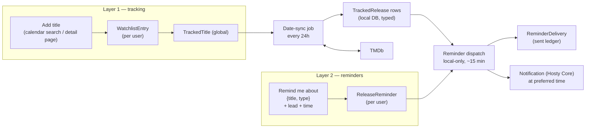
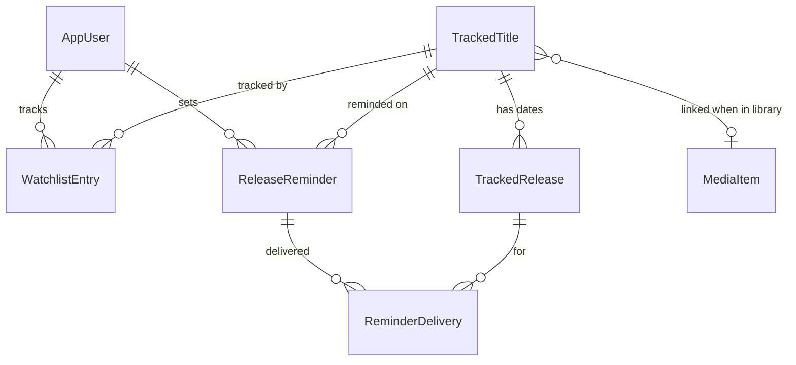

# Release Tracking

Status: Implemented
Created: 2026-07-14
Updated: 2026-07-24

> Near-term slice of the M5 [Watchlist and discovery](watchlist-and-discovery.md)
> vision. This spec covers **only** tracking: a per-user calendar of movie/series
> release dates sourced from TMDb, plus reminders on the releases a user cares
> about. It deliberately excludes acquisition — no content-source search, no
> release matching/scoring, no auto-grab, no handoff to `Intake`. Those stay in
> [Watchlist and discovery](watchlist-and-discovery.md) and build on top of the
> entities defined here.

## Description

Two layers:

- **Layer 1 — tracking.** A user adds a movie or series to their calendar (from
  the calendar page via TMDb search, or from a Movie/Series detail page when the
  title is already in the catalog). The app keeps that title's release dates cached
  locally and refreshed from TMDb.
- **Layer 2 — reminders.** The user asks to be reminded about a **release type** of
  a title — "notify me a few days before the digital release of X, at this time" —
  and the app delivers a notification. A reminder targets a title + type, **not a
  specific date**, so the same single dialog covers a known date, a not-yet-announced
  date, and one that has already passed.

Two dumb background loops back this, deliberately separate so neither is adaptive:



- **Date-sync (every 24h, hits TMDb).** Refresh every tracked title's dates into
  the local DB. The *only* loop that calls TMDb, so it stays a plain fixed cadence.
- **Reminder-dispatch (frequent, local-only).** Match reminders against the locally
  stored dates and deliver the ones now due. Touches no external API, so it can run
  often (≈ every 15 minutes) to land a reminder close to its chosen time.

Nothing is downloaded; the outcome of a reminder is a signal ("it's out / almost
out, go grab it"), not an acquisition.

## Scope

In scope:

- A **per-user** calendar of tracked movies and series, sourced from TMDb.
- Titles **not yet in the library** (added by search) and titles that **are** in
  the library (added from their detail page).
- Structured, typed **release dates** persisted locally per region (movies) and
  **episode air dates** (series, opt-in), refreshed on a fixed 24h cadence.
- **Type-targeted reminders** that work whether or not the date is known yet, with
  a per-reminder lead time and notify time, delivered as a per-user notification.
- An **Upcoming/Calendar** surface plus "add to calendar" from detail pages.

Out of scope (owned by [Watchlist and discovery](watchlist-and-discovery.md)):

- `IContentSource`, source/indexer search, release parsing and scoring.
- Auto-grab / operator-approval of a release, and the handoff into the `Intake`
  pipeline stage.
- A destination catalog and quality preferences per tracked item — acquisition-time
  concerns, reserved (see [Reserved seams](#reserved-seams-for-acquisition)), not
  required to track a release.

## Release Types

The app defines its **own** release types and buckets TMDb's raw codes into them,
so the UI and reminders speak a small, friendly vocabulary. Crucially, TMDb only
**types** release dates for **movies** (its `release_dates` codes 1–6); a **series**
carries plain episode `air_date`s with no digital/broadcast typing — the platform
(Netflix vs a broadcaster) is the show's *network*, a property of the show, not of
the date. So the valid types differ by media kind, and the app filters accordingly.

```csharp
enum ReleaseType { Premiere, Theatrical, Digital, EpisodeAir }
```

| App type | Applies to | TMDb source | Notes |
| --- | --- | --- | --- |
| `Premiere` | Movie | Premiere (1) | festival / red-carpet premiere; kept separate since it can be useful, but it is not a public release |
| `Theatrical` | Movie | Theatrical (3) + Theatrical limited (2) | merged; resolves to the **earliest** — the first time it hits cinemas |
| `Digital` | Movie | Digital (4) | streaming / VOD / purchase — a movie's streaming release *is* `Digital` |
| `EpisodeAir` | Series | episode `air_date` | the **only** series release type; streaming vs broadcast is the network, not the date |

TMDb's Physical (5) and TV (6) are **intentionally dropped for now** — a disc date
and a TV-premiere date are weakly applicable to a self-hosted media flow. They can
be added later without reshaping anything, since the mapping is a single table.

Per-kind valid sets, enforced in the reminder picker and on create:

- **Movie** → `Premiere`, `Theatrical`, `Digital` (the UI foregrounds `Theatrical`
  + `Digital`; `Premiere` is secondary).
- **Series** → `EpisodeAir` only, refined by the entry's `MonitorScope` (every
  episode / chosen seasons / future episodes only).

Filtering by kind also protects the pending-reminder mechanic: a type that can never
have data for a kind would otherwise leave a reminder pending forever.

## Data Model

Tracking splits into a **global** part (a title and its dates, fetched once no
matter how many users track it) and two **per-user** parts (the tracking
subscription, and reminders). This gives a personal calendar without duplicating
TMDb requests, and keeps the eventual acquisition action — inherently a
shared-library operation — attachable at the global level later.

This supersedes the single reserved `WatchlistItem` sketch in the
[domain model](domain-model.md#entities--discovery-future-m5); its `CatalogId`
and `Quality` fields move to the deferred acquisition layer.



**TrackedTitle** — global, one row per canonical provider identity (deduped).

| Field | Type | Notes |
| --- | --- | --- |
| Id | Guid | PK |
| Kind | MediaKind | `Movie` \| `Series` (constrained subset) |
| IdentityProvider / IdentityProviderId | string | canonical ref, e.g. `tmdb` / `27205`; unique together |
| Providers | JSON | provider dictionary, mirrors `MediaItem.Providers` |
| MediaItemId | Guid? | FK to the library item once identity resolves; null while pure wishlist |
| Title / Year | string / int? | denormalized display snapshot, refreshed on sync |
| ProductionStatus | string? | provider status; lets sync cheaply skip a fully-settled title |
| LastRefreshedAt | DateTimeOffset | last successful TMDb sync (diagnostics) |
| CreatedAt / UpdatedAt | DateTimeOffset | |

**TrackedRelease** — one typed, dated release event. Uniqueness is enforced with
**two filtered unique indexes** (SQLite treats NULLs as distinct in a plain unique
constraint, so a single `(…, Region, …)` key would not deduplicate episode rows):
movie rows on `(TrackedTitleId, Region, Type)` where `Region IS NOT NULL`, episode
rows on `(TrackedTitleId, Type, Season, Episode)` where `Region IS NULL`.

| Field | Type | Notes |
| --- | --- | --- |
| Id | Guid | PK |
| TrackedTitleId | Guid | FK |
| Region | string? | ISO-3166-1 (`US`, `RU`); null for series episode air dates |
| Type | ReleaseType | app-level (bucketed at parse time) |
| RawType | int? | original TMDb code, kept so `Theatrical` can prefer wide/limited over premiere |
| Season / Episode | int? | set for `EpisodeAir` |
| Date | DateOnly | the release/air date — a **calendar date** (TMDb dates carry no meaningful time); `DateOnly` avoids timezone-shift bugs, and dispatch composes the fire moment from it + `NotifyAt` in the app timezone |
| Note | string? | provider note (e.g. "IMAX", "Netflix") |
| PreviousDate | DateOnly? | prior value when a date moved, so the UI can show "moved to …" |
| CreatedAt / UpdatedAt | DateTimeOffset | |

**WatchlistEntry** *(layer 1)* — per-user tracking; puts a title on that user's
calendar. Unique `(AppUserId, TrackedTitleId)`.

| Field | Type | Notes |
| --- | --- | --- |
| Id | Guid | PK |
| AppUserId | Guid | FK — the tracking user |
| TrackedTitleId | Guid | FK |
| MonitorScope | SeriesMonitorScope? | series episode tracking is **opt-in**: `WholeShow` \| `Seasons` \| `FutureEpisodes`; **null = off** (default for a new series entry, and always for movies) |
| MonitoredSeasons | JSON int[]? | set when `MonitorScope = Seasons` |
| RegionOverride | string? | override the effective watch region for this entry |
| Note | string? | optional personal note |
| CreatedAt | DateTimeOffset | |

**ReleaseReminder** *(layer 2)* — a per-user reminder targeting a title + release
type. Unique `(AppUserId, TrackedTitleId, ReleaseType)`.

| Field | Type | Notes |
| --- | --- | --- |
| Id | Guid | PK |
| AppUserId | Guid | FK |
| TrackedTitleId | Guid | FK — the title (not a specific date) |
| ReleaseType | ReleaseType | the kind of release awaited (`EpisodeAir` for series) |
| LeadDays | int | `0` = on the day, `N` = `N` days before |
| NotifyAt | TimeOnly | preferred local time, **default 09:00**, editable |
| Active | bool | soft-disable without deleting |
| CreatedAt | DateTimeOffset | |

**ReminderDelivery** — the sent ledger; one row per reminder per release event it
fired for. Makes a movie reminder one-shot and a series episode reminder recurring
through one mechanism. Unique `(ReminderId, TrackedReleaseId)`.

| Field | Type | Notes |
| --- | --- | --- |
| Id | Guid | PK |
| ReminderId | Guid | FK |
| TrackedReleaseId | Guid | FK — the concrete date this delivery fired for |
| SentAt | DateTimeOffset | |

```csharp
enum SeriesMonitorScope { WholeShow, Seasons, FutureEpisodes }
```

## Release Schedule Sources (TMDb)

Reuse the existing provider plumbing — the detail fetch already appends
`release_dates` (movies) and `content_ratings` (series)
(`TmdbMetadataProvider.FetchAsync`), and today only the certification is projected
out of `release_dates`. Release tracking additionally parses the **typed dates**,
bucketing each into an app [release type](#release-types).

- **Movies** — `release_dates.results[]` is per-country; each country carries a
  `release_dates[]` of `{ type, release_date, note, certification, iso_639_1 }`.
  Persist one `TrackedRelease` per `(region, app-type)` (keeping `RawType`). The
  watch region is its **own** setting — `WATCH_REGION` (ISO-3166-1, default `US`) —
  independent of `SUPPORTED_LANGUAGES` (a metadata-language axis, not a country); a
  per-entry `RegionOverride` refines it. `status` feeds `ProductionStatus`.
- **Series** — the title-level refresh is one `/tv/{id}` call (`status`,
  `next_episode_to_air`, `last_episode_to_air`), so every tracked series shows when
  it returns for free. **Per-episode** `EpisodeAir` enumeration is opt-in:
  `/tv/{id}/season/{n}` is fetched **only** for a title with at least one
  `WatchlistEntry` that has episode tracking enabled, and only for the union of
  seasons those entries monitor (`WholeShow` / `Seasons` / `FutureEpisodes`).

The existing **certification** extraction stays region-by-language
(`PreferredRegion(language)`) — correct, a rating follows the display language's
region. Only release-**date** tracking uses `WATCH_REGION`.

## Watchlist Behavior (Layer 1)

- **Add** — from the **calendar page** (search TMDb, in library or not) or from a
  **Movie/Series detail page** when the title is already in the catalog. A
  `WatchlistEntry` is created; a `TrackedTitle` is resolved-or-created by canonical
  identity, so a title tracked by several users is stored and synced once. A newly
  added title is synced immediately so its dates appear at once.
- **Wishlist vs library** — on add (and on each library publish via a reconcile),
  the canonical identity is matched against existing `MediaItem`s. A match sets
  `TrackedTitle.MediaItemId` (an "in library" state and, for series, the
  [owned-vs-aired gap](#library-gap-owned-vs-aired)). No match leaves it a pure
  wishlist entry. Deleting the library item unlinks back to wishlist state.
- **Series monitor scope** — episode tracking is **off by default**; the user turns
  it on per series by choosing a scope, which gates which `EpisodeAir` rows exist.
- **Remove** — deletes the `WatchlistEntry` and the user's reminders on that title;
  a `TrackedTitle` with no entries and nothing in the library is cleaned up.

## Reminders (Layer 2)

A reminder is one dialog — **"remind me about the {type} release of {title},
{lead} before, at {time}"** — and the same object serves every date state:

- **Known future date** → scheduled against it.
- **Not announced yet** → *pending*; when the 24h sync first stores a date of that
  type, the reminder binds and schedules automatically. This is the trailer case:
  "I want to see it in cinemas — tell me 3 days before the theatrical date whenever
  it's set."
- **Already passed** → on creation the API resolves current state and reports
  "already released on {date}" immediately (and can still deliver once, so the user
  isn't left wondering). No need to look before setting it. For a **series**, this
  resolution comes from the title-level `last_episode_to_air` (not from persisted
  episode rows): episodes that aired before the reminder was created are summarized
  in the create response ("already airing — up to S2E10"), never delivered
  one-by-one retroactively; recurring delivery starts from the next episode within
  scope.

Details:

- **Remind implies track** — creating a reminder ensures a `WatchlistEntry` exists,
  so "notify me about the digital release of X" both tracks X and sets the reminder
  in one action. Tracking without a reminder stays available (calendar-only).
- **Time is in the dialog** — `NotifyAt` defaults to 09:00 (preselected) and is
  editable per reminder; the local time resolves in the app's configured timezone
  (`TZ` / a setting), with per-user timezones a later additive change.
- **Region** — the reminder resolves the date in the entry's effective region
  (`RegionOverride` else `WATCH_REGION`).
- **Series reminders are recurring** — an `EpisodeAir` reminder is not one-shot: it
  notifies for each episode covered by the entry's `MonitorScope`, then waits for
  the next, indefinitely — new seasons included as the sync discovers them — until
  the user removes or deactivates it, or the show is officially over. Retirement is
  the **reminder-dispatch loop's** job (date-sync stays purely layer 1): when
  dispatch sees `ProductionStatus` `Ended`/`Canceled` with no remaining future
  episode and every covered aired episode already delivered, it retires the
  reminder (optionally with a final "{title} has ended" notice) so it stops rather
  than lingering. Creating an `EpisodeAir` reminder turns on episode tracking for that
  entry if it was off (default scope `FutureEpisodes`), since it needs `EpisodeAir`
  rows to fire. When a whole season drops on a single date (a streaming season
  release), the coinciding `EpisodeAir` dates collapse into one "Season N available"
  delivery instead of one notification per episode — the ledger still records each
  covered episode so nothing re-fires.
- **Follows moves & fires once per event** — matching is by
  `(title, type[, season/episode])`, so a moved TMDb date is followed automatically;
  the `ReminderDelivery` ledger guarantees exactly one notification per concrete
  release event — so a movie reminder fires once and a series reminder fires once
  per episode.
- **Entry points converge** — clicking a concrete date on the calendar just opens
  this dialog with the type prefilled; it is the same `(title, type)` reminder.

## Refresh: Two Loops

Both run as hosted services in the `CatalogHealthService` /
`CatalogMetadataRefreshService` mold, reported over the realtime job feed (see
[Background tasks](background-tasks.md)).

**Date-sync — `watchlist:refresh-dates`, every 24h, the only TMDb caller.**

- For each `TrackedTitle` (optionally skipping fully-settled ones — a movie past
  all its dates with `ProductionStatus = Released`, a series `Ended`/`Canceled` with
  no future episode), refetch and upsert `TrackedRelease` rows, paced under the
  provider rate limit. A moved date updates `Date` and records `PreviousDate`.
- `EpisodeAir` rows are kept only for a rolling horizon (default `−7 … +90` days);
  rows aging out are pruned **unless** they back an unfired `ReminderDelivery` need.
  Pruning cannot strand anything: movie rows are never age-pruned, and the
  already-released resolution for series reads the title-level
  `last_episode_to_air`, not historical episode rows (see
  [Reminders](#reminders-layer-2)).

**Reminder-dispatch — `watchlist:dispatch-reminders`, ≈ every 15 min, local only.**

- For each `Active` reminder, find matching `TrackedRelease` rows (same title, app
  type, effective region; for series, episodes within scope) whose
  `fireAt = (Date − LeadDays)` at `NotifyAt` is `<= now` and that have **no**
  `ReminderDelivery` yet → deliver and record the delivery.
- A fire time already in the past (short lead on a near/passed date) simply fires on
  the next tick. Pure local query; no external API, so it runs frequently and
  cheaply.

Decoupling the loops means date freshness (bounded, rate-limited) and reminder
timing (fast, local) never trade off against each other.

## Notifications

Delivery uses `IHostyCoreClient.PublishNotificationAsync(level, title, body, link,
dedupeKey, target)`, which supports **per-user targeting** and unread-dedupe.

Every notification originates from a reminder the user set. On dispatch, each due
reminder publishes a notification targeted at that user, `link`ed to the calendar /
title, naming the title, the app release type, and the date (e.g. "*Dune: Part
Two* — Digital release in 2 days (Aug 14)"), and — for a linked series episode —
the [owned-vs-aired](#library-gap-owned-vs-aired) gap. The `ReminderDelivery` row
plus the Core `dedupeKey` prevent repeats.

## Library Gap (owned vs aired)

When a `TrackedTitle` is linked to the library (`MediaItemId` set), the app shows
not just "in library" but exactly **what you're missing** — a read-time projection,
no new persisted state.

- **Series** — join the linked series' episode children (each `MediaItem` episode
  carries `IdentitySeasonNumber`/`IdentityEpisodeNumber`; see
  [domain model](domain-model.md#entities--catalog--media)) to compute **Owned**,
  **Aired** (air date `<= now`), and **Missing-aired** (`Aired − Owned`) — the "you
  have S1–S2, S3E1 aired but you don't have it" signal; the UI shows "behind by N".
- **Movies** — a linked movie held only in poor quality can still be tracked for its
  `Digital` date; the link marks it "in library" so the release reads as an upgrade,
  not a first acquisition. (Judging owned quality is out of scope.)

The gap recomputes whenever the library or the schedule changes, so it never drifts.

## Surfaces

- **Navigation** — a new top-level "Calendar" entry in the manifest `ui.navigation`,
  alongside Movies/Series/Collections/Activity.
- **Layout** — a full-width **month grid** inside the standard `max-w-5xl` content
  column, built with `date-fns` (`startOfMonth`/`startOfWeek`/`eachDayOfInterval`),
  mirroring the project-manager calendar rather than pulling a heavy calendar
  library. A toolbar above it holds month nav (`‹ ›`), an **Add title** button, and
  two icon buttons — **Tracked** and **Reminders** — that each open a slide-over
  (shadcn base `Drawer`). Posters carry the visual identity, so no per-title color
  coding is needed.
- **Month grid** — each release renders a rich chip in its day cell: a poster
  thumbnail, the title, the app release type, a bell when a reminder is set, and an
  in-library tick — modeled on the tracked-title card. Same-day releases stack with
  a "+N" overflow; a marker highlights today. Clicking a chip opens the reminder
  dialog.
- **Tracked drawer** — a **name filter** on top, then poster rows of the user's
  tracked movies/series (kind, next date, in-library / owned-vs-aired hint, and a
  "no date yet" marker where applicable); add (TMDb search) and remove live here.
- **Reminders drawer** — a name filter, then poster rows of the user's reminders
  (type, lead, time, and a state pill: scheduled / recurring / released / pending),
  each deletable. This is where **pending** reminders (type set, date unknown) live.
- **Reminder dialog (shared)** — opened from a grid chip, a drawer row, or a
  Movie/Series detail page: release **type** (filtered to the title's kind), **lead**
  (on the day / 1 / 2 / a week before), and **time** (default 09:00). For a not-yet
  announced date the same dialog just resolves to *pending*.
- **Detail pages** — a "Track / remind me" control on Movie and Series detail pages
  for catalog titles, opening that same dialog (with the series episode-tracking
  opt-in).
- **Settings** — the `WATCH_REGION` country (default `US`, separate from
  `SUPPORTED_LANGUAGES`) and the timezone used to resolve reminder times.
- **New UI dependencies** — the shadcn base `Drawer` component and `date-fns` (for
  the month grid), neither currently in `src/web`.

## Reserved Seams for Acquisition

The acquisition layer in [Watchlist and discovery](watchlist-and-discovery.md)
builds on these entities without reshaping them:

- The `IPipelineStage` `Acquisition` phase and `IContentSource` contract are
  **untouched** here — no acquisition stage is added.
- A future destination-catalog + quality block attaches at the `TrackedTitle`
  (shared-library target) or as an admin policy, not on a per-user entry — which is
  why `CatalogId`/`Quality` are deferred rather than placed here now.
- A release becoming due is the natural trigger an acquisition stage will later
  consume to start a source search; until then it only drives reminders.

## API

Endpoints are shaped as discrete commands so the same operations can be exposed as
MCP tools in M6 (see [root](root.md) roadmap):

- `GET /api/watchlist` — the user's tracked titles with resolved dates and reminders.
- `POST /api/watchlist` — add `{ providerRef, kind, monitorScope?, monitoredSeasons?, regionOverride? }`.
- `PATCH /api/watchlist/{id}` — update monitor scope / region.
- `DELETE /api/watchlist/{id}` — stop tracking (and drop the user's reminders on it).
- `GET /api/watchlist/calendar?from&to` — dated release events across tracked titles.
- `POST /api/reminders` — add `{ providerRef | trackedTitleId, releaseType, leadDays, notifyAt }`;
  validates `releaseType` against the title's kind, ensures tracking, and **returns
  the resolved state** (`scheduled` with the date, `alreadyReleased` with the date,
  or `pending`).
- `PATCH /api/reminders/{id}` — change `leadDays` / `notifyAt` / `active`.
- `DELETE /api/reminders/{id}` — remove.
- `POST /api/watchlist/{id}/refresh` — force an immediate date-sync for a title.

All reads are scoped to the authenticated `AppUser`; the shared `TrackedTitle` /
`TrackedRelease` data is joined in but never mutated on another user's behalf.

## Testing Expectations

Backend tests use xUnit and Imposter (mock the TMDb client). Required coverage:

- TMDb→app `ReleaseType` bucketing: `Theatrical` merging limited (2) + wide (3) to
  the earliest, `Premiere` (1) kept separate, `Digital` (4), and Physical (5) / TV
  (6) dropped; plus per-region parsing driven by `WATCH_REGION` (default `US`,
  independent of `SUPPORTED_LANGUAGES`) with the per-entry `RegionOverride`.
- Per-kind type validation: movie reminder types accepted, series restricted to
  `EpisodeAir`, invalid `(kind, releaseType)` combinations rejected.
- Season-drop collapse: coinciding same-date `EpisodeAir` releases yield one
  delivery/notification while still ledgering every covered episode.
- Reminder resolution in all three states: known-future (scheduled), not-announced
  (pending → binds when a matching date appears on sync), already-passed (reported
  on creation and delivered once).
- Reminder fire logic: `leadDays` + `NotifyAt` in the configured timezone, fire when
  already past, follow a moved date, and once-per-event via `ReminderDelivery`
  (movie one-shot vs series episode recurring).
- "Remind implies track" creating the `WatchlistEntry`; per-user scoping of tracking
  and reminders; `TrackedTitle` dedupe across users.
- Series: title-level `next_episode_to_air` with tracking off (no season fetch, no
  `EpisodeAir` rows); opt-in enumeration within horizon and scope filtering.
- Recurring series reminder: fires once per aired episode across seasons, keeps
  going as the sync discovers new episodes, auto-enables episode tracking on
  creation, and retires when the series is `Ended`/`Canceled` with no future episode
  (or when the user removes it) — not before.
- 24h date-sync upsert, `PreviousDate` on moves, horizon pruning.
- Wishlist↔library linking on add and on a simulated publish/delete; the
  owned/aired/missing-aired gap and its refresh when either side changes.
- Watchlist and reminder API authorization scoping, and the reminder-creation
  resolved-state response.
