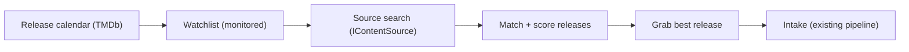

# Watchlist and Discovery

> Future scope (M5), **acquisition layer**. This draft documents the design seams
> reserved now; the implementation is deferred. Custom content-source providers
> are preferred over a generic indexer protocol.
>
> The tracking substrate this builds on — the per-user watchlist, the typed
> release schedule, and the release calendar/notifications — is specified
> separately and comes first in [Release tracking](../release-tracking/feature.md). This doc
> covers only what tracking does **not**: searching content sources, matching and
> scoring releases, and grabbing the best one into `Intake`.

## Description

Discovery automates *what to download*. It prepends acquisition stages to the
[automation pipeline](../automation-pipeline/feature.md): a release calendar and a watchlist
drive searches against content sources, a best release is selected, and it is
handed to Intake — after which the existing processing pipeline is unchanged.



## Content Sources

- `IContentSource` is **provider-agnostic** (not tied to Torznab). Each source is
  a custom provider implementing search, capabilities, and release parsing.
- Sources return candidate releases (title, year, `SxxEyy`, resolution, quality,
  size, seeders) for matching.

## Watchlist

```jsonc
{
  "id": "{uuid}",
  "providers": { "tmdb": 27205 },
  "type": "movie",            // movie | series
  "catalogId": "{uuid}",      // destination catalog
  "monitored": true,
  "quality": { /* preferences: resolution, language, size bounds */ }
}
```

- The operator adds a movie/series (chosen from a metadata provider) with a target
  catalog and quality preferences.
- Series can monitor whole shows, seasons, or future episodes.

## Release Calendar

- Built from provider release/air dates (TMDb).
- For monitored series, when an episode's air date passes, a search is triggered
  automatically.

## Matching and Decision

- Candidate releases are parsed and scored against the watchlist item and quality
  preferences.
- The best candidate is grabbed automatically, or queued for operator approval
  (configurable).
- Grabbing produces a magnet/`.torrent` plus the target catalog, which enters
  `Intake`.

## Existing Seams

- `IPipelineStage` carries a phase and a global order, so acquisition stages can run before
  `Intake` without changing processing ([domain model](../domain-model/feature.md)).
- Release tracking already provides the per-user watchlist, the typed release schedule and the
  release calendar this plan builds on.
- `IContentSource` and the acquisition entities below are not in the code yet.

## Target Domain Additions

Moved from the domain model on 2026-10-05.

### Discovery entities

The near-term **release-tracking** slice splits this reserved `WatchlistItem`
sketch into a global title/schedule part (`TrackedTitle`, `TrackedRelease`) and a
per-user subscription part (`WatchlistEntry`, `ReleaseReminder`,
`ReminderDelivery`); its `CatalogId`
and `Quality` fields move to the deferred acquisition layer. See
[Release tracking](../release-tracking/feature.md) for those entities.

**WatchlistItem** *(superseded by the release-tracking split above)*: Id,
Providers (JSON), Type, CatalogId (FK), Monitored, Quality (JSON preferences),
CreatedAt.
**ContentSourceConfig** *(acquisition)*: Id, Name, Type, Config (JSON without raw
secrets), SecretRefs (JSON references to Hosty-managed secrets), Enabled.

### Contract: IContentSource

Provider-agnostic (not Torznab-specific); each source is a custom implementation.

```csharp
public interface IContentSource
{
    string Key { get; }
    ContentSourceCapabilities Capabilities { get; }   // movie/series search, paging

    Task<IReadOnlyList<ReleaseCandidate>> SearchAsync(
        ReleaseQuery query, CancellationToken ct);
}

public record ReleaseQuery(MediaKind Kind, string Title, int? Year,
                           int? Season = null, int? Episode = null);

public record ReleaseCandidate(
    string Title, string DownloadUri,        // magnet or .torrent URL
    int? Year, int? Season, int? Episode,
    string? Resolution, string? Quality,
    long? SizeBytes, int? Seeders);
```

A matcher scores candidates against a `WatchlistItem` and quality preferences,
grabs the best (or queues for approval), and hands the result to the pipeline's
`Intake` stage. See [Watchlist and discovery](#matching-and-decision).

## Deliverables

- [ ] D1. `IContentSource` with a first custom content-source provider: search, capabilities and
      release parsing.
- [ ] D2. Watchlist acquisition settings — target catalog and quality preferences — and series
      monitoring of whole shows, seasons or future episodes.
- [ ] D3. Release matching and scoring against the watchlist item and its quality preferences.
- [ ] D4. Acquisition stages before `Intake`: calendar-triggered search for monitored series,
      automatic grab or an operator approval queue, and the hand-off to `Intake`.

## Verification

Tests cover source search and capability handling; release parsing and
score-based selection; calendar-triggered search for monitored series; auto-grab
vs approval; correct handoff into `Intake`.
