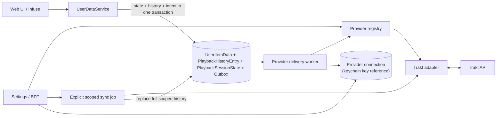

# Watched-History Providers: Trakt

Status: Draft
Created: 2026-07-21
Updated: 2026-07-22

## Goal

Add a provider-neutral watched-history integration and ship Trakt as its first
provider. Media Server remains offline-first and keeps its current local playback
state, while an explicit user-driven sync makes watched movies and episodes
portable through Trakt.

The preliminary phase determines whether Infuse exposes a reliable distinction
between actual completion and a manual watched mark. If it does,
`PlaybackHistoryEntry` and exact per-play synchronization are mandatory parts of
this feature, not deferred follow-up work. If it does not, the plan remains `Draft`
until the user approves a different history model or reduced behavior.

## Scope

- A stable watched-history provider registry with Trakt as the only shipped and
  active provider in the first version.
- Deployment-level Trakt application configuration through Media Server's Hosty
  app settings, beside the existing TMDb credential configuration.
- One per-user Trakt account connection through OAuth Device Code flow.
- Per-connection token storage in the Hosty Core app secrets store, with
  automatic token refresh.
- A Settings section named **Watch history providers**, placed near Infuse Access.
- An explicit **Sync with Trakt** action with a preview popup and catalog/media-kind
  scope selection.
- Full-history two-way reconciliation after successful Phase 0 validation: Trakt
  history replaces safely matched local history, while reliable local exact plays
  and one timeless legacy/manual mark missing from Trakt are added first.
- No periodic or automatic Trakt-to-local synchronization.
- Durable asynchronous outbound operations so Trakt failures never block local
  playback or manual watched-state changes.
- Manual watched behavior that ensures one timeless Trakt mark only when Trakt has
  no history for the item.
- Manual unwatch behavior that removes only Media Server-created timeless Trakt
  entries whose exact remote history IDs were resolved and stored, while retaining
  external timeless entries and every exact timestamped play.
- Movie, episode, season/series bulk, and multi-episode-file mapping through
  existing TMDb identities plus canonical season and episode numbers.
- Explicit handling of missing and non-unique identities.
- A preliminary Infuse/Jellyfin observation phase before choosing the exact
  playback-completion timestamp contract.
- Conditional implementation of `PlaybackHistoryEntry`: when the observation
  confirms a reliable completion signal, store every local and imported Trakt play
  as an exact or timeless history entry and make Sync use full Trakt history.
- Backend xUnit tests using Imposter where dependencies are mocked, SQLite
  integration tests, frontend tests, and live contract verification with a
  dedicated Trakt test account.

## Out of Scope

- A second external watched-history provider implementation.
- More than one active watched-history provider per user.
- Runtime loading of third-party provider assemblies or plugins.
- Trakt scrobble start, pause, or stop calls.
- Live watching status or resume-position synchronization with Trakt.
- Automatic inbound polling or provider-to-provider replication.
- Ratings, favorites, comments, collection, lists, watchlist, recommendations, or
  catalog acquisition from Trakt.
- Synchronizing media that is not present in the local library.
- Reconstructing historical play times from existing `PlayCount` or
  `LastPlayedDate` values.
- Exporting multiple legacy plays from an aggregate local play count.
- Broad Trakt media-history deletion that could remove exact timestamped plays.
- Ambiguous anime absolute-number mapping without canonical TMDb season and
  episode numbers.

## Current Behavior

- `UserDataService` owns playback-state changes shared by the web and
  Jellyfin-compatible surfaces.
- A movie, episode, or video becomes watched at 90% of runtime. Its resume position
  is reset, `Played` becomes true, and `PlayCount` increments only on a false-to-true
  transition.
- Starting meaningful progress on an already-watched item clears `Played`; an
  explicit unwatch also clears `Played` and resume while retaining `PlayCount`.
- `LastPlayedDate` is updated by playback start/progress and watched operations. It
  is not a dedicated completion timestamp.
- Jellyfin `Sessions/Playing`, `Sessions/Playing/Progress`, and
  `Sessions/Playing/Stopped` all call `ReportPlaybackAsync`.
- Jellyfin `PlayedItems` POST/DELETE and the web watched toggle call
  `SetPlayedAsync` separately from progress reporting.
- `PlaybackReportBody` already accepts `PlaySessionId`, `MediaSourceId`,
  `PositionTicks`, and `IsPaused`, but `PlaySessionId` is currently ignored by
  `UserDataService`.
- `PlaybackInfo` already returns a fresh server-generated `PlaySessionId`, but
  Media Server does not currently retain or correlate it with later reports.
- A first playback report at or above 90% currently calls `MarkWatched` even though
  no below-to-above threshold crossing was observed.
- One playback session can currently increment `PlayCount` twice: crossing 90%,
  rewinding to meaningful progress below 90% (which clears `Played`), then crossing
  90% again.
- Jellyfin `PlayedItems` accepts optional `DatePlayed`; Media Server currently uses
  it as `LastPlayedDate`, but it does not establish why the client changed the
  state.
- Development builds already write method, path, query, status, and duration for
  every request to `requests.log`. JSON playback-body fields are not included.
- Local state is aggregate-only in SQLite. There is no per-play history or exact
  dedicated `LastWatchedAt` value.
- No external watched-history provider connection exists today.

## Target Behavior

### Provider Boundary

The integration follows the stable provider-key pattern already used by metadata
providers:

- `IWatchHistoryProviderRegistry` resolves adapters by keys such as `trakt` and
  returns configuration and capability descriptors for Settings;
- `IWatchHistoryProvider` accepts provider-neutral movie/episode identities and
  aggregate history operations;
- provider authorization is a separate collaborator so Device OAuth does not
  become mandatory for every possible future provider;
- provider DTOs, OAuth details, credentials, timestamp sentinels, rate limits,
  transport errors, and remote IDs remain inside the adapter;
- `UserDataService`, sync reconciliation, identity cardinality checks, and the
  transactional outbox do not branch on `trakt`.

Adapters declare capabilities including exact timestamp writes, timeless writes,
aggregate watched reads, full history reads, and individual history-entry removal.
An unsupported capability produces a typed sync issue; the core never fabricates a
timestamp or falls back to a broader destructive operation.

Although the schema identifies connections by `(AppUserId, ProviderKey)`, the first
version permits only one active watched-history connection per user and ships only
the Trakt adapter. Simultaneous multi-provider fan-out is deferred.

### Deployment Configuration and Per-User OAuth

**Token storage (settled 2026-07-22).** Per-user OAuth tokens live in the Hosty
Core app secrets store, which shipped in Core 0.60.0
([feature](https://github.com/alex-de-haas/docker-host/blob/main/docs/features/app-secrets-store.md);
[platform request #15](../features/hosty-platform-requests.md)). Media Server
stores one secret per connection through `HostySecretsClient`
(`HostySdk.App` 0.2.0) and keeps only the key reference in SQLite. There is no
app-side credential encryption: Core holds the values in
`apps/<id>/secrets.json`, outside the backed-up `data/` directory, so a database
backup never carries live Trakt access.

Two consequences shape the design below. A database restore rolls the app's rows
back but not its secrets — which is what we want, because Trakt refresh tokens
rotate on every refresh, so a token embedded in a backup would usually be stale
by restore time while the live keychain keeps the connection working. And a
missing secret is an expected state, not an error: it means the app was restored
onto a new host (Core state does not migrate) or the connection was never
completed, and it maps to `RequiresReconnect`.

The Media Server Hosty app settings add:

- `TRAKT_CLIENT_ID`;
- secret `TRAKT_CLIENT_SECRET`.

No operator-generated encryption key is required.

The instance operator creates one Trakt API application for the Media Server
instance, then enters these values through the same deployment settings surface
that currently contains the TMDb API token. Missing or invalid Trakt configuration
does not prevent Media Server from starting.

The admin-only setup help links to `https://docs.trakt.tv/docs/create-an-app` and
names both required settings. Saved secrets are never displayed. Regular users
see only that the provider needs operator configuration.

After instance configuration, each Media Server user connects their own Trakt
account from the Trakt card in **Watch history providers**, near Infuse Access:

1. Start Trakt Device OAuth for the current authenticated user.
2. Display the activation URL/code and poll only at Trakt's returned interval.
3. Represent pending, denied, expired, used, invalid, and slow-down responses.
4. Store the returned access and refresh credentials in the Core secrets store
   under this connection's key.
5. Retrieve and display the connected Trakt identity.
6. Refresh tokens serially before expiry; move to `RequiresReconnect` after a
   permanent refresh failure without discarding pending outbound operations.

No API accepts an arbitrary app-user ID for these actions. Administrators configure
the instance application but cannot connect a Trakt account on another user's
behalf or retrieve that user's tokens.

Disconnect revokes the token on a best-effort basis, then deletes that connection's
stored credentials, authorization attempt, sync jobs, and pending operations.
Under the Core secrets store, "stored credentials" means the per-connection
keychain secret: disconnect issues the keychain `DELETE` for that key **before**
removing the connection row, so a failed best-effort revocation can never leave
a live refresh token orphaned in the Core store with no database reference to
clean it up. Disconnect never deletes local playback state.
User-directory reconciliation applies the same credential cleanup — including
the keychain `DELETE` — when a user becomes unassigned or disabled.

### Preliminary Infuse/Jellyfin Observation

The route-level classification hypothesis is defined before observation:

- `Sessions/Playing*` represents real playback and is the only source of an exact
  local completion;
- the first observed crossing from below 90% to at least 90% in one playback
  session creates one exact play, even when the user reached it by seeking;
- a first report already at or above 90% is not a crossing and creates no exact
  play;
- one session can increment `PlayCount` and create an outbox event at most once,
  even after rewinding below 90% and crossing again;
- a PlayedItems POST outside an active/recent matching playback session is a manual
  watched action and creates a timeless mark;
- a PlayedItems POST for the same item inside the active/recent session correlation
  window is a duplicate completion signal and creates neither a timeless mark nor
  a second exact play;
- PlayedItems DELETE is an explicit manual unwatch.

Phase 0 confirms or refutes this concrete hypothesis; it does not search for an
undefined signal. A small diagnostic change records Infuse's Jellyfin calls without
changing playback behavior.
The existing development `requests.log` already captures routes and query strings;
the playback endpoints additionally need structured diagnostic fields from the
parsed body:

- server timestamp and route kind (`Playing`, `Progress`, `Stopped`,
  `PlayedItemsPost`, or `PlayedItemsDelete`);
- internal app user ID and Jellyfin item ID;
- `PlaySessionId` and `MediaSourceId` when supplied;
- `PositionTicks`, resolved runtime ticks, and calculated percentage;
- `IsPaused` and whether the request is a stop;
- parsed `DatePlayed` and whether it was supplied at all;
- `Played` before and after the operation, without changing the operation.

Diagnostics must not log authorization headers, access tokens, raw request bodies,
file paths, media titles, or provider credentials. The logging is Development-only
and should use bounded structured values so it cannot affect request success.

The observation matrix covers:

- ordinary movie playback beyond 90%;
- ordinary episode playback beyond 90%;
- stopping below 90%;
- manually marking watched without playback;
- manually marking unwatched;
- rewatching an already-watched item;
- seeking across 90%;
- repeated progress and stopped calls for one playback session;
- a session that ends by network loss/client termination without Stopped;
- Infuse auto-advance from episode N to episode N+1, including Stopped/Playing
  ordering;
- a multi-episode file and the item ID reported for its progress;
- the same completion/manual/rewatch cases through the web player;
- starting and resuming playback directly at or above 90%, to confirm that a
  session's first above-threshold report never creates an exact play.

The resulting trace must answer:

- Does Infuse return the `PlaySessionId` generated by PlaybackInfo, and is it stable
  across Playing/Progress/Stopped?
- Does actual completion call `PlayedItems`, and does a manual watched toggle use
  the same route?
- When is `DatePlayed` present, and can actual playback be distinguished from a
  manual mark by route sequence and fields?
- Can one completion be deduplicated reliably across progress and stopped calls?
- Can a rewatch be identified while the aggregate `Played` flag remains true?
- Does a Progress report crossing 90% arrive even when Stopped is missing?
- Does auto-advance close and start distinct sessions in a stable order?
- Which item identity does Infuse report for a multi-episode file?
- Does the web player follow the same server-side completion contract?

The primary session key is the echoed `PlaySessionId`. If Infuse does not echo it,
the fallback is a server-derived session keyed by app user plus item: a Playing
start opens a new generated session, Progress/Stopped attach while it remains
active, and an inactivity/correlation window closes it. Phase 0 measures and fixes
the window duration; a time bucket alone is not used as a durable identity.

Phase 0 succeeds when the trace confirms the route split, either the echoed or
fallback session key, one detectable below-to-above crossing, duplicate
PlayedItems correlation, and deterministic handling of the expanded matrix. On
success, `PlaybackHistoryEntry` is implemented. A failed criterion keeps the plan
Draft and records exactly which assumption was refuted.

### Sync with Trakt

The Trakt Settings card exposes **Sync with Trakt**. It opens a popup where the
user selects one or more accessible catalogs and optionally movies or series. The
action is explicit; no schedule or background inbound poll invokes it.

The popup first creates a read-only preview. It reports:

- selected catalogs/media kinds;
- watched on both sides;
- watched only in Trakt;
- currently watched only in Media Server;
- local rows that are currently unwatched but retain historical `PlayCount`;
- remote items absent from the selected local library;
- missing or ambiguous identities;
- pending or terminal outbound operations;
- local rows whose state revision must remain unchanged until application;
- local history entries and aggregate values that will be replaced.

When Phase 0 confirms reliable actual-playback detection, Apply runs as one
asynchronous, per-user/provider-serialized full-history job:

1. Drain pending outbound operations for the selected scope. If they cannot be
   drained because of a terminal issue, block Apply and expose the issue; do not
   discard them silently.
2. Capture each candidate `UserItemData.StateRevision` at the start of Apply.
3. Fetch the complete paginated Trakt movie and episode history needed for the
   selected scope, including every individual history ID and watched time.
4. Match remote plays to local `PlaybackHistoryEntry` rows by normalized identity
   and exact timestamp where available.
5. Export a reliable local exact entry missing from Trakt with its exact time.
   Export a current legacy/timeless local watched mark missing from Trakt as at
   most one `watched_at: "unknown"`, regardless of historical local `PlayCount`.
6. Do not upload an item whose current local `Played=false`, even when its retained
   `PlayCount` is greater than zero; unwatch is treated as intentional current
   state.
7. Re-fetch affected Trakt history after successful additions.
8. Before applying each item, compare its current state revision with the captured
   value. Skip changed rows as `LocalStateChangedDuringSync`; their newly queued
   outbound work runs after the sync lock is released.
9. Replace matching local `PlaybackHistoryEntry` rows from that final Trakt
   snapshot. Preserve every exact play; normalize any number of remote unknown
   entries for one media identity to at most one local timeless entry because
   their individual occurrence times are unknowable.
10. Recompute `PlayCount` and `LastWatchedAt` from the resulting local history and
   set `Played` from the synchronized Trakt state. A watched item clears resume; an
   item still absent from Trakt becomes unwatched but retains useful resume.
11. Leave favorites, `LastPlayedDate`, catalogs, metadata, files, and source ordering
   unchanged.

Trakt-authoritative replacement applies only to safely and uniquely mapped rows
whose export succeeded and whose state revision did not change during the job.
Unmappable rows, `AmbiguousLocalIdentity`, failed additions, and concurrently
changed rows retain all local state, including `Played`, resume, history, and
`PlayCount`.

This is a full per-play reconciliation followed by a Trakt-authoritative local
history projection. Only pre-migration aggregate history remains lossy: an existing
`PlayCount > 1` without individual rows can collapse to one unknown entry. The
preview warns about that specific loss before Apply.

If a local-only timeless addition fails, that item's local watched state is not
cleared or overwritten during the run. The result records a retryable or terminal
issue.

For a pre-migration row with `Played=false`, positive `PlayCount`, and no local
history entries, Sync preserves the historical `PlayCount` when Trakt also has no
history. It does not silently recompute the count to zero. If Trakt has history,
the imported full history becomes authoritative and replaces the legacy count.

Applying the same completed sync again is idempotent at the play level: exact
identity/timestamp matches are not reposted, and an item that already has any
timeless history receives no additional `unknown` entry.

If Phase 0 does not validate reliable actual-playback detection, this full-history
behavior is not silently replaced with aggregate-only Sync. The plan remains Draft
and returns to the user for a new storage/sync decision.

### Manual Watched and Unwatched

An explicit watched toggle changes local state immediately. For the active
provider it records an asynchronous `EnsureTimelessWatched` operation:

- if local history contains no entry of any kind, add one local
  `PlaybackHistoryEntry` with `WatchedAt=null` and origin `Manual`;
- if local exact or timeless history already exists, do not create another local
  play merely because `Played` was toggled back to true;
- fetch and retain the current Trakt item-history ID set in the outbox event;
- if any history exists, complete without adding anything;
- otherwise add exactly one `watched_at: "unknown"` entry, then read item history
  again and identify the new ID by set difference;
- retry the read-after-write with bounded delay for eventual consistency;
- store the uniquely resolved provider history ID on the locally created
  `PlaybackHistoryEntry`; if it remains unresolved, stop reposting, mark the link
  unresolved, and continue reconciliation without guessing;
- never expand local `PlayCount` into several unknown entries.

An explicit unwatch also changes local state immediately while retaining the local
`PlayCount`, matching current behavior. It records `RemoveOwnedTimelessEntries`:

- remove locally created Manual/Legacy timeless entries while preserving exact and
  Trakt-imported history;
- delete remotely only the provider history IDs linked to those Media
  Server-created timeless entries;
- retain timeless entries created by other clients and every exact entry;
- never use Trakt's media-object removal form, which could remove all plays.

This ownership link avoids deleting timeless entries created by another client and
does not depend on Trakt returning the literal `unknown` sentinel later. The live
contract test still verifies write/read timing and normalization, but round-trip
`unknown` is no longer an approval blocker for safe deletion.

Season/series manual marks do not run one read-before-write loop per episode. The
worker groups compatible events by show, performs one aggregate/full-history read,
batches all missing episodes into one `POST /sync/history` payload (or the minimum
bounded chunks required by the live contract), then performs grouped read-after-
write reconciliation. Bulk unwatch batches the already stored owned history IDs
through individual-ID removal payloads.

After unwatch, Trakt can still consider the item watched when external timeless or
exact plays remain. The next explicit Sync with Trakt will consequently set the
matching local item back to watched. Settings help and the unwatch result must
explain this behavior.

### Playback Completion and Exact Time

The desired behavior is to send an exact server UTC `watched_at` only when Media
Server can establish that playback actually crossed the local 90% threshold. A
manual state change must use `unknown`.

The exact source is the first below-to-at-least-90% crossing in
`Sessions/Playing*`, keyed by echoed `PlaySessionId` or the Phase 0 fallback
session. Server UTC at that crossing is `WatchedAt`. `DatePlayed` remains a
diagnostic field and is never sufficient by itself because it is client supplied.
When Phase 0 confirms the hypothesis:

- insert one exact `PlaybackHistoryEntry` with server UTC at the crossing and the
  unique session key established by Phase 0;
- increment `PlayCount` once per proven completion, including a rewatch;
- enqueue one exact UTC history addition in the same SQLite transaction;
- mark the session completion durably so rewinds, repeated Progress/Stopped, a
  correlated PlayedItems POST, and process restarts cannot create another play.

The rule intentionally accepts seeking across 90% as completion, matching the
existing threshold policy. It does not require Stopped, so a Progress crossing is
retained when the client or network disappears afterward.

If the trace cannot distinguish actual completion safely, the integration plan
stays Draft and returns to the user. It must not fabricate exact history or silently
drop the agreed conditional `PlaybackHistoryEntry` functionality.

When the trace succeeds, **Sync with Trakt** uses the paginated full history
endpoint and imports every exact play plus at most one normalized timeless marker
per identity.

### Identity Mapping

The provider-neutral identity snapshot contains media kind, available external
IDs, and canonical episode coordinates. The Trakt adapter supports:

- movies through local TMDb movie ID as `movie.ids.tmdb`;
- episodes through parent-series TMDb ID plus canonical season and episode number;
- multi-episode files by expanding their inclusive episode range outbound;
- series/season manual toggles through the existing descendant-episode expansion.

Video extras, missing identities, invalid numbering, and ambiguous absolute-number
anime are not guessed. The local operation still succeeds and a bounded provider
issue is shown.

Outbound operations from separate local copies are independent and can create
separate Trakt plays for the same Trakt movie or episode. Inbound behavior for
multiple selected local rows sharing one normalized identity remains an open
question: applying to all copies may erase another edition's resume point, while
choosing one row is arbitrary. Catalog scope can disambiguate copies when the user
selects only one catalog.

### User Interface and Internal API

Settings gains a **Watch history providers** section near Infuse Access. The Trakt
card shows:

- operator configuration availability;
- connected Trakt identity and connection health;
- pending/failed operation counts;
- last successful delivery and explicit sync;
- Connect, Reconnect, Sync with Trakt, and Disconnect actions;
- concise help for timeless watched marks, unwatch, and exact-play retention.

The provider-keyed internal API, exposed to the browser through the existing
Next.js BFF, adds current-user endpoints:

- `GET /api/watch-history/providers`;
- `GET /api/watch-history/connections/{providerKey}`;
- `POST /api/watch-history/connections/{providerKey}/authorization/start`;
- `POST /api/watch-history/connections/{providerKey}/authorization/poll`;
- `POST /api/watch-history/connections/{providerKey}/sync/preview`;
- `POST /api/watch-history/connections/{providerKey}/sync/apply`;
- `DELETE /api/watch-history/connections/{providerKey}`.

No response contains plaintext credentials, keychain values, or Trakt device
secrets. Mutations use the existing authenticated same-origin app session.

### Data Model

`WatchHistoryProviderConnection` stores:

- connection ID, `AppUserId`, and stable `ProviderKey`;
- provider account ID and display identity;
- the Core secrets-store key holding the provider credentials (never the value);
- optional credential expiry and connection status;
- connected, last delivery, and last explicit sync timestamps;
- bounded sanitized error state.

The schema keeps `(AppUserId, ProviderKey)` unique and the first-version service
enforces at most one active provider connection for a user.

`WatchHistoryProviderAuthorization` stores one short-lived authorization attempt:

- provider state/device code, held in the Core secrets store for the attempt's
  short lifetime;
- safe user-facing activation code and URL;
- issue, expiry, polling interval, next poll time, and status.

When Phase 0 validates reliable completion detection, `PlaybackHistoryEntry`
stores the local per-play source of truth:

- entry ID, app user ID, media item ID, and creation time;
- nullable `WatchedAt`, where null represents one normalized timeless/unknown mark;
- origin: `LocalPlayback`, `Manual`, `TraktSync`, or `Legacy`;
- optional playback/session idempotency key selected by Phase 0;
- immutable canonical identity snapshot for durable outbound delivery;
- optional provider key/history ID, ownership flag, and link status
  (`None`, `Pending`, `Resolved`, or `Unresolved`).

Exact entries are not deduplicated merely by media item and timestamp because two
real plays can share the same timestamp precision. Phase 0 defines the uniqueness
rule for locally observed playback sessions. At most one local timeless entry is
retained per user/media identity.

`PlaybackSessionState` durably gates threshold crossings:

- app user, media item, optional client `PlaySessionId`, and server session key;
- start, last-report, completion, and expiry timestamps;
- last observed position/fraction and whether a below-90% value has been observed;
- completion-recorded flag and the resulting history-entry ID;
- uniqueness on the server session key and, when present, the client session key.

The row lets a restart, rewind, repeated Progress/Stopped, or correlated
PlayedItems POST reuse the same completion decision. Expired session rows are
cleaned after a bounded diagnostic/idempotency retention period.

`WatchHistoryOutboxEvent` stores provider-neutral outbound intent:

- event, connection, app user, local media item, and optional source history-entry
  IDs;
- operation (`EnsureTimelessWatched`, `RemoveOwnedTimelessEntries`, or
  `AddExactWatch`);
- immutable canonical identity snapshot and optional occurrence timestamp/session
  key;
- for timeless creation, the bounded pre-create remote ID snapshot needed to
  resolve a committed add after a crash or eventually consistent read;
- pending, leased, completed, or terminal status;
- attempts, lease, next-attempt, completion, and sanitized error fields;
- an idempotency key derived from connection, media item, local state revision,
  operation, and any approved completion session key.

`WatchHistorySyncRun` stores a bounded preview/application job:

- user, connection, selected catalog/media-kind scope, status, and expiry;
- aggregate counts and a bounded issue/sample payload;
- pending-event prerequisite state;
- captured per-item state revisions used to reject stale application;
- started, completed, and failure timestamps.

`UserItemData` remains the fast persisted aggregate beside per-play history. It
gains `LastWatchedAt`, `WatchedStateChangedAt`, and a local state revision:

- after full Sync, `PlayCount` and `LastWatchedAt` are recomputed from normalized
  local history;
- `Played` remains current state rather than `history.Count > 0`, so explicit
  unwatch can leave exact historical plays and a positive count while setting
  `Played=false`;
- `LastPlayedDate` keeps its current meaning and is never populated from Trakt;
- pre-migration `PlayCount` is preserved until the first full Sync. A watched
  legacy row can contribute at most one timeless `Legacy` entry because its
  individual play times cannot be reconstructed.

Provider history IDs are retained on individual history entries when known. Remote
deletion is permitted only when that entry is explicitly marked as created by
Media Server; an imported or pre-existing provider entry is never inferred to be
owned merely because its identity/timestamp matches.

Credentials live in the Core secrets store under a per-connection key such as
`trakt.connection.{id}.tokens`; SQLite holds only that key. Media Server performs
no credential encryption of its own — the store is outside backup scope, which is
what the encryption was for. Plaintext credentials exist only in memory for an
outbound request and are never logged. The SDK client caches reads, so a briefly
unavailable Core does not stall delivery for a connection already in use.

### Service Design

- Register provider adapters through DI and resolve by stable key; core services do
  not depend on Trakt DTOs.
- Use a typed Trakt `HttpClient` and handlers for API version, API key, bearer token,
  timeout, and safe response handling.
- Represent expected provider failures as typed results; reserve exceptions for
  unexpected or transport failures.
- Pass `CancellationToken` through HTTP, EF Core, sync jobs, and workers.
- Serialize sync, token refresh, and Trakt mutations per user/connection without
  holding a database transaction across network calls.
- Keep local state mutation and outbox insertion in one EF Core transaction.
- Treat `UserItemData.StateRevision` as an optimistic concurrency boundary for
  long-running sync application; skip rather than overwrite a changed row.
- Group season/series outbox events by Trakt show identity, use one history read,
  and batch/chunk history additions or owned-ID removals instead of issuing one
  read/mutation pair per episode.
- Pace authenticated Trakt mutations to its documented per-user limit and honor
  `Retry-After`.
- Retry transient failures with bounded exponential backoff and jitter; surface
  terminal identity/contract errors in Settings.
- Bound retained completed events, sync previews, and displayed issues by age and
  count.
- Emit structured metrics without usernames, media titles, or tokens as labels.

## Acceptance Criteria

- [ ] The watched-history core resolves adapters by stable provider key and has no
  Trakt OAuth, DTO, endpoint, timestamp sentinel, or rate-limit branches.
- [ ] Only Trakt is shipped and only one provider connection can be active for a
  user in the first version.
- [ ] Media Server starts and existing playback works when Trakt configuration is
  absent or Trakt is unavailable.
- [ ] The instance operator configures one Trakt application through Hosty Media
  Server settings; each user connects only their own Trakt account from Settings.
- [ ] Tokens and device codes live in the Core secrets store, never in Media
  Server's own database, and are never returned or logged.
- [ ] The preliminary diagnostics capture the required Infuse fields without raw
  bodies/secrets or changes to playback behavior.
- [ ] The expanded Infuse/web test matrix confirms or refutes every predefined
  route/session hypothesis before this plan becomes `Ready`.
- [ ] When the hypothesis succeeds, every first below-to-at-least-90% crossing in
  one echoed or fallback session
  creates exactly one exact `PlaybackHistoryEntry` and one idempotent outbound
  operation in the same transaction.
- [ ] A first report already at or above 90% creates no exact play; rewinding and
  crossing again in the same session cannot increment `PlayCount` or enqueue again.
- [ ] A PlayedItems POST correlated to an active/recent matching session is
  deduplicated; the same route outside that window is a manual timeless mark.
- [ ] Progress crossing is sufficient without Stopped, seeking across 90% follows
  the accepted completion policy, and auto-advance uses distinct sessions.
- [ ] Sync with Trakt is explicit, scoped by catalogs/media kind, previewable,
  serialized, and never invoked by a periodic inbound worker.
- [ ] Pending outbound operations are drained before sync Apply; terminal pending
  issues block Apply rather than being silently discarded.
- [ ] A locally watched item absent from Trakt creates at most one unknown remote
  entry regardless of local `PlayCount`.
- [ ] A local `Played=false` row is not exported merely because it retains a
  positive `PlayCount`.
- [ ] After successful additions, full Trakt history replaces matching local
  history, exact plays are preserved individually, unknown plays are normalized to
  at most one local timeless entry, and favorites/`LastPlayedDate` are unchanged.
- [ ] Sync changes only uniquely/safely mapped rows whose export succeeded and
  whose state revision is unchanged; every excluded row retains all local state.
- [ ] A pre-migration `Played=false, PlayCount>0` row with no Trakt history keeps
  its historical count instead of being recomputed to zero.
- [ ] The preview warns that an aggregate local play count can collapse because
  only one unknown historical mark can be exported safely.
- [ ] Reapplying a completed sync does not duplicate exact local/remote plays or
  create another unknown history entry.
- [ ] Explicit watched changes local state immediately and asynchronously ensures
  one local/remote unknown only when no history of any kind exists.
- [ ] Explicit unwatch changes local state immediately, retains local play count,
  removes only Media Server-created local timeless entries and their resolved
  remote IDs, and preserves external timeless plus every exact entry.
- [ ] Timeless creation persists a uniquely resolved remote ID through
  read-before/write/read-after diff; eventual consistency is retried and unresolved
  ownership never triggers a guessed or broad deletion.
- [ ] Season/series marks use grouped history reads and batched/chunked mutations,
  not one read and one mutation per episode.
- [ ] The next Sync can restore local watched state after unwatch when exact Trakt
  history remains, and Settings explains why.
- [ ] Missing or unsafe mappings never block local state changes and surface a
  bounded issue without exposing private data.
- [ ] Duplicate local identity behavior is explicitly resolved before `Ready` and
  covered by tests.
- [ ] Trakt rate limits, refresh, retries, process restart, ambiguous responses, and
  terminal failures follow the documented policies.
- [ ] User removal/reconciliation deletes provider credentials without deleting
  local playback data; under the Core secrets store, disconnect and
  reconciliation issue the keychain `DELETE` for the per-connection secret
  before removing the connection row, so no orphaned token survives in the
  Core store.
- [ ] Existing Jellyfin credential, PlaybackInfo, playback state, Continue
  Watching, Next Up, Settings, backup, restore, and directory-reconciliation tests
  still pass.
- [ ] Feature documentation describes only the behavior actually implemented.

## Deliverables

- [ ] Development-only Jellyfin playback diagnostics and Infuse observation
  results.
- [ ] Final approved completion timestamp and idempotency contract based on those
  results.
- [ ] Conditional `PlaybackHistoryEntry` entity, constraints, migration, aggregate
  projection, and exact/manual/Trakt/legacy origins when Phase 0 succeeds.
- [ ] Durable `PlaybackSessionState`, echoed/fallback correlation, one-completion
  gate, PlayedItems deduplication, and bounded cleanup.
- [ ] Provider-neutral registry, contracts, descriptors, and capability model.
- [ ] Hosty Trakt settings, validation, and administrator onboarding.
- [ ] Provider connection, authorization, outbox, sync-run, state-revision,
  provider-history ownership link, schema, constraints, and EF Core migration.
- [ ] Core secrets-store integration for credentials (`HostySecretsClient`),
  including the missing-secret reconnect path.
- [ ] Typed Trakt API client and adapter with Device Code, refresh, profile,
  watched-summary, paginated full history, item-history, history-add/remove, and
  revoke operations.
- [ ] Current-user provider API and Next.js BFF contracts.
- [ ] Durable manual watched/unwatched outbound operations.
- [ ] Read-before/write/read-after remote ID resolution with eventual-consistency
  reconciliation and owned-only removal.
- [ ] Grouped and batched season/series watched/unwatched delivery.
- [ ] Previewable, scoped, full-history Sync with Trakt job when Phase 0 succeeds.
- [ ] Movie, episode, bulk, multi-episode, missing, and duplicate identity handling.
- [ ] Watch history providers Settings section near Infuse Access.
- [ ] Directory reconciliation and operational telemetry.
- [ ] Backend xUnit/Imposter and SQLite integration tests.
- [ ] Frontend component tests and manual Hosty iframe/device-flow verification.
- [ ] Dedicated live Trakt contract verification for unknown write/read/delete
  semantics and safe fallback.
- [ ] Feature documentation updates and plan removal under the completion rule.
- [ ] One final MINOR version update in `package.json` and `manifest.json` only when
  the pull request is ready for merge (`0.20.1` to `0.21.0`, unless the branch
  version has changed by then).

## Technical Design



The local request path never waits for Trakt. Manual actions and confirmed playback
update `UserItemData` plus `PlaybackHistoryEntry` and create provider intent
atomically; a worker performs external calls later.
Explicit Sync is the only inbound path and is serialized with outbound delivery so
it cannot read a stale remote snapshot while older local events are pending.

## Risks

- Trakt may not expose a newly added history entry immediately. Owned timeless
  deletion depends on read-before/write/read-after ID resolution, so the worker
  needs bounded eventual-consistency reconciliation and an unresolved terminal
  state that never reposts or guesses.
- Trakt does not deduplicate history by item and timestamp. An ambiguous network
  failure after a committed add can create a duplicate unless the worker performs
  a read-before-retry check.
- Pre-migration aggregate-only rows cannot reconstruct historical plays. Their
  local `PlayCount` can intentionally collapse after exporting one unknown mark and
  replacing the scope with full Trakt history.
- Infuse may emit PlayedItems after natural completion. Incorrect correlation would
  create an extra unknown play; the active/recent session window must be measured
  and tested.
- If Infuse omits `PlaySessionId`, the fallback inactivity window can accidentally
  join two close playbacks or split one delayed session. Playing start, item/user
  identity, and deterministic expiry reduce but do not eliminate this risk.
- Full Trakt history can be large and paginated. Full-history Sync must stream or
  page through it as a background job with bounded previews; unwatch fetches only
  the one item's history.
- Sync is user-triggered but can still be destructive to local aggregate counts and
  resume state. Preview and post-add re-fetch are mandatory.
- A local completion during a long Sync can be overwritten by the remote snapshot
  unless every row is guarded by its captured state revision.
- TMDb identities are not globally unique locally. Updating every duplicate can
  clear another edition's resume, while selecting one is arbitrary.
- Secrets do not follow a backup to a new host (Core state is not backed up), and
  a restore rolls local rows back without rolling the keychain back. Both are
  intended, but the connection must detect a missing or mismatched secret and move
  to `RequiresReconnect` rather than retrying with nothing.
- Directory reconciliation must preserve its existing rule not to revoke
  credentials when directory state is uncertain.
- Development diagnostics must not become a permanent high-volume or sensitive
  request-body log.

## Open Questions

- **Question:** Does Infuse echo the server-generated `PlaySessionId`, and what
  fallback correlation window is safe if it does not?
  **Current answer:** PlaybackInfo already returns a GUID, but later reports are not
  logged or correlated today.
  **Recommendation:** Prefer the echoed ID. Otherwise open a server session on
  Playing and attach same-user/item reports until measured inactivity closes it.
  Phase 0 must record the chosen duration and verify manual PlayedItems outside it.

- **Question:** Can the owned Trakt history ID be resolved reliably after adding
  `watched_at: "unknown"`?
  **Current answer:** A before/after ID set difference removes dependence on the
  unknown sentinel, but Trakt may be eventually consistent or concurrent writes
  may make the difference non-unique.
  **Recommendation:** Serialize per user/item, persist the pre-create set in the
  outbox event, retry delayed reads, and store the ID only for a unique difference.
  A non-unique/unresolved result is visible and never permits deletion or repost.

- **Question:** Which local identity does Infuse report for a multi-episode file?
  **Current answer:** Media Server expands the local represented range, but the
  actual progress item ID from Infuse is not yet observed.
  **Recommendation:** Include a multi-episode playback in Phase 0 and lock the
  exact history expansion rule from the trace before approval.

- **Question:** How should Sync apply one Trakt identity to multiple selected local
  copies?
  **Current answer:** Trakt treats them as one work. Local editions can have
  independent resume and watched state. A one-catalog scope can disambiguate some
  cases, but not duplicates inside that scope.
  **Recommendation:** Keep outbound events independent. For inbound Sync, classify
  multiple candidates inside the selected scope as `AmbiguousLocalIdentity` and
  change none until an explicit edition-grouping rule exists.

## Implementation Phases

### Phase 0: Observe and Finalize the Contract

- [ ] Add Development-only structured playback diagnostics without changing
  current playback behavior.
- [ ] Run the Infuse observation matrix and collect the request sequences.
- [ ] Mark each predefined session hypothesis confirmed/refuted and select the
  primary/fallback session key plus correlation-window duration.
- [ ] Verify Trakt read-before/write/read-after ID resolution, eventual-consistency
  retries, and owned-ID deletion with a test account.
- [ ] Resolve every open question; if actual-playback detection is reliable, lock
  `PlaybackHistoryEntry` and full-history Sync into the approved design.
- [ ] Receive explicit user approval and change status from `Draft` to `Ready`.

### Phase 1: Provider Core, Configuration, and OAuth

- [ ] Add provider contracts, registry, descriptors, and capabilities with Trakt
  as the only adapter.
- [ ] Add Hosty settings, typed validation, admin guidance, and unavailable states.
- [ ] Add connection, authorization, outbox, sync-run, and aggregate state-revision
  schema.
- [ ] When Phase 0 succeeds, add `PlaybackHistoryEntry`, `PlaybackSessionState`,
  provider ownership/link state, aggregate projection, and legacy migration.
- [ ] Integrate `HostySecretsClient` for credential storage and the
  missing-secret reconnect path.
- [ ] Implement typed Trakt HTTP/OAuth/profile/refresh/revoke operations.
- [ ] Add current-user connection endpoints and tests.

### Phase 2: Durable Outbound Watched Operations

- [ ] Add mutation origin/state revision and atomic outbox recording to
  `UserDataService`.
- [ ] Implement first-crossing completion, primary/fallback session idempotency,
  PlayedItems correlation, and rewind/restart deduplication from Phase 0.
- [ ] Implement `EnsureTimelessWatched` and `RemoveOwnedTimelessEntries` with
  read-before/write/read-after ID reconciliation.
- [ ] Implement grouped history reads and batched/chunked bulk mutations.
- [ ] Implement canonical movie/episode/bulk/multi-episode identity mapping.
- [ ] Implement worker leases, pacing, refresh, retries, ambiguous-result checks,
  issues, and cleanup.
- [ ] Verify all existing playback behavior and new offline/restart behavior.

### Phase 3: Explicit Full-History Sync

- [ ] Implement bounded scoped preview and pending-outbox prerequisite.
- [ ] Fetch paginated full Trakt history for the selected scope.
- [ ] Implement missing local exact/timeless additions and final history re-fetch.
- [ ] Replace scoped local history, normalize unknown entries, and recompute
  aggregates without modifying favorites or `LastPlayedDate`.
- [ ] Apply only unchanged state revisions and implement missing/ambiguous,
  failed-export, concurrent-change, and partial-failure issues.
- [ ] Preserve legacy `PlayCount` for unwatched rows with no local/Trakt history.
- [ ] Test repeat sync, count collapse, resume preservation, large scopes, and
  multi-episode cases.

### Phase 4: Settings and Operations

- [ ] Add provider-keyed BFF contracts and Watch history providers UI near Infuse
  Access.
- [ ] Add Device OAuth, connection status, Sync popup, progress/result, issues,
  reconnect, and disconnect states.
- [ ] Add admin onboarding and unknown/unwatch help.
- [ ] Extend directory reconciliation and add structured telemetry.
- [ ] Verify keyboard, narrow-screen, Hosty iframe, and secret-redaction behavior.

### Phase 5: Verification, Documentation, and Release Preparation

- [ ] Run complete backend and frontend build/test suites.
- [ ] Exercise live Trakt OAuth, history, rate-limit, failure, and reconnect paths.
- [ ] Update implemented feature documents in English.
- [ ] Remove this completed planning document and its root index link.
- [ ] Apply the single final MINOR version update only when the pull request is
  ready.

## Verification

Automated commands after implementation:

```sh
dotnet build src/api/MediaServer.Api/MediaServer.Api.csproj
dotnet test src/api/MediaServer.Api.Tests/MediaServer.Api.Tests.csproj
pnpm --dir src/web test
pnpm --dir src/web build
```

Pre-approval observation:

- capture the full ordered request sequence for every Infuse test-matrix case;
- compare `PlaySessionId`, `PositionTicks`, `DatePlayed`, and Played before/after;
- confirm a first report already above 90% is not accepted as a crossing;
- rewind below 90% after completion and cross again, verifying one session-level
  completion decision;
- verify natural completion with and without an additional PlayedItems POST;
- terminate playback without Stopped and verify a Progress crossing remains usable;
- verify Infuse auto-advance session ordering and multi-episode item identity;
- run the same threshold/manual/rewatch cases through the web player;
- confirm diagnostics contain no secrets, raw bodies, titles, or paths;
- restart during a playback session to expose any idempotency dependency;
- record each predefined hypothesis as confirmed/refuted and fix any fallback
  correlation-window duration.

Live Trakt verification uses a dedicated non-production application and account:

- connect, deny, expire, slow down, refresh, reconnect, and disconnect OAuth;
- add unknown to a clean item, resolve its ID from before/after history snapshots,
  and repeat with delayed visibility plus an ambiguous concurrent write;
- create a second unknown through another client, then unwatch and confirm only the
  Media Server-owned ID is removed;
- preserve external unknown and exact entries while removing the owned timeless
  entry for the same item;
- run Sync with selected catalogs containing local-only, remote-only, both-side,
  unwatched-with-count, missing, duplicate, and multi-episode identities;
- confirm one local-only item creates one unknown regardless of local `PlayCount`;
- repeat Sync and confirm no additional unknown entry;
- complete an item locally while Sync is fetching remote history and confirm
  `LocalStateChangedDuringSync` preserves the new local state/history;
- sync an unwatched legacy row with positive `PlayCount` and no remote history,
  confirming the count remains;
- bulk-mark a large season/series and confirm grouped reads plus bounded batched
  mutations rather than one read/mutation pair per episode;
- trigger pending events, `429 Retry-After`, `5xx`, ambiguous network completion,
  process restart, and terminal identity errors;
- unwatch an item with exact remote history, then Sync and confirm it becomes
  locally watched again with clear UI explanation;
- disconnect/unassign a user and confirm local playback data remains and, under
  the Core secrets store, the per-connection keychain secret is gone — including
  when the best-effort Trakt revocation fails;
- restore an older database and confirm the connection keeps working (the
  keychain is not rolled back), then delete the connection's secret out of band
  and confirm the connection reports `RequiresReconnect` without exposing
  credential material.

## Links

- [Originating idea](../ideas/trakt-watched-state-sync.md)
- [Hosty platform request #15: Core-managed app secrets store](../features/hosty-platform-requests.md)
- [docker-host idea: App Secrets Store](https://github.com/alex-de-haas/docker-host/blob/main/docs/ideas/app-secrets-store.md)
- [Jellyfin compatibility](../features/jellyfin-compatibility.md)
- [Storage and data](../features/storage-and-data.md)
- [Security](../features/security.md)
- [Background tasks and progress](../features/background-tasks.md)
- [Frontend application](../features/frontend-application.md)
- [Hosty runtime app](../features/hosty-runtime-app.md)
- [Trakt create an app](https://docs.trakt.tv/docs/create-an-app)
- [Trakt OAuth authentication](https://docs.trakt.tv/docs/authentication-oauth)
- [Trakt Device Code creation](https://docs.trakt.tv/reference/postoauthdevicecode)
- [Trakt Device Code polling](https://docs.trakt.tv/reference/postoauthdevicetoken)
- [Trakt token exchange and refresh](https://docs.trakt.tv/reference/postoauthtoken)
- [Trakt user settings](https://docs.trakt.tv/reference/getuserssettings)
- [Trakt watched-history addition](https://docs.trakt.tv/reference/postsynchistoryadd)
- [Trakt watched-history removal](https://docs.trakt.tv/reference/postsynchistoryremove)
- [Trakt watched-state retrieval](https://docs.trakt.tv/reference/getsyncwatched)
- [Trakt watched-history retrieval](https://docs.trakt.tv/reference/getsynchistoryget)
- [Trakt API rate limits](https://docs.trakt.tv/docs/rate-limiting)

## Notes

This document must remain `Draft` until the Infuse session observations and Trakt
owned-history-ID reconciliation test are complete, every open question is resolved,
and the user explicitly approves the resulting contract. Implementation of the
integration must not start while the plan is `Draft`.

Trakt documentation was reviewed on 2026-07-21. External contracts and rate limits
must be rechecked immediately before implementation.
