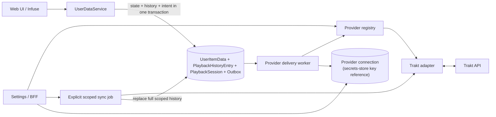

# Watched-History Providers: Trakt

Status: In progress — phases 1–4 shipped (PRs #91–#102); see
[Implementation Phases](#implementation-phases) for what remains
Created: 2026-07-21
Updated: 2026-07-24

## Goal

Add a provider-neutral watched-history integration and ship Trakt as its first
provider. Media Server remains offline-first and keeps its current local playback
state, while an explicit user-driven sync makes watched movies and episodes
portable through Trakt.

The preliminary phase asked whether Infuse exposes a reliable distinction between
actual completion and a manual watched mark. **It does** (observed 2026-07-22, see
the observation results), so `PlaybackHistoryEntry` and exact per-play
synchronization are mandatory parts of this feature rather than deferred work.

## Scope

- A stable watched-history provider registry with Trakt as the only shipped and
  active provider in the first version.
- Deployment-level Trakt application configuration through Media Server's Hosty
  app settings, beside the existing TMDb credential configuration.
- One per-user Trakt account connection through OAuth Device Code flow.
- Per-connection token storage in the Hosty Core app secrets store, with
  automatic token refresh.
- A Settings section named **Watch history providers**, placed near Infuse Access.
- An explicit **Sync with Trakt** action with a preview popup and catalog/media-kind
  scope selection.
- Full-history two-way reconciliation: Trakt
  history replaces safely matched local history, while reliable local exact plays
  and one timeless legacy/manual mark missing from Trakt are added first.
- No periodic or automatic Trakt-to-local synchronization.
- Durable asynchronous outbound operations so Trakt failures never block local
  playback or manual watched-state changes.
- Manual watched behavior that ensures one timeless Trakt mark only when Trakt has
  no history for the item.
- Manual unwatch behavior that removes only Media Server-created timeless Trakt
  entries whose exact remote history IDs were resolved and stored, while retaining
  external timeless entries and every exact timestamped play.
- Movie, episode, season/series bulk, and multi-episode-file mapping through
  existing TMDb identities plus canonical season and episode numbers.
- Explicit handling of missing and non-unique identities.
- `PlaybackHistoryEntry`: store every local and imported Trakt play as an exact or
  timeless history entry, and make Sync use full Trakt history. The observation
  phase that gated this is complete.
- Backend xUnit tests using Imposter where dependencies are mocked, SQLite
  integration tests, frontend tests, and live contract verification with a
  dedicated Trakt test account.

## Out of Scope

- A second external watched-history provider implementation.
- More than one active watched-history provider per user.
- Runtime loading of third-party provider assemblies or plugins.
- Trakt scrobble start, pause, or stop calls.
- Live watching status or resume-position synchronization with Trakt.
- Automatic inbound polling or provider-to-provider replication.
- Detecting or suppressing another Trakt client's writes to the same account.
- More than one provider link per local play (see the Provider Boundary note).
- Ratings, favorites, comments, collection, lists, watchlist, recommendations, or
  catalog acquisition from Trakt.
- Synchronizing media that is not present in the local library.
- Reconstructing historical play times from existing `PlayCount` or
  `LastPlayedDate` values.
- Exporting multiple legacy plays from an aggregate local play count.
- Broad Trakt media-history deletion that could remove exact timestamped plays.
- Ambiguous anime absolute-number mapping without canonical TMDb season and
  episode numbers.

## Current Behavior

- `UserDataService` owns playback-state changes shared by the web and
  Jellyfin-compatible surfaces.
- A movie, episode, or video becomes watched at 90% of runtime. Its resume position
  is reset, `Played` becomes true, and `PlayCount` increments only on a false-to-true
  transition.
- Starting meaningful progress on an already-watched item clears `Played`; an
  explicit unwatch also clears `Played` and resume while retaining `PlayCount`.
- `LastPlayedDate` is updated by playback start/progress and watched operations. It
  is not a dedicated completion timestamp.
- Jellyfin `Sessions/Playing`, `Sessions/Playing/Progress`, and
  `Sessions/Playing/Stopped` all call `ReportPlaybackAsync`.
- Jellyfin `PlayedItems` POST/DELETE and the web watched toggle call
  `SetPlayedAsync` separately from progress reporting.
- `PlaybackReportBody` already accepts `PlaySessionId`, `MediaSourceId`,
  `PositionTicks`, and `IsPaused`, but `PlaySessionId` is currently ignored by
  `UserDataService`.
- `PlaybackInfo` already returns a fresh server-generated `PlaySessionId`, but
  Media Server does not currently retain or correlate it with later reports.
- A first playback report at or above 90% still calls `MarkWatched` — seeking to
  the end is a legitimate way to mark an item — but no longer counts a play,
  since no crossing was observed. Reaching that state through normal playback is
  near-impossible anyway: crossing the threshold clears the resume point, and Infuse
  resumes from the server's position (verified twice), so a stored resume above
  90% cannot normally exist. The one path that produces it is an item whose
  runtime was still unknown when the position was stored.
- One playback session can no longer inflate `PlayCount`. Observed on 2026-07-22:
  a single continuous session took an episode from 0 to 3 plays by crossing 90%,
  rewinding below it and climbing back twice. Fixed by a `PlaybackSession` row
  keyed on the client's `PlaySessionId`, which counts the first crossing per
  session and ignores later ones. A session that never reports below the
  threshold (the client resumed into the final stretch) marks the item watched
  without counting a viewing.
- Jellyfin `PlayedItems` accepts optional `DatePlayed`; Media Server uses it as
  `LastPlayedDate` when present. Infuse never sends it (zero of 635 observed
  records), so it plays no part in this feature.
- Route-level request logging (`requests.log`: method, path, query, status,
  duration) is written in Development **and** whenever the operator enables the
  `PLAYBACK_DIAGNOSTICS` setting. It carries no JSON playback-body fields.
- `PLAYBACK_DIAGNOSTICS` additionally writes one structured JSON line per
  playback-state request to `logs/playback-diagnostics.log`.
- Local state is aggregate-only in SQLite. There is no per-play history or exact
  dedicated `LastWatchedAt` value.
- No external watched-history provider connection exists today.

## Target Behavior

### Provider Boundary

The integration follows the stable provider-key pattern already used by metadata
providers:

- `IWatchHistoryProviderRegistry` resolves adapters by keys such as `trakt` and
  returns configuration and capability descriptors for Settings;
- `IWatchHistoryProvider` accepts provider-neutral movie/episode identities and
  aggregate history operations;
- provider authorization is a separate collaborator so Device OAuth does not
  become mandatory for every possible future provider;
- provider DTOs, OAuth details, credentials, timestamp sentinels, rate limits,
  transport errors, and remote IDs remain inside the adapter;
- `UserDataService`, sync reconciliation, identity cardinality checks, and the
  transactional outbox do not branch on `trakt`.

Adapters declare capabilities including exact timestamp writes, timeless writes,
aggregate watched reads, full history reads, and individual history-entry removal.
An unsupported capability produces a typed sync issue; the core never fabricates a
timestamp or falls back to a broader destructive operation.

Although the schema identifies connections by `(AppUserId, ProviderKey)`, the first
version permits only one active watched-history connection per user and ships only
the Trakt adapter. Simultaneous multi-provider fan-out is deferred.

The boundary is provider-neutral, but one storage detail is not: `PlaybackHistoryEntry`
carries a **single** provider key / history ID / ownership slot, so one local play can
be linked to exactly one remote history entry. That is sufficient while only one
connection can be active, and it is the one schema change a second simultaneous
provider requires — the identity snapshot, the outbox, and the sync run are already
keyed by provider and need no rework. The migration is additive rather than a
redesign: move the link into a child table keyed `(HistoryEntryId, ProviderKey)`
holding the remote history ID, ownership flag, and link status, and read it through
the provider key the caller already has. Recording it here so the second integration
does not discover the limit halfway in; implementing it before a second provider
exists would be speculative structure with no consumer.

### Deployment Configuration and Per-User OAuth

**Token storage (settled 2026-07-22).** Per-user OAuth tokens live in the Hosty
Core app secrets store, which shipped in Core 0.60.0
([feature](https://github.com/alex-de-haas/docker-host/blob/main/docs/features/app-secrets-store.md);
[platform request #15](../features/hosty-platform-requests.md)). Media Server
stores one secret per connection through `HostySecretsClient`
(`HostySdk.App` 0.3.0) and keeps only the key reference in SQLite. There is no
app-side credential encryption: Core holds the values in
`apps/<id>/secrets.json`, outside the backed-up `data/` directory, so a database
backup never carries live Trakt access.

Two consequences shape the design below. A database restore rolls the app's rows
back but not its secrets — which is what we want, because Trakt refresh tokens
rotate on every refresh, so a token embedded in a backup would usually be stale
by restore time while the live store keeps the connection working. And a
missing secret is an expected state, not an error: it means the app was restored
onto a new host (Core state does not migrate) or the connection was never
completed, and it maps to `RequiresReconnect`.

The Media Server Hosty app settings add:

- `TRAKT_CLIENT_ID`;
- secret `TRAKT_CLIENT_SECRET`.

No operator-generated encryption key is required.

The instance operator creates one Trakt API application for the Media Server
instance, then enters these values through the same deployment settings surface
that currently contains the TMDb API token. Missing or invalid Trakt configuration
does not prevent Media Server from starting.

The admin-only setup help links to `https://docs.trakt.tv/docs/create-an-app` and
names both required settings. Saved secrets are never displayed. Regular users
see only that the provider needs operator configuration.

After instance configuration, each Media Server user connects their own Trakt
account from the Trakt card in **Watch history providers**, near Infuse Access:

1. Start Trakt Device OAuth for the current authenticated user.
2. Display the activation URL/code and poll only at Trakt's returned interval.
3. Represent pending, denied, expired, used, invalid, and slow-down responses.
4. Store the returned access and refresh credentials in the Core secrets store
   under this connection's key.
5. Retrieve and display the connected Trakt identity.
6. Refresh tokens serially before expiry; move to `RequiresReconnect` after a
   permanent refresh failure without discarding pending outbound operations.

No API accepts an arbitrary app-user ID for these actions. Administrators configure
the instance application but cannot connect a Trakt account on another user's
behalf or retrieve that user's tokens.

Disconnect revokes the token on a best-effort basis, then deletes that connection's
stored credentials, authorization attempt, sync jobs, and pending operations.
"Stored credentials" means the connection's secrets-store entry, and any
in-flight authorization attempt's entry: disconnect deletes both **before**
removing the rows that reference them, so a failed best-effort revocation can
never leave a live refresh token in the store with nothing in SQLite pointing at
it. Disconnect never deletes local playback state. User-directory reconciliation
applies the same cleanup when a user becomes unassigned or disabled.

### Infuse/Jellyfin Observation — Results

Phase 0 ran on 2026-07-22 against a live install (`docker` runtime, Infuse on
Apple TV) and produced **635 diagnostic records over 14 playback sessions**. The
route-level hypothesis this section reports on was written down before any
observation — that `Sessions/Playing*` is the only source of an exact completion,
that the first below-to-90% crossing in a session is that completion, that one
session counts at most one play, and that PlayedItems is a manual action. Each
claim below is an observation against that hypothesis, not a prediction.

The diagnostics are gated on the operator setting `PLAYBACK_DIAGNOSTICS`, not on
the ASP.NET environment. The original design assumed a Development-only log, which
did not survive contact with how the app is run: the shipped runtime is `docker`,
which is never Development, so the matrix could not have been captured at all —
confirmed when a manual watched/unwatch through Infuse left the database changed
and `requests.log` untouched. The setting should be turned off once observation is
finished; it also enables the route log, which records every request including
streaming.

#### Confirmed

**The client session id is reliable.** All **631** playback reports carried a
`PlaySessionId`, echoed from our `PlaybackInfo` response and stable across
`Playing`, `Progress` and `Stopped` within a session. This is the load-bearing
result: the primary key works, so **the server-derived fallback session, its
inactivity window, and the window-duration measurement are all removed from this
plan**. A report without a session id keeps the historical aggregate rule rather
than being correlated by guesswork.

**A manual mark is trivially distinguishable from playback.** All 4 observed
`PlayedItems` requests carried **no** session id, and no `PlayedItems` POST ever
followed a natural completion — Infuse marks watched by the progress stream alone.
**The active/recent correlation window is therefore removed**: route plus the
presence of a session id separates the two cases exactly, with no timing heuristic.

**`DatePlayed` is never supplied.** Zero of 635 records carried it. **Its handling
is removed from the plan**; the field stays a diagnostic curiosity, and server UTC
at the crossing is the only completion timestamp.

**A Progress crossing survives a missing `Stopped`.** A session killed mid-playback
after crossing 90% kept its completion, with no `Stopped` ever arriving. Requiring
`Stopped` would have lost the play.

**Auto-advance closes and opens sessions in a stable order.** At episode end the
outgoing session's `Stopped` (fraction 1.0) and the next episode's `Playing` arrive
in the same second, in that order, with distinct session ids. No special handling
is needed.

**A rewatch is detectable.** Watching an item again from the start clears `Played`
at the minimum-resume threshold and the next crossing counts normally. Merely
reopening an already-watched item and seeking near the end does *not* count a
second play, because `Played` is still true — the asymmetry that decides when a
rewatch is exported.

#### Corrected — a bug the observation found

The hypothesis said one session could increment `PlayCount` at most once. **That
was false.** One continuous session took an episode from 0 to 3 plays: crossing 90% counts
a play, rewinding below clears `Played` (correctly — it is a genuine resume point),
and the next crossing looks like a fresh completion. Any rewind near the end
inflated the count, and it would have exported three watch events to Trakt for one
viewing.

Fixed before this plan proceeds (media-server 0.21.2): a `PlaybackSession` row keyed
on the client session id counts the first crossing per session and ignores later
ones. Verified on the multi-episode run — one crossing counted, the following 19
reports did not. **The plan's session gate is therefore partly built already** as
`PlaybackSession`; see the Data Model section for what remains.

#### Ruled out as unreachable

A first report already at or above 90% cannot normally happen. Crossing the
threshold clears the resume point, and Infuse resumes from the *server's* position
(observed twice), so a stored resume above 90% cannot exist. The rule that such a
report marks watched without counting a play is implemented anyway, because one
path still produces it: an item whose runtime was unknown when its position was
stored. It is guarded by tests rather than by observation.

#### Multi-episode files

Observed with a real `S01E01-E02` file. Infuse reports **the combined item's own
id** — there is no per-episode identity to report, and Infuse ignores
`IndexNumberEnd` for display too. The reported `runtime` is the **whole file**, so
the 90% mark falls roughly 80% into the second episode: watching only the first
episode records nothing at all, and one completion covers both.

Splitting such files at ingest was considered and **declined** (2026-07-22): the
only reliable automatic split point would come from black-frame/silence detection,
which needs a full decode pass, and the one affected series here has no credits or
intro between the episodes for it to find. Outbound export therefore expands the
local inclusive range into one Trakt event per episode, both carrying the same
completion timestamp — the best available answer, and the plan states the limit
rather than implying per-episode precision.

#### Not applicable

The matrix asked for the same completion cases "through the web player". **There is
no web player** — the web UI has no video element and reports no playback. Its
watched toggle is instrumented (0.21.1) and follows the same `SetPlayedAsync` path
as the Jellyfin route, so there is no second completion contract to verify.

#### What the diagnostics record

`requests.log` captures routes and query strings; the playback endpoints
additionally record structured fields from the parsed body: route kind, app user
and item id, session and media-source ids, position/runtime/percentage, paused and
stopped flags, `DatePlayed` presence, and `Played` before and after.

Diagnostics must not log authorization headers, access tokens, raw request bodies,
file paths, media titles, or provider credentials — what remains is opaque ids,
numbers, and flags. That applies to the route log too: Jellyfin accepts a reusable
access token as the `api_key` query parameter on media and image URLs, so
`requests.log` masks credential-shaped query values rather than persisting working
tokens in a file the operator reads and may share. Writes are bounded, serialized,
and failure-tolerant: a broken log path disables the sink with one warning rather
than failing playback requests.

### Sync with Trakt

The Trakt Settings card exposes **Sync with Trakt**. It opens a popup where the
user selects one or more accessible catalogs and optionally movies or series. The
action is explicit; no schedule or background inbound poll invokes it.

The popup first creates a read-only preview. It reports:

- selected catalogs/media kinds;
- watched on both sides;
- watched only in Trakt;
- currently watched only in Media Server;
- local rows that are currently unwatched but retain historical `PlayCount`;
- remote items absent from the selected local library — **not implemented, and blocked
  on a capability that does not exist**: `IWatchHistoryProvider.GetHistoryAsync`
  answers only for the identities it is given, and those are derived from local
  items, so this count could structurally only ever be zero. Reporting it needs an
  account-wide history read (`AggregateWatchedReads`, or a new paginated
  whole-account read) plus a bound on how much history that may pull. Recorded
  here rather than shipped as a field that is always zero;
- missing or ambiguous identities;
- pending or terminal outbound operations;
- local rows whose state revision must remain unchanged until application;
- local history entries and aggregate values that will be replaced.

Apply runs as one
asynchronous, per-user/provider-serialized full-history job:

1. Drain pending outbound operations for the selected scope. If they cannot be
   drained because of a terminal issue, block Apply and expose the issue; do not
   discard them silently.
2. Capture each candidate `UserItemData.StateRevision` at the start of Apply.
3. Fetch the complete paginated Trakt movie and episode history needed for the
   selected scope, including every individual history ID and watched time.
4. Match remote plays to local `PlaybackHistoryEntry` rows by normalized identity
   and exact timestamp where available.
5. Export a reliable local exact entry missing from Trakt with its exact time.
   Export a current legacy/timeless local watched mark missing from Trakt as at
   most one `watched_at: "unknown"`, regardless of historical local `PlayCount`.
6. Do not upload an item whose current local `Played=false`, even when its retained
   `PlayCount` is greater than zero; unwatch is treated as intentional current
   state.
7. Re-fetch affected Trakt history after successful additions.
8. Before applying each item, compare its current state revision with the captured
   value. Skip changed rows as `LocalStateChangedDuringSync`; their newly queued
   outbound work runs after the sync lock is released.
9. Replace matching local `PlaybackHistoryEntry` rows from that final Trakt
   snapshot. Preserve every exact play; normalize any number of remote unknown
   entries for one media identity to at most one local timeless entry because
   their individual occurrence times are unknowable.
10. Recompute `PlayCount` and `LastWatchedAt` from the resulting local history and
   set `Played` from the synchronized Trakt state. A watched item clears resume; an
   item still absent from Trakt becomes unwatched but retains useful resume.
11. Leave favorites, `LastPlayedDate`, catalogs, metadata, files, and source ordering
   unchanged.

Trakt-authoritative replacement applies only to safely and uniquely mapped rows
whose export succeeded and whose state revision did not change during the job.
Unmappable rows, `AmbiguousLocalIdentity`, failed additions, and concurrently
changed rows retain all local state, including `Played`, resume, history, and
`PlayCount`.

This is a full per-play reconciliation followed by a Trakt-authoritative local
history projection. Only pre-migration aggregate history remains lossy: an existing
`PlayCount > 1` without individual rows can collapse to one unknown entry. The
preview warns about that specific loss before Apply.

If a local-only timeless addition fails, that item's local watched state is not
cleared or overwritten during the run. The result records a retryable or terminal
issue.

For a pre-migration row with `Played=false`, positive `PlayCount`, and no local
history entries, Sync preserves the historical `PlayCount` when Trakt also has no
history. It does not silently recompute the count to zero. If Trakt has history,
the imported full history becomes authoritative and replaces the legacy count.

Applying the same completed sync again is idempotent at the play level: exact
identity/timestamp matches are not reposted, and an item that already has any
timeless history receives no additional `unknown` entry.

### Manual Watched and Unwatched

An explicit watched toggle changes local state immediately. For the active
provider it records an asynchronous `EnsureTimelessWatched` operation:

- if local history contains no entry of any kind, add one local
  `PlaybackHistoryEntry` with `WatchedAt=null` and origin `Manual`;
- if local exact or timeless history already exists, do not create another local
  play merely because `Played` was toggled back to true;
- fetch and retain the current Trakt item-history ID set in the outbox event;
- if any history exists, complete without adding anything;
- otherwise add exactly one `watched_at: "unknown"` entry, then read item history
  again and identify the new ID by set difference;
- retry the read-after-write with bounded delay for eventual consistency;
- store the uniquely resolved provider history ID on the locally created
  `PlaybackHistoryEntry`; if it remains unresolved, stop reposting, mark the link
  unresolved, and continue reconciliation without guessing;
- never expand local `PlayCount` into several unknown entries.

An explicit unwatch also changes local state immediately while retaining the local
`PlayCount`, matching current behavior. It records `RemoveOwnedTimelessEntries`:

- remove locally created Manual/Legacy timeless entries while preserving exact and
  Trakt-imported history;
- delete remotely only the provider history IDs linked to those Media
  Server-created timeless entries;
- retain timeless entries created by other clients and every exact entry;
- never use Trakt's media-object removal form, which could remove all plays.

This ownership link avoids deleting timeless entries created by another client and
does not depend on Trakt returning the literal `unknown` sentinel later. The live
contract test still verifies write/read timing and normalization, but round-trip
`unknown` is no longer an approval blocker for safe deletion.

Season/series manual marks do not run one read-before-write loop per episode. The
worker groups compatible events by show, performs one aggregate/full-history read,
batches all missing episodes into one `POST /sync/history` payload (or the minimum
bounded chunks required by the live contract), then performs grouped read-after-
write reconciliation. Bulk unwatch batches the already stored owned history IDs
through individual-ID removal payloads.

After unwatch, Trakt can still consider the item watched when external timeless or
exact plays remain. The next explicit Sync with Trakt will consequently set the
matching local item back to watched. Settings help and the unwatch result must
explain this behavior.

### Coexisting With Another Trakt Client

Infuse ships its own Trakt integration, and it is the client this app's whole
Jellyfin surface exists for. An operator who enables Trakt in Infuse *and* connects
Trakt here has two independent writers for the same viewing, so one watch produces
two Trakt history entries. The same applies to any other scrobbler pointed at the
same account — a Plex agent, the Trakt app itself.

Media Server does not break in that situation, by construction rather than by
accident: outbound writes are additive, and removal is permitted only for entries
whose remote history ID this app resolved and stored as its own, so a duplicate
from another client is retained rather than deleted (already covered by the
`RemoveOwnedTimelessEntries` rules and the live-verification matrix). Inbound Sync
normalizes any number of remote timeless entries for one identity down to a single
local one, so duplicates do not multiply locally either.

What Media Server cannot do is *prevent* the duplication: Trakt does not
deduplicate history by item and timestamp, and two clients reporting the same watch
seconds apart are indistinguishable from a genuine rewatch. Scrobbling therefore
has to be enabled in exactly one place, and this is a product decision rather than
a technical one:

- the Trakt card in Settings states plainly that Trakt should be enabled either in
  Media Server or in the player, not both, and names Infuse explicitly;
- connecting Trakt here surfaces that note at connection time, not buried in help;
- Media Server is the better place to own it when the library is served from here —
  it sees catalogs, canonical identities, manual marks and the web surface, whereas
  a player only sees what it plays — but the operator makes the call.

Detecting the other writer automatically is deliberately out of scope. It would
mean inferring intent from timing on a service whose API cannot distinguish a
duplicate from a rewatch, and a wrong guess would silently drop a real play.

### Playback Completion and Exact Time

The desired behavior is to send an exact server UTC `watched_at` only when Media
Server can establish that playback actually crossed the local 90% threshold. A
manual state change must use `unknown`.

The exact source is the first below-to-at-least-90% crossing in
`Sessions/Playing*`, keyed by the client's `PlaySessionId`. Server UTC at that
crossing is `WatchedAt`; `DatePlayed` is never used, having been observed as never
supplied. Phase 0 confirmed the hypothesis, so:

- insert one exact `PlaybackHistoryEntry` with server UTC at the crossing, keyed by
  the client session id;
- increment `PlayCount` once per proven completion, including a rewatch — already
  shipped and observed holding across 19 further reports in one session;
- enqueue one exact UTC history addition in the same SQLite transaction;
- keep the session's completion durable so rewinds, repeated Progress/Stopped and
  process restarts cannot create another play.

The rule intentionally accepts seeking across 90% as completion, matching the
existing threshold policy. It does not require Stopped, so a Progress crossing is
retained when the client or network disappears afterward.

If the trace cannot distinguish actual completion safely, the integration plan
stays Draft and returns to the user. It must not fabricate exact history or silently
drop the agreed conditional `PlaybackHistoryEntry` functionality.

When the trace succeeds, **Sync with Trakt** uses the paginated full history
endpoint and imports every exact play plus at most one normalized timeless marker
per identity.

### Identity Mapping

The provider-neutral identity snapshot contains media kind, available external
IDs, and canonical episode coordinates. The Trakt adapter supports:

- movies through local TMDb movie ID as `movie.ids.tmdb`;
- episodes through parent-series TMDb ID plus canonical season and episode number;
- multi-episode files by expanding their inclusive episode range outbound;
- series/season manual toggles through the existing descendant-episode expansion.

Video extras, missing identities, invalid numbering, and ambiguous absolute-number
anime are not guessed. The local operation still succeeds and a bounded provider
issue is shown.

Outbound operations from separate local copies are independent and can create
separate Trakt plays for the same Trakt movie or episode. Inbound behavior for
multiple selected local rows sharing one normalized identity remains an open
question: applying to all copies may erase another edition's resume point, while
choosing one row is arbitrary. Catalog scope can disambiguate copies when the user
selects only one catalog.

### User Interface and Internal API

Settings gains a **Watch history providers** section near Infuse Access. The Trakt
card shows:

- operator configuration availability;
- connected Trakt identity and connection health;
- pending/failed operation counts;
- last successful delivery and explicit sync;
- Connect, Reconnect, Sync with Trakt, and Disconnect actions;
- concise help for timeless watched marks, unwatch, and exact-play retention;
- a plain statement that Trakt should be enabled here **or** in the player, not
  both, naming Infuse's own Trakt integration, shown at connect time rather than
  only in help.

The provider-keyed internal API, exposed to the browser through the existing
Next.js BFF, adds current-user endpoints:

- `GET /api/watch-history/providers`;
- `GET /api/watch-history/connections/{providerKey}`;
- `POST /api/watch-history/connections/{providerKey}/authorization/start`;
- `POST /api/watch-history/connections/{providerKey}/authorization/poll`;
- `POST /api/watch-history/connections/{providerKey}/sync/preview`;
- `POST /api/watch-history/connections/{providerKey}/sync/apply`;
- `DELETE /api/watch-history/connections/{providerKey}`.

No response contains plaintext credentials, secrets-store values, or Trakt
device secrets. Mutations use the existing authenticated same-origin app session.

### Data Model

`WatchHistoryProviderConnection` stores:

- connection ID, `AppUserId`, and stable `ProviderKey`;
- provider account ID and display identity;
- the Core secrets-store key holding the provider credentials (never the value);
- optional credential expiry and connection status;
- connected, last delivery, and last explicit sync timestamps;
- bounded sanitized error state.

The schema keeps `(AppUserId, ProviderKey)` unique and the first-version service
enforces at most one active provider connection for a user.

`WatchHistoryProviderAuthorization` stores one short-lived authorization attempt:

- provider state/device code, held in the Core secrets store for the attempt's
  short lifetime under the **derivable** key
  `trakt.authorization.{authorizationId}.device`;
- safe user-facing activation code and URL;
- issue, expiry, polling interval, next poll time, and status.

The authorization key is derived from the row id rather than stored, so cleanup
never depends on reading the row first. The attempt's secret is deleted on every
terminal path — success, denial, expiry, abandonment, disconnect, and
user-directory reconciliation — and always **before** the row is removed. Because
a crash can still strand one between those two steps, a periodic reconciliation
lists the app's secret keys (the list endpoint returns names only), matches
`trakt.authorization.*` against live rows, and deletes the orphans. Without both
halves, a denied or abandoned attempt would leave its device code in Core
permanently, with nothing left in SQLite pointing at it.

`PlaybackHistoryEntry` stores the local per-play source of truth:

- entry ID, app user ID, media item ID, and creation time;
- nullable `WatchedAt`, where null represents one normalized timeless/unknown mark;
- origin: `LocalPlayback`, `Manual`, `TraktSync`, or `Legacy`;
- the client `PlaySessionId` of the session that produced it, for idempotency;
- immutable canonical identity snapshot for durable outbound delivery;
- optional provider key/history ID, ownership flag, and link status
  (`None`, `Pending`, `Resolved`, or `Unresolved`).

Exact entries are not deduplicated merely by media item and timestamp because two
real plays can share the same timestamp precision. For locally observed playback,
the client session id is the uniqueness rule. At most one local timeless entry is
retained per user/media identity.

`PlaybackSession` durably gates threshold crossings. **It already exists**
(media-server 0.21.2, shipped to fix the play-count inflation Phase 0 found) with:

- app user, media item, and the client `PlaySessionId` as `SessionKey`;
- start and last-report timestamps;
- whether a below-threshold position has been observed;
- a completion timestamp;
- uniqueness on `(AppUserId, MediaItemId, SessionKey)`, and age-based cleanup.

This feature adds one column: the resulting `PlaybackHistoryEntry` id, so a
restart or repeated report reuses the same completion decision rather than merely
suppressing a second count. No server-derived session key is needed — the client
id was observed on every playback report.

`WatchHistoryOutboxEvent` stores provider-neutral outbound intent:

- event, connection, app user, local media item, and optional source history-entry
  IDs;
- operation (`EnsureTimelessWatched`, `RemoveOwnedTimelessEntries`, or
  `AddExactWatch`);
- immutable canonical identity snapshot and optional occurrence timestamp/session
  key;
- for timeless creation, the bounded pre-create remote ID snapshot needed to
  resolve a committed add after a crash or eventually consistent read;
- pending, leased, completed, or terminal status;
- attempts, lease, next-attempt, completion, and sanitized error fields;
- an idempotency key derived from connection, media item, local state revision,
  operation, and any approved completion session key.

`WatchHistorySyncRun` stores a bounded preview/application job:

- user, connection, selected catalog/media-kind scope, status, and expiry;
- aggregate counts and a bounded issue/sample payload;
- pending-event prerequisite state;
- captured per-item state revisions used to reject stale application;
- started, completed, and failure timestamps.

`UserItemData` remains the fast persisted aggregate beside per-play history. It
gains `LastWatchedAt`, `WatchedStateChangedAt`, and a local state revision:

- after full Sync, `PlayCount` and `LastWatchedAt` are recomputed from normalized
  local history;
- `Played` remains current state rather than `history.Count > 0`, so explicit
  unwatch can leave exact historical plays and a positive count while setting
  `Played=false`;
- `LastPlayedDate` keeps its current meaning and is never populated from Trakt;
- pre-migration `PlayCount` is preserved until the first full Sync. A watched
  legacy row can contribute at most one timeless `Legacy` entry because its
  individual play times cannot be reconstructed.

Provider history IDs are retained on individual history entries when known. Remote
deletion is permitted only when that entry is explicitly marked as created by
Media Server; an imported or pre-existing provider entry is never inferred to be
owned merely because its identity/timestamp matches.

Credentials live in the Core secrets store under a per-connection key such as
`trakt.connection.{id}.tokens`; SQLite holds only that key. Every secret Media
Server writes is deleted on the terminal path of whatever owns it, so nothing
outlives its row (see the connection and authorization entities above). Media Server performs
no credential encryption of its own — the store is outside backup scope, which is
what the encryption was for. Plaintext credentials exist only in memory for an
outbound request and are never logged. The SDK client caches reads, so a briefly
unavailable Core does not stall delivery for a connection already in use.

### Service Design

- Register provider adapters through DI and resolve by stable key; core services do
  not depend on Trakt DTOs.
- Use a typed Trakt `HttpClient` and handlers for API version, API key, bearer token,
  timeout, and safe response handling.
- Represent expected provider failures as typed results; reserve exceptions for
  unexpected or transport failures.
- Pass `CancellationToken` through HTTP, EF Core, sync jobs, and workers.
- Serialize sync, token refresh, and Trakt mutations per user/connection without
  holding a database transaction across network calls.
- Keep local state mutation and outbox insertion in one EF Core transaction.
- Treat `UserItemData.StateRevision` as an optimistic concurrency boundary for
  long-running sync application; skip rather than overwrite a changed row.
- Group season/series outbox events by Trakt show identity, use one history read,
  and batch/chunk history additions or owned-ID removals instead of issuing one
  read/mutation pair per episode.
- Pace authenticated Trakt mutations to its documented per-user limit and honor
  `Retry-After`.
- Retry transient failures with bounded exponential backoff and jitter; surface
  terminal identity/contract errors in Settings.
- Bound retained completed events, sync previews, and displayed issues by age and
  count.
- Emit structured metrics without usernames, media titles, or tokens as labels.

## Acceptance Criteria

- [ ] The watched-history core resolves adapters by stable provider key and has no
  Trakt OAuth, DTO, endpoint, timestamp sentinel, or rate-limit branches.
- [ ] Only Trakt is shipped and only one provider connection can be active for a
  user in the first version.
- [ ] Media Server starts and existing playback works when Trakt configuration is
  absent or Trakt is unavailable.
- [ ] The instance operator configures one Trakt application through Hosty Media
  Server settings; each user connects only their own Trakt account from Settings.
- [ ] Tokens and device codes live in the Core secrets store, never in Media
  Server's own database, are never returned or logged, and are deleted on every
  terminal path so no secret outlives the row that referenced it.
- [ ] The preliminary diagnostics capture the required Infuse fields without raw
  bodies/secrets or changes to playback behavior.
- [ ] The expanded Infuse/web test matrix confirms or refutes every predefined
  route/session hypothesis before this plan becomes `Ready`.
- [ ] When the hypothesis succeeds, every first below-to-at-least-90% crossing in
  one client session
  creates exactly one exact `PlaybackHistoryEntry` and one idempotent outbound
  operation in the same transaction.
- [ ] A first report already at or above 90% creates no exact play; rewinding and
  crossing again in the same session cannot increment `PlayCount` or enqueue again.
- [ ] A PlayedItems request is always a manual mark: it carries no session id and
  never follows a natural completion, so no timing correlation is involved.
- [ ] Progress crossing is sufficient without Stopped, seeking across 90% follows
  the accepted completion policy, and auto-advance uses distinct sessions.
- [ ] Sync with Trakt is explicit, scoped by catalogs/media kind, previewable,
  serialized, and never invoked by a periodic inbound worker.
- [ ] Pending outbound operations are drained before sync Apply; terminal pending
  issues block Apply rather than being silently discarded.
- [ ] A locally watched item absent from Trakt creates at most one unknown remote
  entry regardless of local `PlayCount`.
- [ ] A local `Played=false` row is not exported merely because it retains a
  positive `PlayCount`.
- [ ] After successful additions, full Trakt history replaces matching local
  history, exact plays are preserved individually, unknown plays are normalized to
  at most one local timeless entry, and favorites/`LastPlayedDate` are unchanged.
- [ ] Sync changes only uniquely/safely mapped rows whose export succeeded and
  whose state revision is unchanged; every excluded row retains all local state.
- [ ] A pre-migration `Played=false, PlayCount>0` row with no Trakt history keeps
  its historical count instead of being recomputed to zero.
- [ ] The preview warns that an aggregate local play count can collapse because
  only one unknown historical mark can be exported safely.
- [ ] Reapplying a completed sync does not duplicate exact local/remote plays or
  create another unknown history entry.
- [ ] Explicit watched changes local state immediately and asynchronously ensures
  one local/remote unknown only when no history of any kind exists.
- [ ] Explicit unwatch changes local state immediately, retains local play count,
  removes only Media Server-created local timeless entries and their resolved
  remote IDs, and preserves external timeless plus every exact entry.
- [ ] Timeless creation persists a uniquely resolved remote ID through
  read-before/write/read-after diff; eventual consistency is retried and unresolved
  ownership never triggers a guessed or broad deletion.
- [ ] Season/series marks use grouped history reads and batched/chunked mutations,
  not one read and one mutation per episode.
- [ ] The next Sync can restore local watched state after unwatch when exact Trakt
  history remains, and Settings explains why.
- [ ] Settings tells the operator to enable Trakt here or in the player but not
  both, naming Infuse, at connect time.
- [ ] A duplicate created by another Trakt client is retained by unwatch and
  normalized to one local entry by Sync, so a second writer degrades the history
  rather than corrupting it.
- [ ] Missing or unsafe mappings never block local state changes and surface a
  bounded issue without exposing private data.
- [ ] Duplicate local identity behavior is explicitly resolved before `Ready` and
  covered by tests.
- [ ] Trakt rate limits, refresh, retries, process restart, ambiguous responses, and
  terminal failures follow the documented policies.
- [ ] User removal/reconciliation deletes provider credentials without deleting
  local playback data; under the Core secrets store, disconnect and
  reconciliation delete the per-connection secret before removing the connection
  row, and an authorization attempt's secret is deleted on every terminal path,
  so no orphaned credential survives in the Core store.
- [ ] Existing Jellyfin credential, PlaybackInfo, playback state, Continue
  Watching, Next Up, Settings, backup, restore, and directory-reconciliation tests
  still pass.
- [ ] Feature documentation describes only the behavior actually implemented.

## Deliverables

- [ ] Development-only Jellyfin playback diagnostics and Infuse observation
  results.
- [ ] Final approved completion timestamp and idempotency contract based on those
  results.
- [ ] Conditional `PlaybackHistoryEntry` entity, constraints, migration, aggregate
  projection, and exact/manual/Trakt/legacy origins.
- [ ] Link the existing `PlaybackSession` gate to the created history entry (the
  gate, its cleanup, and the one-completion rule already shipped in 0.21.2).
- [ ] Provider-neutral registry, contracts, descriptors, and capability model.
- [ ] Hosty Trakt settings, validation, and administrator onboarding.
- [ ] Provider connection, authorization, outbox, sync-run, state-revision,
  provider-history ownership link, schema, constraints, and EF Core migration.
- [ ] Core secrets-store integration for credentials (`HostySecretsClient`),
  including the missing-secret reconnect path and orphan reconciliation for
  authorization secrets.
- [ ] Typed Trakt API client and adapter with Device Code, refresh, profile,
  watched-summary, paginated full history, item-history, history-add/remove, and
  revoke operations.
- [ ] Current-user provider API and Next.js BFF contracts.
- [ ] Durable manual watched/unwatched outbound operations.
- [ ] Read-before/write/read-after remote ID resolution with eventual-consistency
  reconciliation and owned-only removal.
- [ ] Grouped and batched season/series watched/unwatched delivery.
- [ ] Previewable, scoped, full-history Sync with Trakt job.
- [ ] Movie, episode, bulk, multi-episode, missing, and duplicate identity handling.
- [ ] Watch history providers Settings section near Infuse Access.
- [ ] Directory reconciliation and operational telemetry.
- [ ] Backend xUnit/Imposter and SQLite integration tests.
- [ ] Frontend component tests and manual Hosty iframe/device-flow verification.
- [ ] Dedicated live Trakt contract verification for unknown write/read/delete
  semantics and safe fallback.
- [ ] Feature documentation updates and plan removal under the completion rule.
- [ ] One final MINOR version update in `package.json` and `manifest.json` only when
  the pull request is ready for merge (`0.20.1` to `0.21.0`, unless the branch
  version has changed by then).

## Technical Design



The local request path never waits for Trakt. Manual actions and confirmed playback
update `UserItemData` plus `PlaybackHistoryEntry` and create provider intent
atomically; a worker performs external calls later.
Explicit Sync is the only inbound path and is serialized with outbound delivery so
it cannot read a stale remote snapshot while older local events are pending.

## Risks

- Another Trakt client writing to the same account (notably Infuse's own Trakt
  integration) duplicates history entries for one viewing. Ownership-scoped removal
  keeps this from corrupting anything, and inbound normalization keeps it from
  multiplying locally, but only operator guidance prevents the duplicate itself.
- Trakt may not expose a newly added history entry immediately. Owned timeless
  deletion depends on read-before/write/read-after ID resolution, so the worker
  needs bounded eventual-consistency reconciliation and an unresolved terminal
  state that never reposts or guesses.
- Trakt does not deduplicate history by item and timestamp. An ambiguous network
  failure after a committed add can create a duplicate unless the worker performs
  a read-before-retry check.
- Pre-migration aggregate-only rows cannot reconstruct historical plays. Their
  local `PlayCount` can intentionally collapse after exporting one unknown mark and
  replacing the scope with full Trakt history.
- A client could emit PlayedItems right after a natural completion (Infuse does not
  — observed), which under the "PlayedItems is always a manual mark" rule would look
  like a manual mark seconds after a play. It cannot produce a duplicate anyway:
  `EnsureTimelessWatched` adds nothing when local history already contains an entry
  and nothing remotely when the item already has Trakt history, and the completion
  has just created both. That guard is state-based rather than timing-based, which
  is why it holds for clients whose behaviour was never observed — the reason no
  correlation window is needed rather than merely not measured.
- A client that omits `PlaySessionId` falls back to the aggregate flag rule and can
  therefore still count a rewind as a second play. Infuse supplies one on every
  report, so this affects only hypothetical future clients; correlating them by
  timing was rejected as guesswork.
- Full Trakt history can be large and paginated. Full-history Sync must stream or
  page through it as a background job with bounded previews; unwatch fetches only
  the one item's history.
- Sync is user-triggered but can still be destructive to local aggregate counts and
  resume state. Preview and post-add re-fetch are mandatory.
- A local completion during a long Sync can be overwritten by the remote snapshot
  unless every row is guarded by its captured state revision.
- TMDb identities are not globally unique locally. Updating every duplicate can
  clear another edition's resume, while selecting one is arbitrary.
- Secrets do not follow a backup to a new host (Core state is not backed up), and
  a restore rolls local rows back without rolling the secrets store back. Both are
  intended, but the connection must detect a missing or mismatched secret and move
  to `RequiresReconnect` rather than retrying with nothing.
- Directory reconciliation must preserve its existing rule not to revoke
  credentials when directory state is uncertain.
- Development diagnostics must not become a permanent high-volume or sensitive
  request-body log.

## Open Questions

- **Resolved 2026-07-22 — Does Infuse echo the server-generated `PlaySessionId`?**
  Yes, on all 631 observed playback reports, stable within a session. The fallback
  server-derived session and its correlation window are removed from the plan; a
  client without one keeps the aggregate rule rather than being correlated by
  timing.

- **Resolved 2026-07-22 — Which local identity does Infuse report for a
  multi-episode file?** The combined item's own id; there is no per-episode
  identity, and Infuse ignores `IndexNumberEnd` even for display. Outbound export
  expands the local inclusive range into one Trakt event per episode, sharing the
  completion timestamp. Splitting such files at ingest was considered and declined
  (see the observation results).

- **Question:** Can the owned Trakt history ID be resolved reliably after adding
  `watched_at: "unknown"`?
  **Current answer:** A before/after ID set difference removes dependence on the
  unknown sentinel, but Trakt may be eventually consistent or concurrent writes
  may make the difference non-unique.
  **Recommendation:** Serialize per user/item, persist the pre-create set in the
  outbox event, retry delayed reads, and store the ID only for a unique difference.
  A non-unique/unresolved result is visible and never permits deletion or repost.

- **Question:** How should Sync apply one Trakt identity to multiple selected local
  copies?
  **Current answer:** Trakt treats them as one work. Local editions can have
  independent resume and watched state. A one-catalog scope can disambiguate some
  cases, but not duplicates inside that scope.
  **Recommendation:** Keep outbound events independent. For inbound Sync, classify
  multiple candidates inside the selected scope as `AmbiguousLocalIdentity` and
  change none until an explicit edition-grouping rule exists.

## Implementation Phases

### Phase 0: Observe and Finalize the Contract

- [x] Add operator-gated (`PLAYBACK_DIAGNOSTICS`) structured playback diagnostics
  without changing current playback behavior — shipped, works under the `docker`
  runtime rather than Development only.
- [x] Run the Infuse observation matrix and collect the request sequences — 635
  records over 14 sessions, 2026-07-22.
- [x] Mark each predefined session hypothesis confirmed/refuted: the client session
  id is the key (no fallback needed), one hypothesis was refuted and its bug fixed
  in 0.21.2, and `DatePlayed`/PlayedItems correlation were removed as unnecessary.
- [x] Resolve the observation-dependent open questions (session key, multi-episode
  identity); the two remaining questions are Trakt-side and belong to Phase 2.
- [ ] Verify Trakt read-before/write/read-after ID resolution, eventual-consistency
  retries, and owned-ID deletion with a test account. Still open; it now belongs to
  the live verification in Phase 5 rather than gating implementation.
- [x] Receive explicit user approval — given by starting implementation; the
  `Draft` → `Ready` gate below is superseded by the shipped phases.

### Phase 1: Provider Core, Configuration, and OAuth

Shipped in PRs #91–#94.

- [x] Add provider contracts, registry, descriptors, and capabilities with Trakt
  as the only adapter.
- [x] Add Hosty settings, typed validation, admin guidance, and unavailable states.
- [x] Add connection, authorization, outbox, sync-run, and aggregate state-revision
  schema.
- [x] Add `PlaybackHistoryEntry`, the session-to-entry link,
  provider ownership/link state, aggregate projection, and legacy migration.
- [x] Integrate `HostySecretsClient` for credential storage and the
  missing-secret reconnect path.
- [x] Implement typed Trakt HTTP/OAuth/profile/refresh/revoke operations.
- [x] Add current-user connection endpoints and tests.

### Phase 2: Durable Outbound Watched Operations

Shipped in PRs #95–#98.

- [x] Add mutation origin/state revision and atomic outbox recording to
  `UserDataService`.
- [x] Extend the shipped session gate to record the created history entry, so a
  restart or repeated report reuses the completion decision.
- [x] Implement `EnsureTimelessWatched` and `RemoveOwnedTimelessEntries` with
  read-before/write/read-after ID reconciliation.
- [ ] Implement grouped history reads and batched/chunked bulk mutations. **Partial:**
  the worker leases up to 20 outbox events per tick, but each event still resolves one
  identity, so a season/series mark performs one read/mutation pair per episode.
  `IWatchHistoryProvider.GetHistoryAsync` already takes an identity list, so grouping
  is additive.
- [x] Implement canonical movie/episode/bulk/multi-episode identity mapping.
- [x] Implement worker leases, pacing, refresh, retries, ambiguous-result checks,
  issues, and cleanup.
- [x] Verify all existing playback behavior and new offline/restart behavior.

### Phase 3: Explicit Full-History Sync

Shipped in PRs #99–#100.

- [x] Implement bounded scoped preview and pending-outbox prerequisite.
- [x] Fetch paginated full Trakt history for the selected scope.
- [x] Implement missing local exact/timeless additions and final history re-fetch.
- [x] Replace scoped local history, normalize unknown entries, and recompute
  aggregates without modifying favorites or `LastPlayedDate`.
- [x] Apply only unchanged state revisions and implement missing/ambiguous,
  failed-export, concurrent-change, and partial-failure issues.
- [x] Preserve legacy `PlayCount` for unwatched rows with no local/Trakt history.
- [x] Test repeat sync, count collapse, resume preservation, large scopes, and
  multi-episode cases.

### Phase 4: Settings and Operations

- [x] Add provider-keyed BFF contracts and Watch history providers UI near Infuse
  Access.
- [x] Add Device OAuth, connection status, Sync popup, progress/result, issues,
  reconnect, and disconnect states.
- [x] Add admin onboarding and unknown/unwatch help. A not-configured provider
  names the operator step; the disconnected card warns to enable Trakt in only
  one app; the Sync preview labels every set-aside classification with its reason.
- [ ] Extend directory reconciliation and add structured telemetry. Deferred: this
  is server-side observability, not a Settings surface, and is better sized on its
  own alongside the delivery worker.
- [ ] Verify keyboard, narrow-screen, Hosty iframe, and secret-redaction behavior.
  Secret redaction is covered by a test (no token, refresh token, device code, or
  secrets-store key reaches any response); the card and dialogs wrap on narrow
  widths and use the standard dialog primitives for focus and keyboard. Live
  iframe verification remains, with the live Trakt run below.

### Phase 5: Verification, Documentation, and Release Preparation

- [ ] Run complete backend and frontend build/test suites.
- [ ] Exercise live Trakt OAuth, history, rate-limit, failure, and reconnect paths.
- [ ] Update implemented feature documents in English.
- [ ] Remove this completed planning document and its root index link.
- [ ] Apply the single final MINOR version update only when the pull request is
  ready.

## Verification

Automated commands after implementation:

```sh
dotnet build src/api/MediaServer.Api/MediaServer.Api.csproj
dotnet test src/api/MediaServer.Api.Tests/MediaServer.Api.Tests.csproj
pnpm --dir src/web test
pnpm --dir src/web build
```

Observation — complete (2026-07-22, 635 records / 14 sessions):

- captured the ordered request sequence for the Infuse matrix; compared
  `PlaySessionId`, `PositionTicks` and `Played` before/after — **done**;
- rewound below 90% after completion and crossed again — **done, and it refuted
  the hypothesis**: the count inflated, fixed in 0.21.2;
- natural completion with and without an additional PlayedItems POST — **done**;
  Infuse never sends one;
- terminated playback without `Stopped` and confirmed the Progress crossing holds —
  **done**;
- auto-advance session ordering and multi-episode item identity — **done**;
- confirmed the diagnostics carry no secrets, raw bodies, titles or paths, and that
  the route log masks credential-shaped query values — **done**;
- a first report already above 90% — **not observable**: the threshold clears the
  resume point and Infuse resumes from the server position, so the state cannot
  normally be reached. Covered by unit tests instead;
- the same cases "through the web player" — **not applicable**: there is no web
  player, only a watched toggle, which shares the `SetPlayedAsync` path;
- restart mid-session — **not exercised**. The session row is persisted in SQLite,
  so the completion decision survives a restart by construction; worth a test in
  Phase 2 rather than another observation run.

Live Trakt verification uses a dedicated non-production application and account:

- connect, deny, expire, slow down, refresh, reconnect, and disconnect OAuth;
- add unknown to a clean item, resolve its ID from before/after history snapshots,
  and repeat with delayed visibility plus an ambiguous concurrent write;
- create a second unknown through another client, then unwatch and confirm only the
  Media Server-owned ID is removed;
- preserve external unknown and exact entries while removing the owned timeless
  entry for the same item;
- run Sync with selected catalogs containing local-only, remote-only, both-side,
  unwatched-with-count, missing, duplicate, and multi-episode identities;
- confirm one local-only item creates one unknown regardless of local `PlayCount`;
- repeat Sync and confirm no additional unknown entry;
- complete an item locally while Sync is fetching remote history and confirm
  `LocalStateChangedDuringSync` preserves the new local state/history;
- sync an unwatched legacy row with positive `PlayCount` and no remote history,
  confirming the count remains;
- bulk-mark a large season/series and confirm grouped reads plus bounded batched
  mutations rather than one read/mutation pair per episode;
- trigger pending events, `429 Retry-After`, `5xx`, ambiguous network completion,
  process restart, and terminal identity errors;
- unwatch an item with exact remote history, then Sync and confirm it becomes
  locally watched again with clear UI explanation;
- disconnect/unassign a user and confirm local playback data remains and, under
  the Core secrets store, the per-connection secret is gone — including
  when the best-effort Trakt revocation fails;
- restore an older database and confirm the connection keeps working (the
  secrets store is not rolled back), then delete the connection's secret out of
  band and confirm the connection reports `RequiresReconnect` without exposing
  credential material;
- deny an authorization attempt, let another expire, and abandon a third, then
  confirm no `trakt.authorization.*` key remains in the app's secret listing.

## Links

- [Originating idea](../ideas/trakt-watched-state-sync.md)
- [Watch-history calendar](../features/watch-history-calendar/feature.md)
- [Hosty platform request #15: Core-managed app secrets store](../features/hosty-platform-requests.md)
- [docker-host idea: App Secrets Store](https://github.com/alex-de-haas/docker-host/blob/main/docs/ideas/app-secrets-store.md)
- [Jellyfin compatibility](../features/jellyfin-compatibility.md)
- [Storage and data](../features/storage-and-data.md)
- [Security](../features/security.md)
- [Background tasks and progress](../features/background-tasks.md)
- [Frontend application](../features/frontend-application/feature.md)
- [Hosty runtime app](../features/hosty-runtime-app.md)
- [Trakt create an app](https://docs.trakt.tv/docs/create-an-app)
- [Trakt OAuth authentication](https://docs.trakt.tv/docs/authentication-oauth)
- [Trakt Device Code creation](https://docs.trakt.tv/reference/postoauthdevicecode)
- [Trakt Device Code polling](https://docs.trakt.tv/reference/postoauthdevicetoken)
- [Trakt token exchange and refresh](https://docs.trakt.tv/reference/postoauthtoken)
- [Trakt user settings](https://docs.trakt.tv/reference/getuserssettings)
- [Trakt watched-history addition](https://docs.trakt.tv/reference/postsynchistoryadd)
- [Trakt watched-history removal](https://docs.trakt.tv/reference/postsynchistoryremove)
- [Trakt watched-state retrieval](https://docs.trakt.tv/reference/getsyncwatched)
- [Trakt watched-history retrieval](https://docs.trakt.tv/reference/getsynchistoryget)
- [Trakt API rate limits](https://docs.trakt.tv/docs/rate-limiting)

## Notes

The Infuse observation is complete (2026-07-22) and its results are recorded above.
The `Draft` gate it fed into is spent: implementation ran through PRs #91–#102 and
phases 1–4 are merged (provider core, schema, device-flow OAuth, connection
endpoints, Trakt history operations, identity mapping, per-play history plus the
outbox, the delivery worker, scoped sync preview and apply, and the Settings
section).

What is still open, as of 2026-07-24:

1. **Grouped season/series delivery** — one read/mutation pair per episode today
   (Phase 2).
2. **Directory reconciliation and telemetry** — `DirectoryReconcileService` still
   revokes only the Jellyfin credential; an unassigned or removed user keeps their
   `WatchHistoryConnection` row and its Core secret. Deliberately deferred in
   Phase 4, but it is the one acceptance criterion with a data-hygiene consequence.
3. **Live Trakt verification** — the read-before/write/read-after ID-resolution run,
   the rate-limit/failure/reconnect paths, and the Hosty iframe device-flow check
   against a dedicated test account (Phase 0's last item plus Phase 5).
4. **Feature documentation** — no `docs/features/` document describes the shipped
   watched-history subsystem yet, so this plan cannot be removed under the
   completion rule.

The playback-side work merged earlier (diagnostics 0.21.0–0.21.1, the play-count fix
0.21.2) was outside the plan gate by design: it fixed current behavior and does not
depend on Trakt.

Trakt documentation was reviewed on 2026-07-21. External contracts and rate limits
must be rechecked immediately before implementation.
