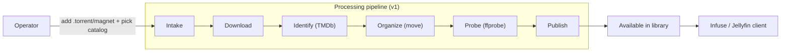
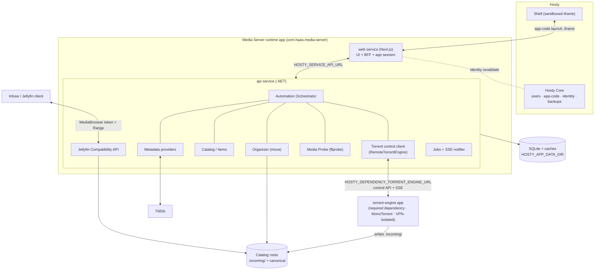

# Media Server Documentation

## Overview

This documentation covers Media Server, which is implemented and shipping. The
core product — milestones M0 through M4 (plus the M3.5 UI redesign) — is built and
merged across 40+ pull requests. The `docs/features/` set holds the living
specifications (each now describes implemented behavior, with per-milestone status
tracked in the [implementation plan](features/implementation-plan.md)), and
`docs/ideas/` holds forward-looking designs and epics.

Media Server is a self-hosted, automation-first application for
acquiring, organizing, and streaming movie and TV libraries. The defining goal is
**maximum automation**: an operator adds a torrent and picks a destination
catalog, and the system downloads it, organizes it into a clean library layout,
identifies it, fetches metadata, probes media streams, and publishes it for
playback without further manual steps. The content then becomes available to
clients such as Infuse over a Jellyfin-compatible API.

Media Server is built and distributed as a **Hosty runtime app** with
manifest `schemaVersion: "app.0.1"`. It runs under Hosty Core-managed lifecycle
and supports both runtime profiles: `dev` (`localCommand`) is the primary local
development loop, and `docker` is the v1 delivery target — unblocked now that
Hosty Core provides the external host-path mount model for catalog roots and
Cloudflare-tunnel ingress. Hosty Core owns Host user authentication, app access
assignment, app identity issuance, and app data backups.

> This documentation supersedes the earlier "Docker Host module"
> (`schemaVersion: "0.2"`) design. That gateway/module contract is retired; the
> current target is the Hosty runtime app `app.0.1` contract.

## Primary Use Case

## High-Level Architecture

## Technology Stack

Backend (`api` service):

- ASP.NET Core Minimal API.
- EF Core over SQLite (single embedded database file, JSON columns for flexible
  provider blobs).
- Torrent downloading delegated to the external, VPN-isolated `torrent-engine` app
  (a **required** cross-app dependency that runs MonoTorrent in its own container),
  driven over its HTTP control API + SSE by `RemoteTorrentEngine`; a
  `DisabledTorrentEngine` fallback keeps the rest of the app working when the
  dependency URL is absent.
- FFprobe for media probing in `api`; encoding is out-of-process in the separate
  [`transcode-engine`](ideas/transcode-engine-app.md) app (batch re-encode), never
  in-process.
- Server-Sent Events for real-time job and download progress (server→client only).
- An extensible automation pipeline (the orchestrator).

Frontend (`web` service):

- Next.js App Router, TypeScript, Tailwind, ShadCN UI.
- Acts as a backend-for-frontend: holds the Hosty app-origin session and proxies
  REST + the SSE stream to `api`, so the browser stays same-origin and iframe-safe.
- Server-Sent Events client (fetch-stream), TanStack React Query for client cache.

Runtime and delivery:

- Hosty runtime app manifest (`manifest.json` at the repo root,
  `schemaVersion: "app.0.1"`).
- `dev` (`localCommand`) runtime profile for local development.
- `docker` runtime profile with images published to GitHub Container Registry —
  the v1 delivery target, unblocked by Hosty Core's external host-path mounts and
  Cloudflare-tunnel ingress (`defaultRuntime: docker`; install `--runtime dev`
  for local work).
- GitHub Actions for build, test, and image publishing.

## Ideas

Forward-looking designs and epics, kept separate from the roadmap specs:

- [Torrent engine app](ideas/torrent-engine-app.md) — extract MonoTorrent into a
  standalone, VPN-isolated Hosty app (implemented).
- [Transcode engine app](ideas/transcode-engine-app.md) — ffmpeg/VAAPI batch
  conversion as a standalone Hosty app (implemented, movies-only v1).
- [Catalog library browsing](ideas/catalog-library-browsing.md) — filter Movies
  and Series by their configured catalog without mixing browsing with catalog
  administration.
- [Watched-history providers: Trakt](ideas/trakt-watched-state-sync.md) — a
  provider-neutral watched-history subsystem with Trakt as its first optional
  per-user provider.

## Planning

Approved, draft, or partly shipped work that is not yet complete:

- [Watched-history providers: Trakt](planning/trakt-watched-state-sync.md) — in
  progress. Provider-neutral watched-history sync/outbox behavior, per-play history,
  and the first Trakt adapter; phases 1–4 are merged, with grouped season delivery,
  directory reconciliation/telemetry, live Trakt verification, and the feature
  document still outstanding.

## Feature documentation

The specifications below live in `docs/features/` and are the source of truth for
the product's behavior. Most describe functionality already implemented through M4;
see the [implementation plan](features/implementation-plan.md) for per-milestone
status. M5 lands in two phases: [Release
tracking](features/release-tracking.md) (a watchlist and release calendar over
TMDb dates, no downloading — implemented) and [Watchlist and
discovery](features/watchlist-and-discovery.md) (the acquisition layer on top —
still planned).

- [Implementation plan](features/implementation-plan.md)
- [Hosty runtime app](features/hosty-runtime-app.md)
- [Catalogs](features/catalogs.md)
- [Automation pipeline](features/automation-pipeline.md)
- [Domain model](features/domain-model.md)
- [Torrents and organizer](features/torrents-and-organizer.md)
- [Metadata](features/metadata.md)
- [Storage and data](features/storage-and-data.md)
- [Collections](features/collections.md)
- [Jellyfin compatibility](features/jellyfin-compatibility.md)
- [File and directory management](features/file-directory-management.md)
- [Background tasks and progress](features/background-tasks.md)
- [Frontend application](features/frontend-application/feature.md)
- [Security](features/security.md)
- [Build and deployment](features/build-and-deployment.md)
- [Release tracking](features/release-tracking.md)
- [Watchlist and discovery](features/watchlist-and-discovery.md)
- [Hosty platform requests](features/hosty-platform-requests.md)

## Testing Expectations

Backend unit tests must use xUnit. Dependencies should be mocked with Imposter.
New features should include corresponding unit tests scoped to the behavior they
introduce. Hosty integration concerns (identity, Shell embedding, the SSE stream,
public endpoints) must be validated through Core-managed runtime profiles, not
by forging tokens. Feature-specific testing requirements are documented in the
relevant planning files until implementation is complete.

## Roadmap

- **M0 — Scaffold.** ✅ Done. `app.0.1` manifest, `api` + `web` services, `dev` +
  `docker` profiles, Hosty app-code session in `web`, health checks, this
  documentation.
- **M1 — Ingest happy path.** ✅ Done. Torrent add + catalog → download → organize
  → scan → TMDb → probe → catalog. Live activity in the UI. Closes the primary use
  case on the server side.
- **M2 — Jellyfin Direct Play.** ✅ Done. System/Users/UserViews/Items/Images,
  `PlaybackInfo`, and range-based direct streaming. Infuse connects, browses, and
  plays.
- **M3 — Playback state.** ✅ Done. `Sessions/Playing*`, user data, resume, watched
  threshold, season/series aggregates.
- **M3.5 — App shell & UI redesign.** ✅ Done. Multi-page themed UI, browse/detail
  pages, Home rails, admin gating.
- **M4 — Automation polish & Docker delivery.** ✅ Done. Reconciler, retries, review
  queue, manual match override, scheduled scans, metadata refresh, app-data backups,
  GHCR image publishing.
- **M5 — Watchlist and discovery.** Lands in two phases: **release tracking**
  ✅ Done — per-user watchlist and release calendar over TMDb dates, typed
  release/air dates, reminders and notifications, no downloading (see [Release
  tracking](features/release-tracking.md)) — then **acquisition** (future: custom
  content-source providers, release matching, auto-grab into the pipeline).
- **M6 — MCP / AI (future).** Use cases exposed as MCP tools for an AI agent.

## Non-Goals

- Live/on-the-fly playback transcode (Direct Play / Direct Stream only). Offline,
  operator-initiated batch re-encode into smaller library versions *is* supported —
  see the [transcode engine app](ideas/transcode-engine-app.md).
- Public torrent indexing.
- DRM-protected content playback.
- Full Jellyfin server replacement (only the subset Infuse needs).
- DLNA, live TV, music, photos, and books.

## Summary

Media Server is an automation-first Hosty runtime app: a `.NET` `api`
service and a Next.js `web` service under Hosty Core lifecycle. Its center of
gravity is the automation pipeline that turns an added torrent into a clean,
identified, metadata-rich, directly-playable library item with no manual steps,
exposed to Infuse through a Jellyfin-compatible API.

<!-- docs-index:begin -->

_Generated by `scripts/docs-index.mjs --fix` — do not edit this block by hand._

### Features

- **frontend-application** — [feature](features/frontend-application/feature.md)
- **recommendation-providers** — [feature](features/recommendation-providers/feature.md)
- **watch-history-calendar** — [feature](features/watch-history-calendar/feature.md)

### Legacy documents (pre-migration)

- [features/automation-pipeline](features/automation-pipeline.md) — Implemented
- [features/background-tasks](features/background-tasks.md) — Implemented
- [features/build-and-deployment](features/build-and-deployment.md) — Implemented
- [features/catalogs](features/catalogs.md) — Implemented
- [features/collections](features/collections.md) — Phase 1 (web) + Phase 2 (Infuse) implemented
- [features/domain-model](features/domain-model.md) — Implemented
- [features/file-directory-management](features/file-directory-management.md) — Implemented
- [features/hosty-platform-requests](features/hosty-platform-requests.md) — Active (partially implemented — see per-item status)
- [features/hosty-runtime-app](features/hosty-runtime-app.md) — Implemented
- [features/implementation-plan](features/implementation-plan.md) — Active
- [features/jellyfin-compatibility](features/jellyfin-compatibility.md) — Implemented
- [features/metadata](features/metadata.md) — Implemented
- [features/release-tracking](features/release-tracking.md) — Implemented
- [features/security](features/security.md) — Implemented
- [features/storage-and-data](features/storage-and-data.md) — Implemented
- [features/torrents-and-organizer](features/torrents-and-organizer.md) — Implemented
- [features/watchlist-and-discovery](features/watchlist-and-discovery.md) — Planned
- [ideas/catalog-library-browsing](ideas/catalog-library-browsing.md) — Promoted
- [ideas/torrent-engine-app](ideas/torrent-engine-app.md) — Implemented
- [ideas/trakt-watched-state-sync](ideas/trakt-watched-state-sync.md) — Promoted
- [ideas/transcode-engine-app](ideas/transcode-engine-app.md) — Implemented (movies-only v1; later items deferred)
- [planning/trakt-watched-state-sync](planning/trakt-watched-state-sync.md) — In progress — phases 1–4 shipped (PRs #91–#102); see

<!-- docs-index:end -->
