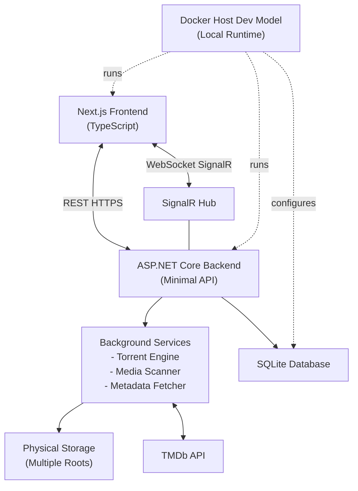

# Media Server Documentation

## Overview

Media Server is a self-hosted application for managing files, torrents, and
media libraries for movies and TV series. It provides a web UI built with
Next.js, TypeScript, Tailwind, and ShadCN components. The backend is built with
ASP.NET Core Minimal APIs, SignalR, background services, SQLite, MonoTorrent,
and TMDb integration.

The distributed application is containerized and run locally through the Docker
Host Dev Model. The production runtime is distributed as a Docker Host module
with strict `schemaVersion: "0.2"` metadata. Docker images are published to
GitHub Container Registry by GitHub Actions.

## High-Level Architecture

## Technology Stack

Frontend:

- Next.js App Router
- TypeScript
- React Server Components where applicable
- ShadCN UI components
- Tailwind CSS
- SignalR JavaScript client
- REST API consumption through `fetch` or `axios`

Backend:

- ASP.NET Core
- Minimal API endpoint definitions
- SignalR
- MonoTorrent
- BackgroundServices and HostedServices
- SQLite
- TMDb API integration

Local runtime and deployment:

- Docker Host Dev Model for local running and Host-facing validation
- Docker Host module metadata as the primary install contract
- Docker Host shell app and gateway integration
- Docker and Docker Compose for image builds, service wiring, or non-Host deployment
- GitHub Actions
- GitHub Container Registry

## Feature Documentation

- [File and directory management](features/file-directory-management.md)
- [Torrent management](features/torrent-management.md)
- [Media libraries](features/media-libraries.md)
- [Background tasks and progress](features/background-tasks.md)
- [Jellyfin-compatible streaming](features/jellyfin-compatible-streaming.md)
- [Frontend application](features/frontend-application.md)
- [Host shell iframe compatibility](features/host-shell-iframe.md)
- [Security and configuration](features/security-configuration.md)
- [Build, packaging, and deployment](features/build-packaging-deployment.md)
- [Docker Host module](features/docker-host-module.md)

## Testing Expectations

Backend unit tests must use xUnit. Dependencies should be mocked with Imposter.
New features should include corresponding unit tests scoped to the behavior they
introduce.

Feature-specific testing requirements are documented in the relevant feature
files.

## Future Enhancements

- DASH playback.
- Advanced transcoding profiles and hardware acceleration presets.
- User profiles.
- Watch history.
- Subtitle management.
- Plugin system.

## Non-Goals

- Public torrent indexing.
- DRM-protected content playback.
- Cloud-only storage for the initial version.

## Summary

Media Server provides a modular foundation for file management, torrent-based
content acquisition, TMDb-powered media libraries, Jellyfin-compatible playback,
and real-time progress tracking. The architecture separates UI, API, background
processing, storage, and deployment concerns so the application can run cleanly
through the Docker Host Dev Model locally and as a Docker Host module in
production.
