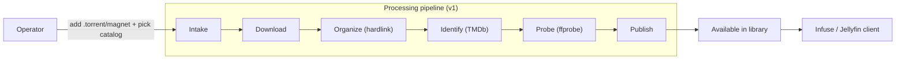
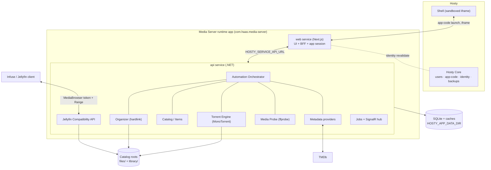

# Media Server Documentation

## Overview

This documentation is the draft implementation plan for Media Server. The
application has not been implemented yet, so current behavior must not be
documented under `docs/features/` until the corresponding implementation exists.

Media Server is planned as a self-hosted, automation-first application for
acquiring, organizing, and streaming movie and TV libraries. The defining goal is
**maximum automation**: an operator adds a torrent and picks a destination
catalog, and the system downloads it, organizes it into a clean library layout,
identifies it, fetches metadata, probes media streams, and publishes it for
playback without further manual steps. The content then becomes available to
clients such as Infuse over a Jellyfin-compatible API.

Media Server will be built and distributed as a **Hosty runtime app** with
manifest `schemaVersion: "app.0.1"`. It runs under Hosty Core-managed lifecycle
and supports both runtime profiles: `dev` (`localCommand`) is the primary local
development loop, and `docker` is the v1 delivery target — unblocked now that
Hosty Core provides the external host-path mount model for catalog roots and
Cloudflare-tunnel ingress. Hosty Core owns Host user authentication, app access
assignment, app identity issuance, and app data backups.

> This documentation supersedes the earlier "Docker Host module"
> (`schemaVersion: "0.2"`) design. That gateway/module contract is retired; the
> current target is the Hosty runtime app `app.0.1` contract.

## Primary Use Case

## High-Level Architecture

## Technology Stack

Backend (`api` service):

- ASP.NET Core Minimal API.
- EF Core over SQLite (single embedded database file, JSON columns for flexible
  provider blobs).
- MonoTorrent torrent engine as a hosted service.
- FFprobe for media probing (FFmpeg only later, if transcoding is ever added).
- SignalR for real-time job and download progress.
- An extensible automation pipeline (the orchestrator).

Frontend (`web` service):

- Next.js App Router, TypeScript, Tailwind, ShadCN UI.
- Acts as a backend-for-frontend: holds the Hosty app-origin session and proxies
  REST/SignalR to `api`, so the browser stays same-origin and iframe-safe.
- SignalR JavaScript client, TanStack React Query for client cache.

Runtime and delivery:

- Hosty runtime app manifest (`apps/media-server/manifest.json`,
  `schemaVersion: "app.0.1"`).
- `dev` (`localCommand`) runtime profile for local development.
- `docker` runtime profile with images published to GitHub Container Registry —
  the v1 delivery target, unblocked by Hosty Core's external host-path mounts and
  Cloudflare-tunnel ingress (`defaultRuntime: docker`; install `--runtime dev`
  for local work).
- GitHub Actions for build, test, and image publishing.

## Ideas

No idea documents yet.

## Planning

- [Implementation plan](planning/implementation-plan.md)
- [Hosty runtime app](planning/hosty-runtime-app.md)
- [Catalogs](planning/catalogs.md)
- [Automation pipeline](planning/automation-pipeline.md)
- [Domain model](planning/domain-model.md)
- [Torrents and organizer](planning/torrents-and-organizer.md)
- [Metadata](planning/metadata.md)
- [Storage and data](planning/storage-and-data.md)
- [Jellyfin compatibility](planning/jellyfin-compatibility.md)
- [File and directory management](planning/file-directory-management.md)
- [Background tasks and progress](planning/background-tasks.md)
- [Frontend application](planning/frontend-application.md)
- [Security](planning/security.md)
- [Build and deployment](planning/build-and-deployment.md)
- [Watchlist and discovery](planning/watchlist-and-discovery.md)
- [Hosty platform requests](planning/hosty-platform-requests.md)

## Features

No implemented feature documentation yet.

## Testing Expectations

Backend unit tests must use xUnit. Dependencies should be mocked with Imposter.
New features should include corresponding unit tests scoped to the behavior they
introduce. Hosty integration concerns (identity, Shell embedding, SignalR,
public endpoints) must be validated through Core-managed runtime profiles, not
by forging tokens. Feature-specific testing requirements are documented in the
relevant planning files until implementation is complete.

## Roadmap

- **M0 — Scaffold.** `app.0.1` manifest, `api` + `web` services, `dev` + `docker`
  profiles, Hosty app-code session in `web`, health checks, this documentation.
- **M1 — Ingest happy path.** Torrent add + catalog → download → organize → scan
  → TMDb → probe → catalog. Live activity in the UI. Closes the primary use case
  on the server side.
- **M2 — Jellyfin Direct Play.** System/Users/UserViews/Items/Images,
  `PlaybackInfo`, and range-based direct streaming. Infuse connects, browses, and
  plays.
- **M3 — Playback state.** `Sessions/Playing*`, user data, resume, watched
  threshold, season/series aggregates.
- **M4 — Automation polish.** Reconciler, retries, review queue, manual match
  override, scheduled scans, metadata refresh, app-data backups.
- **M5 — Watchlist and discovery (future).** Custom content-source providers,
  watchlist, release calendar.
- **M6 — MCP / AI (future).** Use cases exposed as MCP tools for an AI agent.

## Non-Goals

- Media conversion and transcoding (Direct Play / Direct Stream only).
- Public torrent indexing.
- DRM-protected content playback.
- Full Jellyfin server replacement (only the subset Infuse needs).
- DLNA, live TV, music, photos, and books.

## Summary

Media Server is planned as an automation-first Hosty runtime app: a `.NET` `api`
service and a Next.js `web` service under Hosty Core lifecycle. Its center of
gravity is the automation pipeline that turns an added torrent into a clean,
identified, metadata-rich, directly-playable library item with no manual steps,
exposed to Infuse through a Jellyfin-compatible API.
