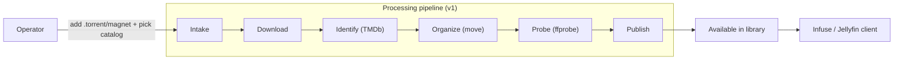
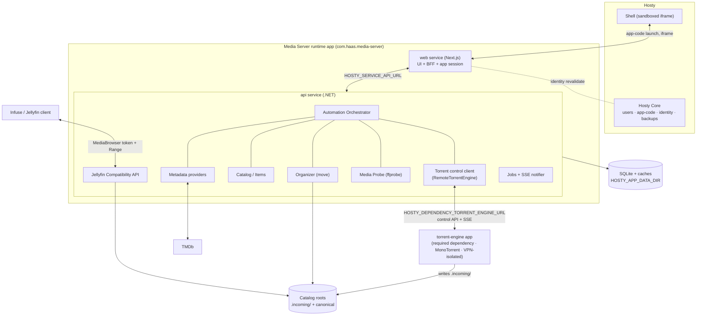

# Media Server Documentation

## Overview

This documentation covers Media Server, which is implemented and shipping. The
core product — milestones M0 through M4 (plus the M3.5 UI redesign) — is built and
merged across 40+ pull requests. The `docs/features/` set holds the living
specifications: each feature folder's `feature.md` describes implemented behavior and
its `plan.md`, while work remains, the intent.

Media Server is a self-hosted, automation-first application for
acquiring, organizing, and streaming movie and TV libraries. The defining goal is
**maximum automation**: an operator adds a torrent and picks a destination
catalog, and the system downloads it, organizes it into a clean library layout,
identifies it, fetches metadata, probes media streams, and publishes it for
playback without further manual steps. The content then becomes available to
clients such as Infuse over a Jellyfin-compatible API.

Media Server is built and distributed as a **Hosty runtime app** with
manifest `schemaVersion: "app.0.1"`. It runs under Hosty Core-managed lifecycle
and supports both runtime profiles: `dev` (`localCommand`) is the primary local
development loop, and `docker` is the v1 delivery target — unblocked now that
Hosty Core provides the external host-path mount model for catalog roots and
Cloudflare-tunnel ingress. Hosty Core owns Host user authentication, app access
assignment, app identity issuance, and app data backups.

> This documentation supersedes the earlier "Docker Host module"
> (`schemaVersion: "0.2"`) design. That gateway/module contract is retired; the
> current target is the Hosty runtime app `app.0.1` contract.

## Primary Use Case

```mermaid
flowchart LR
  U["Operator"] -->|add .torrent/magnet + pick catalog| INTAKE
  subgraph PROC["Processing pipeline (v1)"]
    INTAKE["Intake"] --> DL["Download"] --> ID["Identify (TMDb)"]
    ID --> ORG["Organize (move)"] --> PROBE["Probe (ffprobe)"] --> PUB["Publish"]
  end
  PUB --> AVAIL["Available in library"]
  AVAIL --> INFUSE["Infuse / Jellyfin client"]
```

## High-Level Architecture

```mermaid
flowchart TB
  subgraph Hosty
    CORE["Hosty Core<br/>users · app-code · identity · backups"]
    SHELL["Shell (sandboxed iframe)"]
  end
  subgraph App["Media Server runtime app (com.haas.media-server)"]
    WEB["web service (Next.js)<br/>UI + BFF + app session"]
    subgraph API["api service (.NET)"]
      ORCH["Automation Orchestrator"]
      TOR["Torrent control client<br/>(RemoteTorrentEngine)"]
      ORG["Organizer (move)"]
      CAT["Catalog / Items"]
      META["Metadata providers"]
      PROBE["Media Probe (ffprobe)"]
      JELLY["Jellyfin Compatibility API"]
      JOBS["Jobs + SSE notifier"]
    end
  end
  TENG["torrent-engine app<br/>(required dependency · MonoTorrent · VPN-isolated)"]
  INFUSE["Infuse / Jellyfin client"]
  TMDB["TMDb"]
  DB[("SQLite + caches<br/>HOSTY_APP_DATA_DIR")]
  CATFS[("Catalog roots<br/>.incoming/ + canonical")]

  SHELL <-->|app-code launch, iframe| WEB
  WEB <-->|HOSTY_SERVICE_API_URL| API
  WEB -.identity revalidate.- CORE
  INFUSE <-->|MediaBrowser token + Range| JELLY
  META <--> TMDB
  ORCH --- TOR & ORG & META & PROBE & CAT
  TOR <-->|HOSTY_DEPENDENCY_TORRENT_ENGINE_URL<br/>control API + SSE| TENG
  API --> DB
  TENG -->|writes .incoming/| CATFS
  ORG --> CATFS
  JELLY --> CATFS
```

## Technology Stack

Backend (`api` service):

- ASP.NET Core Minimal API.
- EF Core over SQLite (single embedded database file, JSON columns for flexible
  provider blobs).
- Torrent downloading delegated to the external, VPN-isolated `torrent-engine` app
  (a **required** cross-app dependency that runs MonoTorrent in its own container),
  driven over its HTTP control API + SSE by `RemoteTorrentEngine`; a
  `DisabledTorrentEngine` fallback keeps the rest of the app working when the
  dependency URL is absent.
- FFprobe for media probing in `api`; encoding is out-of-process in the separate
  [`transcode-engine`](https://github.com/alex-de-haas/transcode-engine) app (batch re-encode), never
  in-process.
- Server-Sent Events for real-time job and download progress (server→client only).
- An extensible automation pipeline (the orchestrator).

Frontend (`web` service):

- Next.js App Router, TypeScript, Tailwind, ShadCN UI.
- Acts as a backend-for-frontend: holds the Hosty app-origin session and proxies
  REST + the SSE stream to `api`, so the browser stays same-origin and iframe-safe.
- Server-Sent Events client (fetch-stream), TanStack React Query for client cache.

Runtime and delivery:

- Hosty runtime app manifest (`manifest.json` at the repo root,
  `schemaVersion: "app.0.1"`).
- `dev` (`localCommand`) runtime profile for local development.
- `docker` runtime profile with images published to GitHub Container Registry —
  the v1 delivery target, unblocked by Hosty Core's external host-path mounts and
  Cloudflare-tunnel ingress (`defaultRuntime: docker`; install `--runtime dev`
  for local work).
- GitHub Actions for build, test, and image publishing.

## Documents

Every feature folder is listed in the generated index below with its summary and, where it has a
plan, the plan's status, deliverable progress and last update. The list is generated from each
document's frontmatter; the format and the rules for writing documents are in the Documentation
section of [AGENTS.md](../AGENTS.md).

## Testing Expectations

Backend unit tests must use xUnit. Dependencies should be mocked with Imposter.
New features should include corresponding unit tests scoped to the behavior they
introduce. Hosty integration concerns (identity, Shell embedding, the SSE stream,
public endpoints) must be validated through Core-managed runtime profiles, not
by forging tokens. Feature-specific testing requirements are documented in the
relevant planning files until implementation is complete.

## Roadmap

- **M0 — Scaffold.** ✅ Done. `app.0.1` manifest, `api` + `web` services, `dev` +
  `docker` profiles, Hosty app-code session in `web`, health checks, this
  documentation.
- **M1 — Ingest happy path.** ✅ Done. Torrent add + catalog → download → organize
  → scan → TMDb → probe → catalog. Live activity in the UI. Closes the primary use
  case on the server side.
- **M2 — Jellyfin Direct Play.** ✅ Done. System/Users/UserViews/Items/Images,
  `PlaybackInfo`, and range-based direct streaming. Infuse connects, browses, and
  plays.
- **M3 — Playback state.** ✅ Done. `Sessions/Playing*`, user data, resume, watched
  threshold, season/series aggregates.
- **M3.5 — App shell & UI redesign.** ✅ Done. Multi-page themed UI, browse/detail
  pages, Home rails, admin gating.
- **M4 — Automation polish & Docker delivery.** ✅ Done. Reconciler, retries, review
  queue, manual match override, scheduled scans, metadata refresh, app-data backups,
  GHCR image publishing.
- **M5 — Watchlist and discovery.** Lands in two phases: **release tracking**
  ✅ Done — per-user watchlist and release calendar over TMDb dates, typed
  release/air dates, reminders and notifications, no downloading (see [Release
  tracking](features/release-tracking/feature.md)) — then **acquisition** (future:
  custom content-source providers, release matching, auto-grab into the pipeline).
- **M6 — MCP / AI (future).** Use cases exposed as MCP tools for an AI agent —
  scoped in [mcp-tools](features/mcp-tools/plan.md).

## Non-Goals

- Live/on-the-fly playback transcode (Direct Play / Direct Stream only). Offline,
  operator-initiated batch re-encode into smaller library versions *is* supported —
  see [Transcode Engine](https://github.com/alex-de-haas/transcode-engine).
- Public torrent indexing.
- DRM-protected content playback.
- Full Jellyfin server replacement (only the subset Infuse needs).
- DLNA, live TV, music, photos, and books.

## Summary

Media Server is an automation-first Hosty runtime app: a `.NET` `api`
service and a Next.js `web` service under Hosty Core lifecycle. Its center of
gravity is the automation pipeline that turns an added torrent into a clean,
identified, metadata-rich, directly-playable library item with no manual steps,
exposed to Infuse through a Jellyfin-compatible API.

<!-- docs-index:begin -->

_Generated by `scripts/docs-index.mjs --fix` — do not edit this block by hand._

### Features

Plans: 6 In Progress · 3 Draft · 3 On Hold.

- [Apple Client](features/apple-client/feature.md) — The first-party Apple client that pairs a television with a server, browses the library and plays it through server-side repackaging. · [plan](features/apple-client/plan.md): In Progress, 14/23, updated 2026-10-01
- [Apple Client Core — plan](features/apple-client-core/plan.md) — Phase 2 of the Apple client epic, the first release worth using, built on the finished server APIs. · In Progress, 18/27, updated 2026-08-31
- [Apple Client Visual Design and Collections](features/apple-client-visual-design/feature.md) — Apple client visual design and collections, including refresh behavior and the unsupported-server retry.
- [Apple Playback Buffering](features/apple-playback-buffering/feature.md) — Apple client playback caching in memory or on disk, or native AVPlayer buffering when the cache is off.
- [Apple Playback Stalls and Audio Dropouts](features/apple-playback-stall-investigation/plan.md) — Find and fix why Apple TV playback occasionally freezes or loses audio, one symptom at a time. · On Hold, 0/10, updated 2026-10-02
- [Apple Series Browsing](features/apple-series-browsing/feature.md) — The tvOS series screen with a season selector above a rail of episode cards.
- [Apple TV Home](features/apple-tv-home/feature.md) — The tvOS Home tab with Continue Watching, Next Up and Recommendations rows.
- [Artwork Language](features/artwork-language/feature.md) — Which cached poster, backdrop and logo each surface shows, and the operator's per-title override.
- [Automation Pipeline](features/automation-pipeline/feature.md) — The staged ingest pipeline that carries an added torrent through identification, download, organization, probing and enrichment to playback.
- [Background Tasks and Progress](features/background-tasks/feature.md) — Background jobs for long-running work with observable, restart-safe state and progress reporting to the UI.
- [Blu-ray Sources and MKV Creation](features/bluray-import/feature.md) — BDMV discs import as durable Blu-ray sources, and administrators create MKV versions from a chosen playlist. · [plan](features/bluray-import/plan.md): In Progress, 10/22, updated 2026-09-25
- [Build and Deployment](features/build-and-deployment/feature.md) — How Media Server is developed under the dev profile and delivered as docker images through GitHub Actions.
- [Cache Storage](features/cache-storage/feature.md) — Remux indexes and downloaded artwork live in the Hosty cache directory, persistent but never backed up.
- [Catalog Maintenance](features/catalog-maintenance/feature.md) — Scan for media and Refresh metadata keep each catalog in step with its disk and its metadata sources.
- [Catalogs](features/catalogs/feature.md) — Operator-configured catalogs that drive parsing, target paths, naming, seeding policy and metadata language.
- [Collections (Movie Franchises)](features/collections/feature.md) — Owned movies grouped into TMDb franchise collections in the web UI and as a Jellyfin boxsets library.
- [Convert Dialog](features/convert-dialog/feature.md) — The dialog that composes a new version from one video file as a single transcode-engine job.
- [Dolby Vision Profile](features/dolby-vision-profile/feature.md) — Distinguishes playable Dolby Vision from Dolby Vision shown as HDR10 and converts the latter losslessly.
- [Domain Model](features/domain-model/feature.md) — The persistent EF Core entities and the core pipeline and metadata extension contracts.
- [Episode Media](features/episode-media/feature.md) — Episodes get the same media surface as movies, with versions, tracks, sidecars and conversions.
- [External Subtitle Delivery — plan](features/external-subtitle-delivery/plan.md) — Parked capability to deliver a sidecar subtitle file to a client without merging it into the video. · On Hold, 0/6, updated 2026-07-27
- [External Track Sidecars](features/external-track-sidecars/feature.md) — A release's separate audio and subtitle files stay beside their library file as external streams.
- [File and Directory Management](features/file-directory-management/feature.md) — File operations happen only as catalog automation and stay confined to configured catalog roots. · [plan](features/file-directory-management/plan.md): Draft, 0/2, updated 2026-10-05
- [Frontend Application](features/frontend-application/feature.md) — The Next.js web app embedded in Hosty Shell that acts as a backend-for-frontend for the api service.
- [Manual and Smart Groups](features/groups/feature.md) — Manual and smart groups that organize titles independently of catalogs and franchise collections.
- [Hosty Overlay](features/hosty-overlay/feature.md) — HostyOverlay coordinates identity recovery, required-permission readiness and protected content visibility at the application root.
- [Hosty Platform Requests](features/hosty-platform-requests/feature.md) — A standing register of what Media Server has asked the Hosty platform for, with each request's status.
- [Hosty Runtime App](features/hosty-runtime-app/feature.md) — The Hosty manifest, runtime profiles, environment, identity, user directory and backups of Media Server.
- [Indexing Progress](features/indexing-progress/feature.md) — Media cards show background remux preparation per file and per external audio track.
- [Recoverable Library Moves](features/ingest-move-recovery/plan.md) — Parked work to recover interrupted library moves without losing file ownership or overwriting another version. · On Hold, 0/4, updated 2026-09-23
- [Jellyfin Compatibility](features/jellyfin-compatibility/feature.md) — A Jellyfin-compatible API subset that lets clients such as Infuse browse, Direct Play and sync progress.
- [Library Item Tombstones](features/library-item-tombstones/feature.md) — Deleted items a user favorited, rated or watched survive as unpublished tombstones that keep that history.
- [MCP Tools](features/mcp-tools/feature.md) — Media Server use cases as MCP tools, plus the agent skill that teaches the server's vocabulary. · [plan](features/mcp-tools/plan.md): In Progress, 0/1, updated 2026-09-03
- [Media Probe Providers](features/media-probe-providers/feature.md) — File probing through the transcode engine first and the app's own container-header reader as a fallback. · [plan](features/media-probe-providers/plan.md): Draft, 1/7, updated 2026-09-04
- [Metadata](features/metadata/feature.md) — Provider-agnostic metadata enrichment with TMDb as the first provider.
- [Movie Detail Context](features/movie-detail-context/feature.md) — The web movie page with personal viewing history, cast, media, related movies and tags.
- [Multi-Movie Ingest (Franchise Packs)](features/multi-movie-ingest/feature.md) — A franchise pack download imports as separate movies, each with its own folder and metadata.
- [Native Client API](features/native-client-api/feature.md) — The /native/v1 HTTP surface for Media Server's own clients, carrying what the domain actually holds.
- [Native Playback](features/native-playback/feature.md) — Native playback negotiation, initial track selection and watch recording under /native/v1/playback.
- [Recommendations](features/recommendation-providers/feature.md) — A what-to-watch-next surface built from the viewer's history and ratings and the library, with TMDb for similarity.
- [Release Tracking](features/release-tracking/feature.md) — A per-user calendar of TMDb release dates with reminders, without any downloading.
- [Remux Streaming](features/remux-streaming/feature.md) — Matroska sources served to native clients as computed MP4 containers without a second copy on disk. · [plan](features/remux-streaming/plan.md): In Progress, 33/52, updated 2026-08-15
- [Security](features/security/feature.md) — Protection of catalogs, torrents, settings and streams across Hosty identity and Jellyfin client credentials.
- [Single Catalog per Title](features/single-catalog-per-title/feature.md) — A movie or series exists in at most one catalog, a deliberate constraint until multi-catalog membership exists.
- [Storage and Data](features/storage-and-data/feature.md) — Backed-up app data in an embedded SQLite database, separate from the large catalog roots that hold media.
- [Stream Title Editing](features/stream-title-editing/feature.md) — Correct a track's name and language while submitting a conversion or a merge.
- [Title Preview](features/title-preview/feature.md) — A dialog that describes titles the instance does not hold, from recommendations, the calendar and search.
- [Torrents and Organizer](features/torrents-and-organizer/feature.md) — Torrents download through the external torrent-engine app and each file runs through one ingest pipeline into the catalog. · [plan](features/torrents-and-organizer/plan.md): In Progress, 9/11, updated 2026-10-01
- [Track Extraction](features/track-extraction/feature.md) — Write a version's embedded audio and subtitle tracks out as files beside it, recorded as external streams.
- [Video Part Joining](features/video-part-joining/feature.md) — Join two versions of a movie into one Matroska version from the Media tab.
- [Watch-History Calendar](features/watch-history-calendar/feature.md) — The calendar's Watched view, a screening diary over each user's play history.
- [Watch-History Deletion](features/watch-history-deletion/feature.md) — A user can delete one recorded play from their own watch history.
- [Watch-History Manual Entries](features/watch-history-manual-entries/feature.md) — Users can log, date or re-date a viewing in their own watch history.
- [Watch History](features/watch-history-providers/feature.md) — Per-user play history entries and aggregate item data as the local source of truth for watch state.
- [Watchlist and Discovery](features/watchlist-and-discovery/plan.md) — Acquisition stages that search content sources for watchlist titles, score releases and hand the best one to Intake. · Draft, 0/4, updated 2026-10-05

<!-- docs-index:end -->
