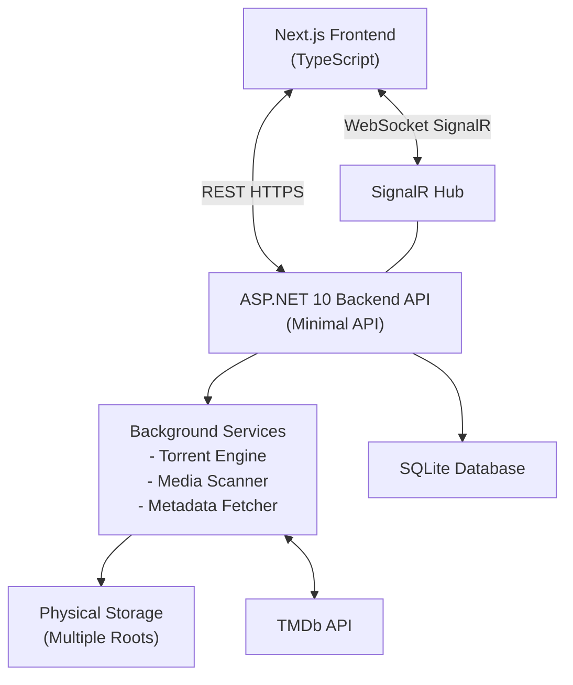

# Media Server – Technical Specification

## 1. Overview

The Media Server is a self-hosted application for managing files, torrents, and media libraries (movies and TV series).  
It provides a web-based UI built with **Next.js (TypeScript)** with **Tailwind** and **ShadCN components**. A backend built with **ASP.NET 10 Minimal API**. Using **SignalR** for real-time updates and background task progress reporting.

The system is designed to work on home servers using **Docker** and supports multiple physical storage roots for media files. It integrates with **TMDb API** for rich metadata about movies and TV series.

## 2. High-Level Architecture



## 3. Technology Stack

### Frontend
- Next.js (App Router)
- TypeScript
- React Server Components (where applicable)
- ShadCN UI components
- Tailwind CSS
- SignalR JavaScript Client
- REST API consumption via fetch/axios

### Backend
- ASP.NET 10
- Minimal API
- SignalR
- MonoTorrent (torrent engine)
- BackgroundServices / HostedServices
- SQLite
- TMDb API integration

## 4. Core Features

TODO: describe core features in more detail, e.g. file management, torrent management, media libraries, background tasks, real-time updates, etc.

## 5. File & Directory Management

### 5.1 Storage Roots

- Ability to attach multiple physical directories (storage roots)
- Each root has:
  - Unique ID
  - Display name
  - Absolute physical path
  - Read/Write permissions
  - Free / total space

Example:
```json
{
  "id": "{uuid}",
  "name": "Movies Disk",
  "path": "/mnt/media/movies"
}
```

### 5.2 File Operations

Supported operations:
- Upload files (multipart / resumable optional)
- Copy files
- Move files
- Delete files
- Rename files

Constraints:
- Operations restricted to attached storage roots
- Atomic operations where supported by OS
- Large file handling (stream-based)
- Multiple files operations support

### 5.3 Directory Operations

Supported operations:
- Create directory
- Copy directory (recursive)
- Move directory
- Delete directory (recursive)
- Rename directory

Additional behavior:
- Progress reporting for long operations via SignalR
- Validation against directory traversal attacks

### 5.4 API Endpoints (Example)

GET    /api/files?path=/movies
POST   /api/files/upload
POST   /api/files/copy
POST   /api/files/move
DELETE /api/files
POST   /api/directories

## 6. Torrent Management (MonoTorrent)

### 6.1 Torrent Engine
- MonoTorrent runs as a background service
- Supports:
  - Magnet links
  - .torrent files
  - Pause / Resume / Stop
  - Sequential download (for streaming use cases)
  - Per-torrent configuration:
    - Download directory
    - Speed limits
    - Ratio limits

### 6.2 Torrent Lifecycle

States:
- Queued
- Downloading
- Paused
- Completed
- Seeding
- Error

Each torrent stores:
- InfoHash
- Name
- Progress
- Download speed
- Upload speed
- ETA
- Save path

### 6.3 Torrent API (Example)

POST   /api/torrents/add
POST   /api/torrents/{id}/pause
POST   /api/torrents/{id}/resume
DELETE /api/torrents/{id}
GET    /api/torrents

### 6.4 Real-Time Updates
- SignalR hub broadcasts:
  - Torrent progress
  - Speed updates
  - State changes
- Client subscribes once and receives updates for all active torrents

## 7. Media Libraries

### 7.1 Library Types

Supported library types:
- Movies
- TV Series

Library configuration:
```json
{
  "id": "{uuid}",
  "type": "movie",
  "name": "Movies Library",
  "paths": ["/mnt/media/movies"]
}
```

### 7.2 Media Scanning
- Manual and scheduled scans
- Scans attached directories for media files
- Supported formats:
  - .mp4, .mkv, .avi, .mov, .webm
  - Filename parsing for title, year, season, episode

### 7.3 Metadata Management (TMDb)

Capabilities:
- Fetch metadata for newly discovered files
- Re-scan and refresh metadata
- Manual match override

Metadata includes:
- Title
- Original title
- Description
- Genres
- Release date
- Runtime
- Posters & backdrops
- Cast & crew
- Seasons & episodes (for series)

Caching:
- Local metadata cache to avoid excessive TMDb requests

### 7.4 Media Entity Model (Simplified)

```json
{
  "id": "{uuid}",
  "type": "movie",
  "title": "Inception",
  "year": 2010,
  "path": "/mnt/media/movies/Inception (2010).mkv",
  "tmdbId": 27205, // TODO: change to providers dictionary for multiple metadata sources
  "metadata": {}
}
```

### 7.5 Movie Entity Fields

Movie contains fields:
- Id
- OriginalTitle
- OriginalLanguage
- Title
- Overview
- VoteAverage
- VoteCount
- ReleaseDate
- Budget
- Revenue
- PosterPath
- BackdropPath
- LogoPath
- Genres
- Crew
- Cast
- ReleaseDates
- OfficialRating

## 8. Background Tasks & Progress Tracking

### 8.1 Background Jobs
- Torrent downloads
- File operations (copy/move/delete)
- Media scans
- Metadata fetching

### 8.2 Progress Reporting
Each job has:
- Job ID
- Type
- Status
- Progress (0–100)
- Error (optional)

SignalR events:
- jobStarted
- jobProgress
- jobCompleted
- jobFailed

## 9. Streaming

API for Jellyfin protocol and support clients like Infuse.

## 10. Frontend Application (Next.js)

### 10.1 Pages / Sections
- Dashboard
- File Browser
- Torrents
- Media Libraries
- Movies
- TV Series
- Settings

### 10.2 State Management
- Server data via REST
- Real-time updates via SignalR
- Optional client cache (React Query / SWR)

### 10.3 UI Features
- File explorer (tree + list)
- Torrent list with live progress bars
- Media grids with posters
- Media detail pages
- Background task notifications

## 11. Security
- Authentication (JWT / Cookie-based)
- Authorization per operation
- Path sandboxing
- Rate limiting on public endpoints
- API key for TMDb stored securely

## 12. Configuration

### 12.1 Server Configuration
- Storage roots
- TMDb API key
- Torrent limits
- Scan schedules

### 12.2 Environment Variables

```
MEDIA_STORAGE_ROOTS
TMDB_API_KEY
DATABASE_CONNECTION
TORRENT_MAX_DOWNLOAD_SPEED
TORRENT_MAX_UPLOAD_SPEED
```

## 13. Future Enhancements
- Media streaming (HLS/DASH)
- Transcoding pipeline
- User profiles
- Watch history
- Subtitle management
- Plugin system

## 14. Non-Goals
- Public torrent indexing
- DRM-protected content playback
- Cloud-only storage (initial version)

## 15. Summary

This Media Server provides a modular, scalable foundation for:
- File and directory management
- Torrent-based content acquisition
- Rich media libraries powered by TMDb
- Real-time progress tracking via SignalR

The architecture cleanly separates UI, API, and background processing, ensuring long-term maintainability and extensibility.
